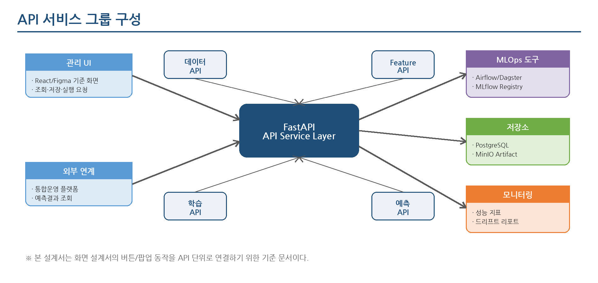
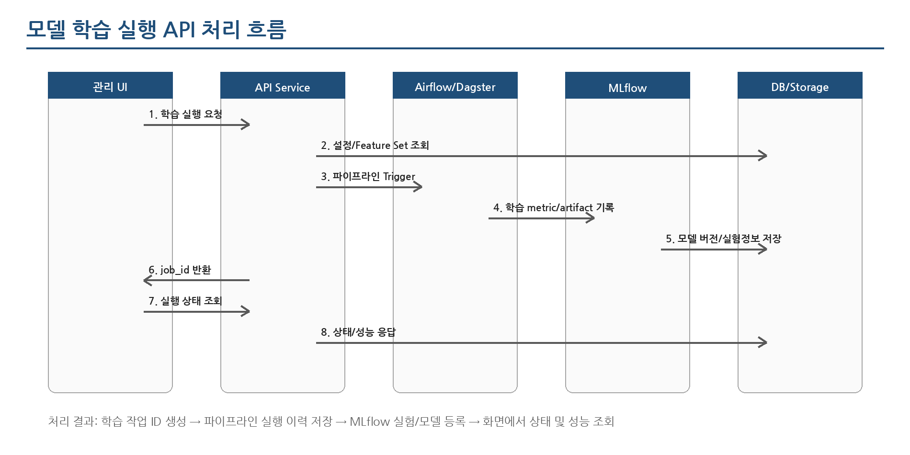
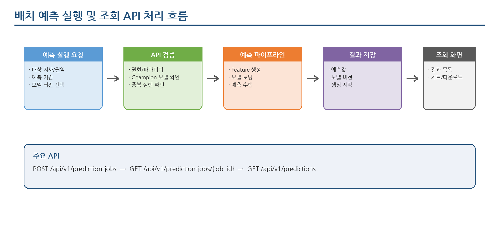

한국지역난방공사 스마트 통합운영 시스템 구축 대응

**THERMOps: 열수요 예측 모델 운영 자동화 플랫폼**

**API 설계서**

오픈소스 기반 예측·학습·운영관리 API 표준 설계

작성일: 2026.06.24

문서구분: 사전 구축형 솔루션 설계 산출물

# **문서 이력**

| **버전** | **일자**   | **작성/수정 내용**                                  | **비고**               |
|----------|------------|-----------------------------------------------------|------------------------|
| v0.1     | 2026.06.24 | THERMOps: 열수요 예측 모델 운영 자동화 플랫폼 API 설계서 최초 작성 | 제안 전 사전 구축 기준 |

# **1. 개요**

## **1.1 목적**

본 문서는 THERMOps: 열수요 예측 모델 운영 자동화 플랫폼의 API 구조, 요청/응답 형식, 주요 엔드포인트, 오류 처리, 화면 연계 기준을 정의한다. 수주 후 발주기관 원천 데이터 구조와 운영환경에 맞춰 빠르게 설치·적용할 수 있도록 데이터 관리, Feature 관리, 모델 학습, 모델 운영, 배치 예측, 모니터링, 대시보드 API를 표준화하는 것을 목적으로 한다.

## **1.2 설계 범위**

- 관리 UI와 백엔드 서비스 간 REST API 설계

- Airflow/Dagster 기반 배치/파이프라인 실행 API 설계

- MLflow 기반 실험·모델 버전 관리 API 연계 설계

- PostgreSQL 기준 예측결과·성능지표·실행이력 조회 API 설계

- 향후 화면 설계서 및 Figma 인터랙티브 프로토타입에서 사용할 버튼/팝업 동작 기준 정의

## **1.3 설계 전제**

| **구분**    | **전제 내용**                                                                                            |
|-------------|----------------------------------------------------------------------------------------------------------|
| API 방식    | RESTful API, JSON 요청/응답을 기본으로 한다.                                                             |
| API Prefix  | /api/v1 을 기본 Prefix로 사용한다.                                                                       |
| 인증 방식   | 사전 구축형에서는 Bearer Token/JWT 구조를 가정하되, 실제 사업 환경의 SSO/IAM과 연계 가능하도록 분리한다. |
| 배치 연계   | Airflow를 기본 오케스트레이션 도구로 가정하고, Dagster 전환 가능성을 고려한다.                           |
| 모델 관리   | MLflow Tracking/Registry와 연동하되, 화면은 솔루션 API를 통해 조회·제어한다.                             |
| 데이터 저장 | PostgreSQL 표준 스키마를 기준으로 설계하며, 현장 DBMS 확정 시 Dialect 및 타입을 조정한다.                |

# **2. API 아키텍처**

## **2.1 API 그룹**

| **API 그룹**   | **주요 역할**                                          | **주요 화면 연계**                 |
|----------------|--------------------------------------------------------|------------------------------------|
| Dashboard API  | 대시보드 요약, 예측/오차/모델 상태 집계                | 열수요 예측 대시보드               |
| Data API       | 데이터 소스, 데이터 적재, 품질 점검 결과 관리          | 데이터 소스 관리, 데이터 품질 점검 |
| Mapping API    | 원천 컬럼과 표준 스키마 컬럼 간 매핑 관리              | 데이터 매핑 설정                   |
| Feature API    | Feature 정의, Feature Set 구성, 미리보기               | Feature 목록, Feature Set 설정     |
| Training API   | 학습 설정, 학습 실행, 학습 작업 상태 조회              | 모델 학습 설정, 모델 학습 실행     |
| Model API      | MLflow 모델 버전, 운영 후보/Champion 모델 관리         | 모델 Registry 관리, 모델 성능 비교 |
| Prediction API | 배치 예측 실행, 예측 결과 조회, 예측 결과 다운로드     | 배치 예측 실행, 예측 결과 조회     |
| Monitoring API | 성능 평가, 드리프트 리포트, 재학습 후보 관리           | 성능 모니터링, 드리프트 리포트     |
| Pipeline API   | Airflow/Dagster 파이프라인 실행, 재시도, 실행이력 관리 | 파이프라인 실행 이력               |
| Common API     | 공통 코드, 지사/권역, 상태값, 권한 기준 조회           | 전체 화면 공통                     |

## **2.2 주요 처리 흐름**

관리 UI는 솔루션 API만 호출하고, API 서비스가 Airflow/Dagster, MLflow, PostgreSQL, MinIO와 연계한다. 화면은 외부 도구의 내부 API를 직접 호출하지 않으며, 모든 상태값과 실행 결과는 솔루션 API를 통해 표준 응답 형식으로 제공한다.

# **3. 공통 API 규약**

## **3.1 기본 URL 및 Header**

| **항목**      | **값/형식**            | **설명**                                       |
|---------------|------------------------|------------------------------------------------|
| Base URL      | https://{host}/api/v1  | 운영환경 도메인 확정 전 기준                   |
| Content-Type  | application/json       | JSON 요청 본문                                 |
| Accept        | application/json       | JSON 응답                                      |
| Authorization | Bearer {access_token}  | 로그인/SSO 연계 후 발급된 토큰                 |
| X-Request-Id  | UUID                   | 추적 로그 상관관계 식별자. 미전달 시 서버 생성 |
| X-Client-Type | WEB / BATCH / EXTERNAL | 호출 주체 구분. 선택 항목                      |

## **3.2 공통 응답 구조**

> {  
> "success": true,  
> "code": "OK",  
> "message": "정상 처리되었습니다.",  
> "data": {},  
> "timestamp": "2026-06-24T13:00:00+09:00",  
> "request_id": "6f8b2e7e-0000-0000-0000-000000000001"  
> }

| **필드**   | **타입**     | **설명**                                  |
|------------|--------------|-------------------------------------------|
| success    | boolean      | 처리 성공 여부                            |
| code       | string       | 업무/시스템 응답 코드                     |
| message    | string       | 사용자 또는 운영자에게 표시 가능한 메시지 |
| data       | object/array | 업무 응답 데이터                          |
| timestamp  | datetime     | 응답 생성 시각                            |
| request_id | string       | 요청 추적 ID                              |

## **3.3 페이징 응답 구조**

> {  
> "success": true,  
> "code": "OK",  
> "message": "정상 처리되었습니다.",  
> "data": {  
> "items": \[\],  
> "page": 1,  
> "size": 20,  
> "total_count": 152,  
> "total_pages": 8  
> }  
> }

## **3.4 공통 오류 코드**

| **HTTP** | **코드**             | **메시지**                              | **처리 기준**                        |
|----------|----------------------|-----------------------------------------|--------------------------------------|
| 400      | INVALID_REQUEST      | 요청값이 올바르지 않습니다.             | 필수값 누락, 형식 오류, 기간 역전 등 |
| 401      | UNAUTHORIZED         | 인증이 필요합니다.                      | 토큰 없음/만료                       |
| 403      | FORBIDDEN            | 접근 권한이 없습니다.                   | 역할/권한 미충족                     |
| 404      | NOT_FOUND            | 대상을 찾을 수 없습니다.                | ID에 해당하는 리소스 없음            |
| 409      | CONFLICT             | 현재 상태에서 처리할 수 없습니다.       | 중복 실행, 운영중 모델 삭제 시도 등  |
| 422      | VALIDATION_FAILED    | 검증에 실패했습니다.                    | 데이터 매핑/Feature 설정 검증 실패   |
| 500      | INTERNAL_ERROR       | 서버 처리 중 오류가 발생했습니다.       | 예상치 못한 서버 오류                |
| 503      | PIPELINE_UNAVAILABLE | 파이프라인 서비스에 연결할 수 없습니다. | Airflow/Dagster/MLflow 연결 실패     |

## **3.5 공통 상태값**

| **구분**        | **상태값** | **설명**                       |
|-----------------|------------|--------------------------------|
| 배치/파이프라인 | READY      | 실행 준비 상태                 |
| 배치/파이프라인 | RUNNING    | 실행 중                        |
| 배치/파이프라인 | SUCCESS    | 정상 완료                      |
| 배치/파이프라인 | FAILED     | 실패                           |
| 배치/파이프라인 | CANCELED   | 사용자 또는 시스템에 의해 취소 |
| 모델 버전       | CANDIDATE  | 후보 모델                      |
| 모델 버전       | CHAMPION   | 운영 예측에 사용하는 대표 모델 |
| 모델 버전       | ARCHIVED   | 보관 모델                      |
| Feature         | ACTIVE     | 학습/예측 사용 가능            |
| Feature         | INACTIVE   | 비활성 상태                    |

# **4. API 목록**

| **그룹**   | **Method** | **Endpoint**                                     | **설명**                  | **화면/버튼 연계**      |
|------------|------------|--------------------------------------------------|---------------------------|-------------------------|
| Dashboard  | GET        | /dashboard/overview                              | 대시보드 요약 조회        | 대시보드 진입 시        |
| Dashboard  | GET        | /dashboard/prediction-trend                      | 예측/실제/오차 추이 조회  | 대시보드 차트           |
| Dashboard  | GET        | /dashboard/model-health                          | 모델 운영 상태 조회       | 대시보드 모델 상태 카드 |
| Common     | GET        | /codes                                           | 공통 코드 조회            | 콤보박스 초기화         |
| Common     | GET        | /sites                                           | 지사/권역/공급구역 조회   | 검색 조건               |
| Data       | GET        | /data-sources                                    | 데이터 소스 목록 조회     | 데이터 소스 관리        |
| Data       | POST       | /data-sources                                    | 데이터 소스 등록          | 신규 등록 저장          |
| Data       | GET        | /data-sources/{source_id}                        | 데이터 소스 상세 조회     | 상세/수정 화면          |
| Data       | PUT        | /data-sources/{source_id}                        | 데이터 소스 수정          | 수정 저장               |
| Data       | DELETE     | /data-sources/{source_id}                        | 데이터 소스 삭제          | 삭제 버튼               |
| Data       | POST       | /data-sources/{source_id}/test-connection        | 연결 테스트               | 연결 테스트 버튼        |
| Data       | POST       | /ingestion-jobs                                  | 데이터 적재 실행          | 적재 실행 버튼          |
| Data       | GET        | /ingestion-jobs/{job_id}                         | 적재 작업 상태 조회       | 실행 이력 상세          |
| Data       | POST       | /data-quality/checks                             | 품질 점검 실행            | 품질 점검 버튼          |
| Data       | GET        | /data-quality/runs                               | 품질 점검 결과 목록       | 품질 점검 화면          |
| Mapping    | GET        | /mappings                                        | 데이터 매핑 목록 조회     | 데이터 매핑 설정        |
| Mapping    | POST       | /mappings                                        | 데이터 매핑 등록          | 신규 매핑 저장          |
| Mapping    | PUT        | /mappings/{mapping_id}                           | 데이터 매핑 수정          | 수정 저장               |
| Mapping    | POST       | /mappings/{mapping_id}/validate                  | 매핑 검증                 | 검증 버튼               |
| Mapping    | POST       | /mappings/{mapping_id}/preview                   | 변환 결과 미리보기        | 미리보기 버튼           |
| Feature    | GET        | /features                                        | Feature 목록 조회         | Feature 목록            |
| Feature    | POST       | /features                                        | Feature 등록              | 신규 Feature 저장       |
| Feature    | PUT        | /features/{feature_id}                           | Feature 수정              | 수정 저장               |
| Feature    | DELETE     | /features/{feature_id}                           | Feature 삭제              | 삭제 버튼               |
| Feature    | GET        | /feature-sets                                    | Feature Set 목록 조회     | Feature Set 설정        |
| Feature    | POST       | /feature-sets                                    | Feature Set 등록          | 저장 버튼               |
| Feature    | PUT        | /feature-sets/{feature_set_id}                   | Feature Set 수정          | 수정 저장               |
| Feature    | POST       | /feature-sets/{feature_set_id}/preview           | Feature Set 미리보기      | 미리보기 버튼           |
| Training   | GET        | /training-configs                                | 학습 설정 목록 조회       | 모델 학습 설정          |
| Training   | POST       | /training-configs                                | 학습 설정 등록            | 저장 버튼               |
| Training   | PUT        | /training-configs/{config_id}                    | 학습 설정 수정            | 수정 저장               |
| Training   | POST       | /training-jobs                                   | 모델 학습 실행            | 학습 실행 버튼          |
| Training   | GET        | /training-jobs                                   | 학습 작업 목록 조회       | 모델 학습 실행 이력     |
| Training   | GET        | /training-jobs/{job_id}                          | 학습 작업 상세 조회       | 진행상태/결과 확인      |
| Training   | POST       | /training-jobs/{job_id}/cancel                   | 학습 작업 취소            | 취소 버튼               |
| Model      | GET        | /models                                          | 모델 목록 조회            | 모델 Registry 관리      |
| Model      | GET        | /models/{model_name}/versions                    | 모델 버전 목록 조회       | 모델 상세               |
| Model      | GET        | /models/{model_name}/versions/{version}          | 모델 버전 상세 조회       | 성능/메타정보 확인      |
| Model      | POST       | /models/{model_name}/versions/{version}/champion | Champion 모델 지정        | 운영 모델 지정 버튼     |
| Model      | PATCH      | /models/{model_name}/versions/{version}/status   | 모델 상태 변경            | 보관/비활성 처리        |
| Prediction | POST       | /prediction-jobs                                 | 배치 예측 실행            | 예측 실행 버튼          |
| Prediction | GET        | /prediction-jobs/{job_id}                        | 예측 작업 상태 조회       | 실행 상태 확인          |
| Prediction | GET        | /predictions                                     | 예측 결과 목록 조회       | 예측 결과 조회          |
| Prediction | GET        | /predictions/summary                             | 예측 결과 요약 조회       | 요약 카드/차트          |
| Prediction | GET        | /predictions/export                              | 예측 결과 다운로드        | 엑셀 다운로드 버튼      |
| Monitoring | GET        | /performance-metrics                             | 성능 지표 조회            | 성능 모니터링           |
| Monitoring | POST       | /drift-checks                                    | 드리프트 점검 실행        | 드리프트 점검 버튼      |
| Monitoring | GET        | /drift-reports                                   | 드리프트 리포트 조회      | 드리프트 리포트 화면    |
| Monitoring | GET        | /retraining-candidates                           | 재학습 후보 조회          | 재학습 후보 관리        |
| Pipeline   | GET        | /pipelines                                       | 파이프라인 목록 조회      | 파이프라인 실행 이력    |
| Pipeline   | POST       | /pipelines/{pipeline_id}/trigger                 | 파이프라인 수동 실행      | 수동 실행 버튼          |
| Pipeline   | GET        | /pipeline-runs                                   | 파이프라인 실행 이력 조회 | 실행 이력 목록          |
| Pipeline   | GET        | /pipeline-runs/{run_id}                          | 파이프라인 실행 상세 조회 | 실행 이력 상세          |
| Pipeline   | POST       | /pipeline-runs/{run_id}/retry                    | 실패 작업 재시도          | 재시도 버튼             |

# **5. 주요 API 상세 설계**

## **5.1 데이터 소스 등록 API**

| **항목**     | **내용**                                     |
|--------------|----------------------------------------------|
| Method / URL | POST /api/v1/data-sources                    |
| 설명         | CSV, DB, API 등 원천 데이터 소스를 등록한다. |
| 화면 연계    | 데이터 소스 관리 \> 신규 버튼 \> 저장        |
| 권한         | 관리자, 데이터 관리자                        |

| **Request 필드** | **타입** | **필수** | **설명**                                        |
|------------------|----------|----------|-------------------------------------------------|
| source_name      | string   | Y        | 데이터 소스 명                                  |
| source_type      | string   | Y        | CSV / DB / API                                  |
| data_domain      | string   | Y        | HEAT_DEMAND / WEATHER / OPERATION / CALENDAR    |
| connection_info  | object   | Y        | 접속정보 또는 파일 경로. 민감정보는 암호화 저장 |
| active_yn        | boolean  | N        | 사용 여부                                       |

> {  
> "source_name": "열수요 실적 DB",  
> "source_type": "DB",  
> "data_domain": "HEAT_DEMAND",  
> "connection_info": {  
> "db_type": "postgresql",  
> "host": "10.0.0.10",  
> "port": 5432,  
> "database": "heat_ops",  
> "schema": "public",  
> "table": "tb_heat_demand_raw"  
> },  
> "active_yn": true  
> }
>
> {  
> "success": true,  
> "code": "OK",  
> "message": "데이터 소스가 등록되었습니다.",  
> "data": { "source_id": "DS-000001" }  
> }

## **5.2 데이터 매핑 등록/수정 API**

| **항목**     | **내용**                                                        |
|--------------|-----------------------------------------------------------------|
| Method / URL | POST /api/v1/mappings, PUT /api/v1/mappings/{mapping_id}        |
| 설명         | 원천 컬럼과 표준 스키마 컬럼 간 매핑 규칙을 등록 또는 수정한다. |
| 화면 연계    | 데이터 매핑 설정 \> 저장                                        |
| 권한         | 관리자, 데이터 관리자                                           |

| **Request 필드**           | **타입** | **필수** | **설명**                     |
|----------------------------|----------|----------|------------------------------|
| source_id                  | string   | Y        | 데이터 소스 ID               |
| target_table               | string   | Y        | 표준 테이블명                |
| mapping_name               | string   | Y        | 매핑명                       |
| columns                    | array    | Y        | 컬럼 매핑 목록               |
| columns\[\].source_column  | string   | Y        | 원천 컬럼명                  |
| columns\[\].target_column  | string   | Y        | 표준 컬럼명                  |
| columns\[\].transform_rule | string   | N        | 단위 변환, 날짜 포맷 변환 등 |
| columns\[\].required_yn    | boolean  | N        | 필수 여부                    |

> {  
> "source_id": "DS-000001",  
> "mapping_name": "열수요 실적 표준 매핑",  
> "target_table": "heat_demand_actual",  
> "columns": \[  
> {"source_column":"BRANCH_CD", "target_column":"site_id", "required_yn":true},  
> {"source_column":"MEASURE_DTM", "target_column":"measured_at", "transform_rule":"to_datetime(YYYYMMDDHH24MI)", "required_yn":true},  
> {"source_column":"DEMAND_VAL", "target_column":"heat_demand", "transform_rule":"unit:Gcal", "required_yn":true}  
> \]  
> }

## **5.3 데이터 매핑 검증 API**

| **항목**     | **내용**                                                                                 |
|--------------|------------------------------------------------------------------------------------------|
| Method / URL | POST /api/v1/mappings/{mapping_id}/validate                                              |
| 설명         | 매핑 규칙의 필수 컬럼 누락, 타입 불일치, 날짜 포맷 오류, 단위 변환 규칙 오류를 점검한다. |
| 화면 연계    | 데이터 매핑 설정 \> 검증 버튼                                                            |
| 권한         | 관리자, 데이터 관리자                                                                    |

> {  
> "success": true,  
> "code": "OK",  
> "message": "매핑 검증이 완료되었습니다.",  
> "data": {  
> "mapping_id": "MAP-000001",  
> "valid": true,  
> "warnings": \["선택 컬럼 supply_temp가 매핑되지 않았습니다."\],  
> "errors": \[\]  
> }  
> }

## **5.4 Feature Set 등록 API**

| **항목**     | **내용**                                         |
|--------------|--------------------------------------------------|
| Method / URL | POST /api/v1/feature-sets                        |
| 설명         | 모델 학습에 사용할 입력 Feature 묶음을 등록한다. |
| 화면 연계    | Feature Set 설정 \> 저장                         |
| 권한         | 관리자, 분석가                                   |

| **Request 필드** | **타입** | **필수** | **설명**             |
|------------------|----------|----------|----------------------|
| feature_set_name | string   | Y        | Feature Set 명       |
| target_domain    | string   | Y        | HEAT_DEMAND          |
| features         | array    | Y        | 사용 Feature ID 목록 |
| apply_site_scope | string   | N        | ALL / SITE / REGION  |
| description      | string   | N        | 설명                 |

> {  
> "feature_set_name": "기본 열수요 예측 Feature Set",  
> "target_domain": "HEAT_DEMAND",  
> "features": \["temperature", "humidity", "day_of_week", "is_holiday", "lag_24h", "lag_168h", "rolling_mean_24h"\],  
> "apply_site_scope": "ALL",  
> "description": "기상, 달력, 과거 수요 기반 기본 입력값 구성"  
> }

## **5.5 모델 학습 실행 API**

| **항목**     | **내용**                                                                                                                         |
|--------------|----------------------------------------------------------------------------------------------------------------------------------|
| Method / URL | POST /api/v1/training-jobs                                                                                                       |
| 설명         | 학습 설정을 기준으로 모델 학습 파이프라인을 실행한다. API는 작업 ID를 즉시 반환하고, 실제 학습은 비동기 파이프라인으로 처리한다. |
| 화면 연계    | 모델 학습 설정 \> 학습 실행 버튼 \> 확인 다이얼로그 \> 실행                                                                      |
| 권한         | 관리자, 분석가                                                                                                                   |

| **Request 필드**    | **타입** | **필수** | **설명**                                   |
|---------------------|----------|----------|--------------------------------------------|
| config_id           | string   | Y        | 학습 설정 ID                               |
| site_ids            | array    | N        | 학습 대상 지사/권역. 미전달 시 설정값 사용 |
| train_start_at      | date     | N        | 학습 시작일                                |
| train_end_at        | date     | N        | 학습 종료일                                |
| validation_start_at | date     | N        | 검증 시작일                                |
| validation_end_at   | date     | N        | 검증 종료일                                |
| register_model_yn   | boolean  | N        | 학습 완료 후 모델 Registry 등록 여부       |
| triggered_by        | string   | N        | 실행 사용자 ID                             |

> {  
> "config_id": "TRC-000001",  
> "site_ids": \["SITE-001", "SITE-002"\],  
> "train_start_at": "2024-01-01",  
> "train_end_at": "2026-03-31",  
> "validation_start_at": "2026-04-01",  
> "validation_end_at": "2026-05-31",  
> "register_model_yn": true  
> }
>
> {  
> "success": true,  
> "code": "ACCEPTED",  
> "message": "모델 학습 파이프라인이 실행 요청되었습니다.",  
> "data": {  
> "job_id": "TRJ-20260624-000001",  
> "pipeline_run_id": "AIRFLOW-RUN-000001",  
> "status": "RUNNING"  
> }  
> }

## **5.6 학습 작업 상세 조회 API**

| **항목**     | **내용**                                                                                           |
|--------------|----------------------------------------------------------------------------------------------------|
| Method / URL | GET /api/v1/training-jobs/{job_id}                                                                 |
| 설명         | 모델 학습 작업의 진행 상태, 사용 Feature Set, 모델 성능, MLflow Run ID, 등록 모델 버전을 조회한다. |
| 화면 연계    | 모델 학습 실행 이력 \> 상세 보기                                                                   |
| 권한         | 관리자, 분석가, 조회자                                                                             |

> {  
> "success": true,  
> "code": "OK",  
> "data": {  
> "job_id": "TRJ-20260624-000001",  
> "status": "SUCCESS",  
> "algorithm": "LightGBM",  
> "feature_set_id": "FS-000001",  
> "mlflow_run_id": "run_abc123",  
> "registered_model_name": "heat_demand_lgbm",  
> "registered_model_version": "12",  
> "metrics": {"mae": 15.23, "rmse": 21.87, "mape": 4.82},  
> "started_at": "2026-06-24T10:00:00+09:00",  
> "ended_at": "2026-06-24T10:27:14+09:00"  
> }  
> }

## **5.7 Champion 모델 지정 API**

| **항목**     | **내용**                                                                                                               |
|--------------|------------------------------------------------------------------------------------------------------------------------|
| Method / URL | POST /api/v1/models/{model_name}/versions/{version}/champion                                                           |
| 설명         | 배치 예측에 사용할 운영 후보 모델을 Champion 상태로 지정한다. 기존 Champion 모델은 CANDIDATE 또는 ARCHIVED로 전환한다. |
| 화면 연계    | 모델 Registry 관리 \> 운영 모델 지정 버튼 \> 확인 다이얼로그                                                           |
| 권한         | 관리자, 모델 승인 권한자                                                                                               |

> {  
> "reason": "최근 검증기간 MAPE가 기존 운영 모델 대비 개선되어 Champion으로 전환",  
> "approved_by": "admin"  
> }
>
> {  
> "success": true,  
> "code": "OK",  
> "message": "Champion 모델이 변경되었습니다.",  
> "data": {  
> "model_name": "heat_demand_lgbm",  
> "champion_version": "12",  
> "previous_champion_version": "10"  
> }  
> }

## **5.8 배치 예측 실행 API**

| **항목**     | **내용**                                                         |
|--------------|------------------------------------------------------------------|
| Method / URL | POST /api/v1/prediction-jobs                                     |
| 설명         | 선택한 대상/기간/모델 기준으로 D+1, D+7 등 배치 예측을 실행한다. |
| 화면 연계    | 배치 예측 실행 \> 예측 실행 버튼 \> 확인 다이얼로그              |
| 권한         | 관리자, 분석가                                                   |

| **Request 필드**   | **타입** | **필수** | **설명**                                |
|--------------------|----------|----------|-----------------------------------------|
| site_ids           | array    | Y        | 예측 대상 지사/권역/공급구역            |
| target_start_at    | datetime | Y        | 예측 대상 시작 시각                     |
| target_end_at      | datetime | Y        | 예측 대상 종료 시각                     |
| prediction_horizon | string   | Y        | D_PLUS_1 / D_PLUS_7 / CUSTOM            |
| model_name         | string   | N        | 모델명. 미전달 시 Champion 모델 사용    |
| model_version      | string   | N        | 모델 버전. 미전달 시 Champion 모델 사용 |
| overwrite_yn       | boolean  | N        | 동일 대상/시각 예측값 덮어쓰기 여부     |

> {  
> "site_ids": \["SITE-001"\],  
> "target_start_at": "2026-06-25T00:00:00+09:00",  
> "target_end_at": "2026-06-26T00:00:00+09:00",  
> "prediction_horizon": "D_PLUS_1",  
> "overwrite_yn": false  
> }

## **5.9 예측 결과 조회 API**

| **항목**     | **내용**                                                                                          |
|--------------|---------------------------------------------------------------------------------------------------|
| Method / URL | GET /api/v1/predictions                                                                           |
| 설명         | 지사/기간/모델/예측구간 기준으로 예측 결과를 조회한다. 실제값이 매칭된 경우 오차를 함께 반환한다. |
| 화면 연계    | 예측 결과 조회 \> 조회 버튼                                                                       |
| 권한         | 관리자, 분석가, 조회자                                                                            |

| **Query 파라미터** | **타입** | **필수** | **설명**              |
|--------------------|----------|----------|-----------------------|
| site_id            | string   | N        | 지사/권역/공급구역 ID |
| from               | datetime | Y        | 예측 대상 시작 시각   |
| to                 | datetime | Y        | 예측 대상 종료 시각   |
| model_name         | string   | N        | 모델명                |
| model_version      | string   | N        | 모델 버전             |
| prediction_horizon | string   | N        | 예측 구간             |
| page               | number   | N        | 페이지 번호           |
| size               | number   | N        | 페이지 크기           |

> {  
> "success": true,  
> "code": "OK",  
> "data": {  
> "items": \[  
> {  
> "site_id": "SITE-001",  
> "target_at": "2026-06-25T01:00:00+09:00",  
> "predicted_demand": 124.52,  
> "actual_demand": 126.10,  
> "absolute_error": 1.58,  
> "model_name": "heat_demand_lgbm",  
> "model_version": "12"  
> }  
> \],  
> "page": 1,  
> "size": 20,  
> "total_count": 24  
> }  
> }

## **5.10 성능 지표 조회 API**

| **항목**     | **내용**                                                            |
|--------------|---------------------------------------------------------------------|
| Method / URL | GET /api/v1/performance-metrics                                     |
| 설명         | 모델/지사/평가기간 기준으로 MAE, RMSE, MAPE 등 성능지표를 조회한다. |
| 화면 연계    | 모델 성능 비교, 성능 모니터링 \> 조회                               |
| 권한         | 관리자, 분석가, 조회자                                              |

> {  
> "success": true,  
> "code": "OK",  
> "data": {  
> "model_name": "heat_demand_lgbm",  
> "model_version": "12",  
> "period": {"from": "2026-06-01", "to": "2026-06-23"},  
> "metrics": \[  
> {"site_id":"SITE-001", "mae":14.2, "rmse":20.6, "mape":4.71},  
> {"site_id":"SITE-002", "mae":18.1, "rmse":25.4, "mape":5.23}  
> \]  
> }  
> }

## **5.11 파이프라인 수동 실행 API**

| **항목**     | **내용**                                                                                |
|--------------|-----------------------------------------------------------------------------------------|
| Method / URL | POST /api/v1/pipelines/{pipeline_id}/trigger                                            |
| 설명         | 등록된 데이터 적재/품질검증/Feature 생성/학습/예측/모니터링 파이프라인을 수동 실행한다. |
| 화면 연계    | 파이프라인 실행 이력 \> 수동 실행 버튼                                                  |
| 권한         | 관리자, 운영자                                                                          |

> {  
> "business_date": "2026-06-24",  
> "parameters": {  
> "site_ids": \["SITE-001"\],  
> "force_run": false  
> }  
> }

## **5.12 대시보드 요약 조회 API**

| **항목**     | **내용**                                                                                                  |
|--------------|-----------------------------------------------------------------------------------------------------------|
| Method / URL | GET /api/v1/dashboard/overview                                                                            |
| 설명         | 대시보드 상단 카드에 표시할 예측 상태, 최신 오차, 모델 상태, 실패 배치 건수, 재학습 후보 건수를 집계한다. |
| 화면 연계    | 열수요 예측 대시보드 진입 시 자동 조회                                                                    |
| 권한         | 관리자, 분석가, 조회자                                                                                    |

> {  
> "success": true,  
> "code": "OK",  
> "data": {  
> "prediction_status": "SUCCESS",  
> "latest_prediction_at": "2026-06-24T06:00:00+09:00",  
> "avg_mape_7d": 4.92,  
> "champion_model": {"model_name":"heat_demand_lgbm", "version":"12"},  
> "failed_pipeline_count": 1,  
> "retraining_candidate_count": 2  
> }  
> }

# **6. 화면-API 연계 기준**

본 장은 향후 화면 설계서에서 버튼 클릭, 화면 이동, 다이얼로그 팝업, 팝업 내 버튼 동작을 정의할 때 참조하는 기준이다.

| **화면**             | **사용자 동작** | **호출 API**                                    | **성공 시 동작**              | **실패 시 동작**                |
|----------------------|-----------------|-------------------------------------------------|-------------------------------|---------------------------------|
| 데이터 소스 관리     | 연결 테스트     | POST /data-sources/{id}/test-connection         | 성공 메시지 표시              | 오류 메시지와 상세 로그 표시    |
| 데이터 매핑 설정     | 검증            | POST /mappings/{id}/validate                    | 검증 결과 패널 갱신           | 오류 컬럼 하이라이트            |
| Feature Set 설정     | 미리보기        | POST /feature-sets/{id}/preview                 | 샘플 Feature 데이터 팝업 표시 | 계산 오류 메시지 표시           |
| 모델 학습 설정       | 학습 실행       | POST /training-jobs                             | 실행 이력 화면으로 이동       | 실행 실패 다이얼로그 표시       |
| 모델 Registry 관리   | 운영 모델 지정  | POST /models/{name}/versions/{version}/champion | 모델 상태 갱신                | 권한/상태 오류 메시지 표시      |
| 배치 예측 실행       | 예측 실행       | POST /prediction-jobs                           | 예측 작업 상태 화면 이동      | 중복 실행/모델 미지정 오류 표시 |
| 예측 결과 조회       | 조회            | GET /predictions                                | 목록/차트 갱신                | 검색 조건 오류 메시지 표시      |
| 파이프라인 실행 이력 | 재시도          | POST /pipeline-runs/{run_id}/retry              | 재시도 실행 상태 표시         | 재시도 불가 사유 표시           |
| 드리프트 리포트      | 점검 실행       | POST /drift-checks                              | 점검 작업 상태 표시           | 기준 데이터 미존재 오류 표시    |

# **7. 권한 및 보안 설계**

## **7.1 역할 기준**

| **역할** | **권한 범위**               | **주요 가능 작업**                                                 |
|----------|-----------------------------|--------------------------------------------------------------------|
| 관리자   | 전체 관리 권한              | 데이터 소스 등록, 매핑 수정, 모델 Champion 지정, 파이프라인 재시도 |
| 분석가   | 모델/Feature/예측 운영 권한 | Feature Set 등록, 학습 실행, 예측 실행, 성능 확인                  |
| 운영자   | 배치 운영 권한              | 파이프라인 상태 확인, 실패 재시도, 로그 확인                       |
| 조회자   | 조회 권한                   | 대시보드, 예측 결과, 성능지표 조회                                 |

## **7.2 보안 고려사항**

- DB 접속정보, API Key, 파일 경로 인증정보 등 민감 설정값은 평문 저장하지 않는다.

- 관리성 API는 관리자/분석가/운영자 권한을 구분하여 접근을 제한한다.

- 학습 실행, Champion 모델 지정, 배치 재시도 등 주요 변경 행위는 감사 로그를 남긴다.

- 외부 연계 API는 조회 전용 Scope와 관리 Scope를 분리한다.

- 수주 후 발주기관 인증체계가 확정되면 SSO, 내부망 인증, API Gateway 정책을 반영한다.

# **8. API 오류 및 메시지 처리**

| **상황**               | **응답 코드**        | **화면 메시지**                                                                   | **비고**                 |
|------------------------|----------------------|-----------------------------------------------------------------------------------|--------------------------|
| 필수 검색조건 누락     | VALIDATION_FAILED    | 필수 검색조건을 입력해 주세요.                                                    | 필드 단위 오류 표시      |
| 데이터 매핑 검증 실패  | VALIDATION_FAILED    | 매핑 검증에 실패했습니다. 오류 항목을 확인해 주세요.                              | 오류 컬럼 하이라이트     |
| 동일 예측 작업 실행 중 | CONFLICT             | 동일 조건의 예측 작업이 실행 중입니다.                                            | 실행 이력 이동 버튼 제공 |
| Champion 모델 미존재   | NOT_FOUND            | 운영 모델이 지정되지 않았습니다. 모델 Registry에서 Champion 모델을 지정해 주세요. | 예측 실행 차단           |
| Airflow 연결 실패      | PIPELINE_UNAVAILABLE | 파이프라인 서비스에 연결할 수 없습니다. 운영자에게 문의해 주세요.                 | 재시도 버튼 제한         |
| MLflow 모델 조회 실패  | PIPELINE_UNAVAILABLE | 모델 관리 서비스에 연결할 수 없습니다.                                            | 모델 상세 조회 제한      |

# **9. 수주 후 보정 필요사항**

| **보정 항목**    | **보정 내용**                                               | **영향 API**                   |
|------------------|-------------------------------------------------------------|--------------------------------|
| 인증/권한 체계   | 발주기관 SSO, IAM, 내부망 인증 방식 확정                    | 전체 API                       |
| 원천 시스템 구조 | 실제 열수요/기상/운영 데이터 위치와 접근 방식 확정          | Data API, Mapping API          |
| 운영 DBMS        | PostgreSQL 외 Oracle/Tibero 등 도입 시 타입/쿼리 보정       | Data API, Prediction API       |
| API Gateway      | 통합운영 플랫폼의 API Gateway 사용 여부 및 인증 정책 반영   | 전체 API                       |
| 모델 승인 절차   | Champion 모델 지정 권한, 승인자, 승인 이력 보관 기준 확정   | Model API                      |
| 배치 운영정책    | 실행 주기, 중복 실행 기준, 실패 재시도 횟수, 알림 채널 확정 | Pipeline API                   |
| 다운로드 포맷    | 엑셀/CSV/JSON, 개인정보 또는 보안정보 마스킹 기준 확정      | Prediction API, Monitoring API |

# **10. 후속 산출물 연계**

| **후속 산출물**             | **API 설계서 활용 방식**                                                       |
|-----------------------------|--------------------------------------------------------------------------------|
| 화면 설계서                 | 화면별 조회 조건, 목록 컬럼, 버튼, 다이얼로그 동작을 본 API 기준으로 연결한다. |
| Figma 인터랙티브 프로토타입 | 버튼 클릭, 팝업 확인/취소, 화면 이동 흐름을 API 호출 단위와 매핑한다.          |
| 프론트엔드 개발 명세        | React Query/axios 호출 단위, request/response type 정의 기준으로 활용한다.     |
| 백엔드 개발 명세            | FastAPI router, schema, service, repository 구현 기준으로 활용한다.            |
| 테스트 케이스               | 정상/오류/권한/상태값별 API 테스트 시나리오의 기준으로 활용한다.               |

# **부록 A. API 설계 요약**

| **구분**    | **요약**                                                                                            |
|-------------|-----------------------------------------------------------------------------------------------------|
| 핵심 방향   | 관리 UI가 직접 Airflow/MLflow를 호출하지 않고, 솔루션 API가 일관된 응답과 권한 처리를 담당한다.     |
| 비동기 처리 | 학습, 적재, 예측, 드리프트 점검은 job_id를 반환하고 실행 상태 조회 API로 추적한다.                  |
| 화면 연계   | 모든 주요 버튼은 조회/저장/검증/실행/재시도/상태변경 API 중 하나와 연결된다.                        |
| 확장성      | 수주 후 인증체계, DBMS, API Gateway, 원천 시스템 구조가 확정되면 어댑터와 설정값 중심으로 보정한다. |
