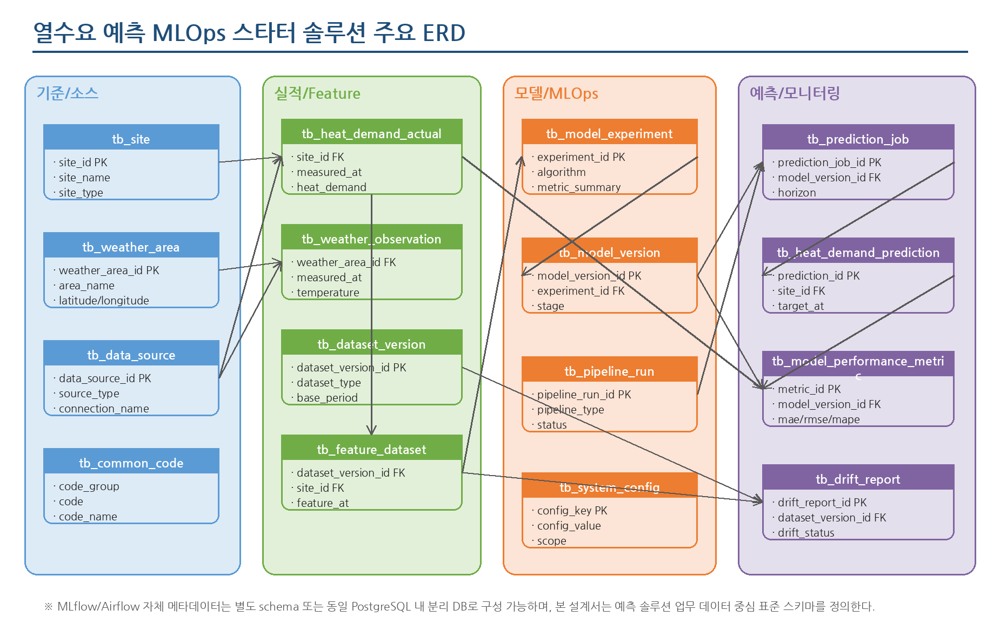

**THERMOps: 열수요 예측 모델 운영 자동화 플랫폼  
DB 설계서**

Open-source MLOps Starter Kit for Heat Demand Forecasting

| **문서 구분**   | DB 설계서                                                                |
|-----------------|--------------------------------------------------------------------------|
| **작성 기준**   | 제안 전 사전 구축형 솔루션 표준 스키마                                   |
| **대상 시스템** | THERMOps: 열수요 예측 모델 운영 자동화 플랫폼                                          |
| **작성일**      | 2026-06-24                                                               |
| **비고**        | 수주 후 발주기관 원천 데이터 구조, 운영 DBMS, 보안 정책에 따라 보완 필요 |

# 문서 이력

| **버전** | **일자**   | **주요 내용**                                          | **비고**               |
|----------|------------|--------------------------------------------------------|------------------------|
| v0.1     | 2026-06-24 | THERMOps: 열수요 예측 모델 운영 자동화 플랫폼 표준 DB 설계 초안 작성 | 제안 전 사전 구축 기준 |

# 목차

> 1\. 개요
>
> 2\. DB 구성 개요
>
> 3\. 주요 ERD
>
> 4\. 테이블 목록
>
> 5\. 테이블 상세 정의
>
> 6\. 주요 인덱스 및 제약조건
>
> 7\. 공통 코드 정의
>
> 8\. 데이터 적재·보관·삭제 기준
>
> 9\. 보안 및 개인정보 고려사항
>
> 10\. DDL 예시
>
> 11\. 후속 설계 작업

# 1. 개요

## 1.1 목적

- 본 문서는 오픈소스 기반 THERMOps: 열수요 예측 모델 운영 자동화 플랫폼의 업무 데이터 저장 구조를 정의한다.

- 과제 수주 전 사전 개발 가능한 표준 스키마를 정의하여, 수주 후 발주기관의 원천 데이터 구조에 맞춰 빠르게 매핑·적용할 수 있도록 한다.

- 열수요 실적, 기상/달력 변수, Feature 데이터셋, 모델 버전, 예측 결과, 성능 모니터링 이력을 일관된 구조로 저장하는 것을 목표로 한다.

## 1.2 설계 범위

| **구분**            | **포함 범위**                                        | **비고**                                              |
|---------------------|------------------------------------------------------|-------------------------------------------------------|
| 기준정보            | 지사/권역/공급구역, 기상권역, 공급구역-기상권역 매핑 | 수주 후 실제 조직/설비 체계에 맞춰 조정               |
| 원천/적재 데이터    | 열수요 실적, 기상 관측/예보, 달력/공휴일 기준        | 초기에는 CSV/복제 DB 기반 적용 권장                   |
| Feature/학습 데이터 | 데이터셋 버전, Feature 데이터셋                      | Feature 컬럼은 고정 컬럼+JSON 확장 구조 병행          |
| 모델/MLOps          | 실험 요약, 모델 버전, 파이프라인 실행 이력           | MLflow/Airflow 자체 메타DB와 업무 요약 DB를 분리      |
| 예측/모니터링       | 예측 작업, 예측 결과, 성능 평가, 드리프트 리포트     | 운영 자동 재학습은 제외하고 재학습 후보 판단까지 고려 |

## 1.3 설계 전제

- 스타터 솔루션 기준 DBMS는 PostgreSQL을 기본으로 하되, 실제 사업에서는 기관 표준 DBMS에 맞춰 타입과 DDL을 전환할 수 있도록 한다.

- MLflow와 Airflow의 내부 메타데이터는 별도 DB 또는 schema로 구성하고, 본 문서는 예측 업무 데이터 중심 스키마를 정의한다.

- 원천 운영계와 직접 연계하기 전에는 샘플 데이터, 파일 반입, 복제 DB를 우선 사용한다.

- 모델 파일, 리포트 HTML, 대용량 Artifact는 DB에 직접 저장하지 않고 MinIO 또는 파일 저장소 URI를 참조한다.

<table>
<colgroup>
<col style="width: 100%" />
</colgroup>
<thead>
<tr class="header">
<th><strong>설계상 주의사항 
</strong>본 설계서는 과제 수주 전 사전 구축 가능한 표준 스키마이다. 실제 발주기관의 열수요 계측 단위, 지사/공급구역 체계, 기상 데이터 제공 방식, 운영 DBMS, 보안 정책에 따라 수주 후 데이터 매핑 정의서와 물리 DDL을 확정해야 한다.</th>
</tr>
</thead>
<tbody>
</tbody>
</table>

# 2. DB 구성 개요

## 2.1 논리 스키마 구성

| **논리 영역**      | **주요 테이블**                                                                            | **설명**                                                            |
|--------------------|--------------------------------------------------------------------------------------------|---------------------------------------------------------------------|
| 기준정보 영역      | tb_site, tb_weather_area, tb_site_weather_mapping, tb_common_code                          | 예측 대상과 외부 변수 매핑 기준을 관리                              |
| 연계/적재 영역     | tb_data_source, tb_heat_demand_actual, tb_weather_observation, tb_calendar                 | 원천 데이터 적재 결과와 시간 기준 정보를 관리                       |
| Feature/학습 영역  | tb_dataset_version, tb_feature_dataset                                                     | 학습/검증/예측 데이터셋 버전과 Feature를 관리                       |
| 모델/MLOps 영역    | tb_model_experiment, tb_model_version, tb_pipeline_run, tb_system_config                   | 모델 학습 실험 요약, 모델 버전, 파이프라인 실행 이력, 설정값을 관리 |
| 예측/모니터링 영역 | tb_prediction_job, tb_heat_demand_prediction, tb_model_performance_metric, tb_drift_report | 예측 작업, 예측 결과, 성능 평가, 데이터 드리프트 리포트를 관리      |

## 2.2 저장소 구성

| **저장소**           | **용도**                                                  | **구성 방안**                                                     |
|----------------------|-----------------------------------------------------------|-------------------------------------------------------------------|
| PostgreSQL 업무 DB   | 표준 스키마, 예측 결과, 성능 평가, 운영 설정 저장         | 스타터 솔루션 기본 DBMS. 실제 사업에서는 기관 표준 DBMS 전환 가능 |
| MLflow Backend Store | 실험, 파라미터, metric, model registry 메타데이터 저장    | 업무 DB와 동일 DBMS 내 별도 schema 또는 별도 DB 구성              |
| Airflow Metadata DB  | DAG, Task 실행 이력과 스케줄 메타데이터 저장              | 운영 안정성을 위해 업무 DB와 논리 분리 권장                       |
| MinIO/Object Storage | 모델 파일, 학습 산출물, 드리프트 리포트, 대용량 파일 저장 | DB에는 URI만 저장하여 DB 용량 증가 방지                           |

# 3. 주요 ERD

아래 ERD는 THERMOps: 열수요 예측 모델 운영 자동화 플랫폼의 핵심 업무 데이터 관계를 나타낸다. 수주 후 발주기관 데이터 구조 확정 시 상세 엔티티와 관계를 보완한다.

그림 1. THERMOps: 열수요 예측 모델 운영 자동화 플랫폼 주요 ERD

# 4. 테이블 목록

| **테이블명**                | **한글명**             | **영역**     | **설명**                                                                                                       |
|-----------------------------|------------------------|--------------|----------------------------------------------------------------------------------------------------------------|
| tb_site                     | 공급구역/지사 기준정보 | 기준정보     | 열수요 예측 대상이 되는 지사, 권역, 공급구역 등 예측 단위 기준정보를 관리한다.                                 |
| tb_weather_area             | 기상권역 기준정보      | 기준정보     | 열수요 예측에 활용할 기상 관측 또는 예보 권역 기준정보를 관리한다.                                             |
| tb_site_weather_mapping     | 공급구역-기상권역 매핑 | 기준정보     | 각 예측 대상 구역에 적용할 대표 기상권역을 매핑한다.                                                           |
| tb_data_source              | 데이터 소스 관리       | 연계/적재    | CSV, DB, API 등 원천 데이터 소스 연결 정보를 관리한다. 민감한 접속정보는 별도 Secret 또는 환경변수로 관리한다. |
| tb_heat_demand_actual       | 열수요 실적            | 실적 데이터  | 예측 학습 및 성능 평가에 사용하는 시간 단위 열수요 실적 데이터를 저장한다.                                     |
| tb_weather_observation      | 기상 관측/예보 데이터  | 외부 변수    | 열수요 예측 Feature 생성에 사용하는 기상 관측 및 예보 데이터를 저장한다.                                       |
| tb_calendar                 | 달력/공휴일 기준       | 외부 변수    | 요일, 주말, 공휴일, 계절 등 시간 기반 Feature 생성을 위한 달력 기준정보를 저장한다.                            |
| tb_dataset_version          | 데이터셋 버전          | Feature/학습 | 학습, 검증, 예측에 사용한 데이터셋 버전과 생성 조건을 관리한다.                                                |
| tb_feature_dataset          | Feature 데이터셋       | Feature/학습 | 모델 학습 및 예측에 사용할 표준 Feature 데이터를 저장한다. Feature 컬럼은 공통 컬럼과 확장 JSON을 병행한다.    |
| tb_model_experiment         | 모델 실험 요약         | 모델/MLOps   | MLflow에 기록된 학습 실험의 업무 관점 요약 정보를 관리한다.                                                    |
| tb_model_version            | 모델 버전 관리         | 모델/MLOps   | 예측에 사용할 모델 버전, 상태, Artifact 위치를 관리한다.                                                       |
| tb_prediction_job           | 예측 작업              | 예측         | 배치 예측 실행 단위와 실행 상태를 관리한다.                                                                    |
| tb_heat_demand_prediction   | 열수요 예측 결과       | 예측         | 모델이 생성한 시간 단위 열수요 예측 결과를 저장한다.                                                           |
| tb_model_performance_metric | 모델 성능 평가         | 모니터링     | 예측값과 실제값을 비교한 성능 평가 결과를 관리한다.                                                            |
| tb_drift_report             | 데이터 드리프트 리포트 | 모니터링     | 학습 기준 데이터와 최근 입력 데이터 간 분포 변화 점검 결과를 관리한다.                                         |
| tb_pipeline_run             | 파이프라인 실행 이력   | 운영 이력    | Airflow DAG 또는 향후 Dagster Job 실행 이력을 업무 관점에서 관리한다.                                          |
| tb_system_config            | 시스템 설정            | 운영 설정    | 예측 단위, 임계치, 기본 모델명 등 운영 설정값을 관리한다.                                                      |
| tb_common_code              | 공통 코드              | 공통         | 상태, 유형, 구분 등 시스템 공통 코드값을 관리한다.                                                             |

# 5. 테이블 상세 정의

## 5.1 tb_site - 공급구역/지사 기준정보

열수요 예측 대상이 되는 지사, 권역, 공급구역 등 예측 단위 기준정보를 관리한다.

| **컬럼명**     | **타입**     | **키** | **NULL** | **설명**                        |
|----------------|--------------|--------|----------|---------------------------------|
| site_id        | varchar(50)  | PK     | N        | 예측 대상 지사/권역/공급구역 ID |
| site_name      | varchar(100) |        | N        | 예측 대상 명칭                  |
| site_type      | varchar(20)  |        | N        | BRANCH, REGION, AREA 등 구분    |
| parent_site_id | varchar(50)  | FK     | Y        | 상위 예측 단위 ID               |
| active_yn      | char(1)      |        | N        | 사용 여부(Y/N)                  |
| created_at     | timestamp    |        | N        | 등록 일시                       |
| updated_at     | timestamp    |        | Y        | 수정 일시                       |

## 5.2 tb_weather_area - 기상권역 기준정보

열수요 예측에 활용할 기상 관측 또는 예보 권역 기준정보를 관리한다.

| **컬럼명**      | **타입**      | **키** | **NULL** | **설명**           |
|-----------------|---------------|--------|----------|--------------------|
| weather_area_id | varchar(50)   | PK     | N        | 기상권역 ID        |
| area_name       | varchar(100)  |        | N        | 기상권역 명칭      |
| latitude        | numeric(10,6) |        | Y        | 위도               |
| longitude       | numeric(10,6) |        | Y        | 경도               |
| provider        | varchar(50)   |        | Y        | 기상 데이터 제공처 |
| active_yn       | char(1)       |        | N        | 사용 여부(Y/N)     |
| created_at      | timestamp     |        | N        | 등록 일시          |

## 5.3 tb_site_weather_mapping - 공급구역-기상권역 매핑

각 예측 대상 구역에 적용할 대표 기상권역을 매핑한다.

| **컬럼명**      | **타입**    | **키** | **NULL** | **설명**         |
|-----------------|-------------|--------|----------|------------------|
| mapping_id      | bigserial   | PK     | N        | 매핑 ID          |
| site_id         | varchar(50) | FK     | N        | 공급구역/지사 ID |
| weather_area_id | varchar(50) | FK     | N        | 대표 기상권역 ID |
| priority_no     | integer     |        | N        | 우선순위         |
| valid_from      | date        |        | Y        | 적용 시작일      |
| valid_to        | date        |        | Y        | 적용 종료일      |
| active_yn       | char(1)     |        | N        | 사용 여부(Y/N)   |

## 5.4 tb_data_source - 데이터 소스 관리

CSV, DB, API 등 원천 데이터 소스 연결 정보를 관리한다. 민감한 접속정보는 별도 Secret 또는 환경변수로 관리한다.

| **컬럼명**      | **타입**     | **키** | **NULL** | **설명**                       |
|-----------------|--------------|--------|----------|--------------------------------|
| data_source_id  | varchar(50)  | PK     | N        | 데이터 소스 ID                 |
| source_name     | varchar(100) |        | N        | 데이터 소스 명칭               |
| source_type     | varchar(20)  |        | N        | CSV, DB, API                   |
| source_category | varchar(30)  |        | N        | HEAT, WEATHER, CALENDAR 등     |
| connection_ref  | varchar(200) |        | Y        | 접속정보 참조키 또는 파일 경로 |
| load_cycle      | varchar(20)  |        | Y        | DAILY, HOURLY, MANUAL          |
| active_yn       | char(1)      |        | N        | 사용 여부(Y/N)                 |
| created_at      | timestamp    |        | N        | 등록 일시                      |

## 5.5 tb_heat_demand_actual - 열수요 실적

예측 학습 및 성능 평가에 사용하는 시간 단위 열수요 실적 데이터를 저장한다.

| **컬럼명**    | **타입**      | **키** | **NULL** | **설명**                            |
|---------------|---------------|--------|----------|-------------------------------------|
| actual_id     | bigserial     | PK     | N        | 열수요 실적 ID                      |
| site_id       | varchar(50)   | FK     | N        | 예측 대상 ID                        |
| measured_at   | timestamp     |        | N        | 실적 측정 시각                      |
| heat_demand   | numeric(18,6) |        | N        | 열수요 실적값                       |
| supply_temp   | numeric(10,3) |        | Y        | 공급온도                            |
| return_temp   | numeric(10,3) |        | Y        | 회수온도                            |
| flow_rate     | numeric(18,6) |        | Y        | 유량                                |
| quality_flag  | varchar(20)   |        | Y        | NORMAL, MISSING, OUTLIER, ESTIMATED |
| source_system | varchar(100)  |        | Y        | 원천 시스템명                       |
| loaded_at     | timestamp     |        | N        | 적재 일시                           |

## 5.6 tb_weather_observation - 기상 관측/예보 데이터

열수요 예측 Feature 생성에 사용하는 기상 관측 및 예보 데이터를 저장한다.

| **컬럼명**      | **타입**      | **키** | **NULL** | **설명**                 |
|-----------------|---------------|--------|----------|--------------------------|
| weather_id      | bigserial     | PK     | N        | 기상 데이터 ID           |
| weather_area_id | varchar(50)   | FK     | N        | 기상권역 ID              |
| measured_at     | timestamp     |        | N        | 관측 또는 예보 기준 시각 |
| data_type       | varchar(20)   |        | N        | OBSERVED, FORECAST       |
| temperature     | numeric(10,3) |        | Y        | 외기온도                 |
| humidity        | numeric(10,3) |        | Y        | 습도                     |
| wind_speed      | numeric(10,3) |        | Y        | 풍속                     |
| rainfall        | numeric(10,3) |        | Y        | 강수량                   |
| apparent_temp   | numeric(10,3) |        | Y        | 체감온도                 |
| loaded_at       | timestamp     |        | N        | 적재 일시                |

## 5.7 tb_calendar - 달력/공휴일 기준

요일, 주말, 공휴일, 계절 등 시간 기반 Feature 생성을 위한 달력 기준정보를 저장한다.

| **컬럼명**    | **타입**     | **키** | **NULL** | **설명**                       |
|---------------|--------------|--------|----------|--------------------------------|
| calendar_date | date         | PK     | N        | 기준 일자                      |
| day_of_week   | integer      |        | N        | 요일(1~7)                      |
| is_weekend    | char(1)      |        | N        | 주말 여부(Y/N)                 |
| is_holiday    | char(1)      |        | N        | 공휴일 여부(Y/N)               |
| holiday_name  | varchar(100) |        | Y        | 공휴일 명칭                    |
| season        | varchar(20)  |        | Y        | SPRING, SUMMER, AUTUMN, WINTER |
| created_at    | timestamp    |        | N        | 등록 일시                      |

## 5.8 tb_dataset_version - 데이터셋 버전

학습, 검증, 예측에 사용한 데이터셋 버전과 생성 조건을 관리한다.

| **컬럼명**          | **타입**     | **키** | **NULL** | **설명**                            |
|---------------------|--------------|--------|----------|-------------------------------------|
| dataset_version_id  | varchar(80)  | PK     | N        | 데이터셋 버전 ID                    |
| dataset_type        | varchar(30)  |        | N        | TRAIN, VALIDATION, TEST, PREDICTION |
| base_start_at       | timestamp    |        | Y        | 기준 데이터 시작 시각               |
| base_end_at         | timestamp    |        | Y        | 기준 데이터 종료 시각               |
| feature_config_hash | varchar(128) |        | Y        | Feature 설정 해시                   |
| record_count        | integer      |        | Y        | 레코드 수                           |
| created_by          | varchar(50)  |        | Y        | 생성자 또는 파이프라인              |
| created_at          | timestamp    |        | N        | 생성 일시                           |

## 5.9 tb_feature_dataset - Feature 데이터셋

모델 학습 및 예측에 사용할 표준 Feature 데이터를 저장한다. Feature 컬럼은 공통 컬럼과 확장 JSON을 병행한다.

| **컬럼명**         | **타입**      | **키** | **NULL** | **설명**               |
|--------------------|---------------|--------|----------|------------------------|
| feature_id         | bigserial     | PK     | N        | Feature 데이터 ID      |
| dataset_version_id | varchar(80)   | FK     | N        | 데이터셋 버전 ID       |
| site_id            | varchar(50)   | FK     | N        | 예측 대상 ID           |
| feature_at         | timestamp     |        | N        | Feature 기준 시각      |
| target_heat_demand | numeric(18,6) |        | Y        | 학습용 정답 열수요     |
| temp               | numeric(10,3) |        | Y        | 기온 Feature           |
| humidity           | numeric(10,3) |        | Y        | 습도 Feature           |
| lag_24h_demand     | numeric(18,6) |        | Y        | 24시간 전 열수요       |
| lag_168h_demand    | numeric(18,6) |        | Y        | 168시간 전 열수요      |
| rolling_24h_avg    | numeric(18,6) |        | Y        | 24시간 이동평균        |
| feature_json       | jsonb         |        | Y        | 추가 Feature 확장 컬럼 |
| created_at         | timestamp     |        | N        | 생성 일시              |

## 5.10 tb_model_experiment - 모델 실험 요약

MLflow에 기록된 학습 실험의 업무 관점 요약 정보를 관리한다.

| **컬럼명**         | **타입**    | **키** | **NULL** | **설명**                    |
|--------------------|-------------|--------|----------|-----------------------------|
| experiment_id      | varchar(80) | PK     | N        | 실험 ID                     |
| mlflow_run_id      | varchar(80) |        | Y        | MLflow Run ID               |
| dataset_version_id | varchar(80) | FK     | N        | 학습 데이터셋 버전 ID       |
| algorithm          | varchar(50) |        | N        | LightGBM, XGBoost 등        |
| parameter_json     | jsonb       |        | Y        | 학습 파라미터               |
| metric_json        | jsonb       |        | Y        | 주요 성능 지표              |
| trained_at         | timestamp   |        | N        | 학습 일시                   |
| created_by         | varchar(50) |        | Y        | 학습 실행자 또는 파이프라인 |

## 5.11 tb_model_version - 모델 버전 관리

예측에 사용할 모델 버전, 상태, Artifact 위치를 관리한다.

| **컬럼명**          | **타입**     | **키** | **NULL** | **설명**                      |
|---------------------|--------------|--------|----------|-------------------------------|
| model_version_id    | varchar(80)  | PK     | N        | 모델 버전 ID                  |
| model_name          | varchar(100) |        | N        | 모델명                        |
| experiment_id       | varchar(80)  | FK     | N        | 실험 ID                       |
| mlflow_model_uri    | varchar(500) |        | Y        | MLflow 모델 URI               |
| artifact_uri        | varchar(500) |        | Y        | MinIO 등 Artifact 위치        |
| model_stage         | varchar(20)  |        | N        | CANDIDATE, CHAMPION, ARCHIVED |
| metric_summary_json | jsonb        |        | Y        | 대표 성능 요약                |
| registered_at       | timestamp    |        | N        | 등록 일시                     |

## 5.12 tb_prediction_job - 예측 작업

배치 예측 실행 단위와 실행 상태를 관리한다.

| **컬럼명**         | **타입**    | **키** | **NULL** | **설명**                         |
|--------------------|-------------|--------|----------|----------------------------------|
| prediction_job_id  | varchar(80) | PK     | N        | 예측 작업 ID                     |
| pipeline_run_id    | varchar(80) | FK     | Y        | 파이프라인 실행 ID               |
| model_version_id   | varchar(80) | FK     | N        | 사용 모델 버전 ID                |
| prediction_horizon | varchar(20) |        | N        | D_PLUS_1, D_PLUS_7, CUSTOM       |
| target_start_at    | timestamp   |        | N        | 예측 대상 시작 시각              |
| target_end_at      | timestamp   |        | N        | 예측 대상 종료 시각              |
| job_status         | varchar(20) |        | N        | QUEUED, RUNNING, SUCCESS, FAILED |
| created_at         | timestamp   |        | N        | 작업 생성 일시                   |
| finished_at        | timestamp   |        | Y        | 작업 종료 일시                   |

## 5.13 tb_heat_demand_prediction - 열수요 예측 결과

모델이 생성한 시간 단위 열수요 예측 결과를 저장한다.

| **컬럼명**        | **타입**      | **키** | **NULL** | **설명**          |
|-------------------|---------------|--------|----------|-------------------|
| prediction_id     | bigserial     | PK     | N        | 예측 결과 ID      |
| prediction_job_id | varchar(80)   | FK     | N        | 예측 작업 ID      |
| site_id           | varchar(50)   | FK     | N        | 예측 대상 ID      |
| target_at         | timestamp     |        | N        | 예측 대상 시각    |
| predicted_demand  | numeric(18,6) |        | N        | 예측 열수요       |
| lower_bound       | numeric(18,6) |        | Y        | 예측 하한         |
| upper_bound       | numeric(18,6) |        | Y        | 예측 상한         |
| model_version_id  | varchar(80)   | FK     | N        | 사용 모델 버전 ID |
| created_at        | timestamp     |        | N        | 예측 생성 일시    |

## 5.14 tb_model_performance_metric - 모델 성능 평가

예측값과 실제값을 비교한 성능 평가 결과를 관리한다.

| **컬럼명**       | **타입**      | **키** | **NULL** | **설명**           |
|------------------|---------------|--------|----------|--------------------|
| metric_id        | bigserial     | PK     | N        | 성능 평가 ID       |
| site_id          | varchar(50)   | FK     | N        | 평가 대상 ID       |
| model_version_id | varchar(80)   | FK     | N        | 모델 버전 ID       |
| eval_start_at    | timestamp     |        | N        | 평가 시작 시각     |
| eval_end_at      | timestamp     |        | N        | 평가 종료 시각     |
| mae              | numeric(18,6) |        | Y        | 평균절대오차       |
| rmse             | numeric(18,6) |        | Y        | 평균제곱근오차     |
| mape             | numeric(18,6) |        | Y        | 평균절대백분율오차 |
| sample_count     | integer       |        | Y        | 평가 샘플 수       |
| created_at       | timestamp     |        | N        | 평가 생성 일시     |

## 5.15 tb_drift_report - 데이터 드리프트 리포트

학습 기준 데이터와 최근 입력 데이터 간 분포 변화 점검 결과를 관리한다.

| **컬럼명**         | **타입**     | **키** | **NULL** | **설명**                   |
|--------------------|--------------|--------|----------|----------------------------|
| drift_report_id    | varchar(80)  | PK     | N        | 드리프트 리포트 ID         |
| dataset_version_id | varchar(80)  | FK     | N        | 비교 대상 데이터셋 버전 ID |
| model_version_id   | varchar(80)  | FK     | Y        | 관련 모델 버전 ID          |
| base_period        | varchar(100) |        | Y        | 기준 데이터 기간           |
| current_period     | varchar(100) |        | Y        | 비교 데이터 기간           |
| drift_status       | varchar(20)  |        | N        | NORMAL, WARNING, DRIFT     |
| drift_score_json   | jsonb        |        | Y        | Feature별 drift score      |
| report_uri         | varchar(500) |        | Y        | HTML/JSON 리포트 위치      |
| created_at         | timestamp    |        | N        | 생성 일시                  |

## 5.16 tb_pipeline_run - 파이프라인 실행 이력

Airflow DAG 또는 향후 Dagster Job 실행 이력을 업무 관점에서 관리한다.

| **컬럼명**          | **타입**     | **키** | **NULL** | **설명**                                             |
|---------------------|--------------|--------|----------|------------------------------------------------------|
| pipeline_run_id     | varchar(80)  | PK     | N        | 파이프라인 실행 ID                                   |
| pipeline_type       | varchar(30)  |        | N        | INGESTION, FEATURE, TRAINING, PREDICTION, MONITORING |
| orchestrator        | varchar(30)  |        | N        | AIRFLOW, DAGSTER                                     |
| orchestrator_run_id | varchar(120) |        | Y        | 오케스트레이터 내부 Run ID                           |
| run_status          | varchar(20)  |        | N        | RUNNING, SUCCESS, FAILED, CANCELED                   |
| started_at          | timestamp    |        | N        | 시작 일시                                            |
| finished_at         | timestamp    |        | Y        | 종료 일시                                            |
| message             | text         |        | Y        | 실행 메시지 또는 오류 내용                           |

## 5.17 tb_system_config - 시스템 설정

예측 단위, 임계치, 기본 모델명 등 운영 설정값을 관리한다.

| **컬럼명**   | **타입**     | **키** | **NULL** | **설명**                      |
|--------------|--------------|--------|----------|-------------------------------|
| config_key   | varchar(100) | PK     | N        | 설정 키                       |
| config_value | text         |        | Y        | 설정 값                       |
| config_type  | varchar(20)  |        | Y        | STRING, NUMBER, BOOLEAN, JSON |
| scope        | varchar(50)  |        | Y        | GLOBAL, SITE, MODEL 등        |
| description  | varchar(500) |        | Y        | 설정 설명                     |
| updated_by   | varchar(50)  |        | Y        | 수정자                        |
| updated_at   | timestamp    |        | Y        | 수정 일시                     |

## 5.18 tb_common_code - 공통 코드

상태, 유형, 구분 등 시스템 공통 코드값을 관리한다.

| **컬럼명**  | **타입**     | **키** | **NULL** | **설명**       |
|-------------|--------------|--------|----------|----------------|
| code_group  | varchar(50)  | PK     | N        | 코드 그룹      |
| code        | varchar(50)  | PK     | N        | 코드           |
| code_name   | varchar(100) |        | N        | 코드명         |
| sort_order  | integer      |        | Y        | 정렬 순서      |
| active_yn   | char(1)      |        | N        | 사용 여부(Y/N) |
| description | varchar(500) |        | Y        | 코드 설명      |
| created_at  | timestamp    |        | N        | 등록 일시      |

# 6. 주요 인덱스 및 제약조건

| **대상 테이블**             | **인덱스/제약조건**                                | **설명**                                     |
|-----------------------------|----------------------------------------------------|----------------------------------------------|
| tb_heat_demand_actual       | UNIQUE(site_id, measured_at)                       | 동일 예측 대상/측정시각 중복 실적 방지       |
| tb_heat_demand_actual       | INDEX(site_id, measured_at DESC)                   | 기간별 실적 조회, 학습 데이터 추출 성능 확보 |
| tb_weather_observation      | UNIQUE(weather_area_id, measured_at, data_type)    | 동일 기상권역/시각/유형 중복 방지            |
| tb_weather_observation      | INDEX(weather_area_id, measured_at DESC)           | Feature 생성 시 기상 데이터 조인 성능 확보   |
| tb_feature_dataset          | INDEX(dataset_version_id, site_id, feature_at)     | 학습/예측 데이터셋 추출 성능 확보            |
| tb_heat_demand_prediction   | UNIQUE(prediction_job_id, site_id, target_at)      | 동일 작업 내 중복 예측 결과 방지             |
| tb_heat_demand_prediction   | INDEX(site_id, target_at DESC)                     | 예측 결과 조회 및 실제값 매칭 성능 확보      |
| tb_model_performance_metric | INDEX(site_id, model_version_id, eval_end_at DESC) | 모델/구역별 성능 추이 조회                   |
| tb_pipeline_run             | INDEX(pipeline_type, run_status, started_at DESC)  | 파이프라인 실행 상태 조회                    |
| tb_drift_report             | INDEX(dataset_version_id, created_at DESC)         | 데이터셋별 드리프트 리포트 조회              |

<table>
<colgroup>
<col style="width: 100%" />
</colgroup>
<thead>
<tr class="header">
<th><strong>제약조건 설계 원칙 
</strong>실적·기상·예측 결과처럼 시간 단위 중복이 발생하면 모델 학습과 성능 평가가 왜곡될 수 있다. 따라서 site_id, weather_area_id, measured_at, target_at 등 시간축 컬럼을 중심으로 유니크 제약과 조회 인덱스를 우선 적용한다.</th>
</tr>
</thead>
<tbody>
</tbody>
</table>

# 7. 공통 코드 정의

| **코드 그룹**      | **코드**   | **코드명/설명**        |
|--------------------|------------|------------------------|
| SITE_TYPE          | BRANCH     | 지사                   |
| SITE_TYPE          | REGION     | 권역                   |
| SITE_TYPE          | AREA       | 공급구역               |
| SOURCE_TYPE        | CSV        | CSV/파일               |
| SOURCE_TYPE        | DB         | DB 연계                |
| SOURCE_TYPE        | API        | API 연계               |
| SOURCE_CATEGORY    | HEAT       | 열수요                 |
| SOURCE_CATEGORY    | WEATHER    | 기상                   |
| SOURCE_CATEGORY    | CALENDAR   | 달력/공휴일            |
| DATASET_TYPE       | TRAIN      | 학습 데이터셋          |
| DATASET_TYPE       | VALIDATION | 검증 데이터셋          |
| DATASET_TYPE       | TEST       | 테스트 데이터셋        |
| DATASET_TYPE       | PREDICTION | 예측 입력 데이터셋     |
| MODEL_STAGE        | CANDIDATE  | 후보 모델              |
| MODEL_STAGE        | CHAMPION   | 운영 후보/대표 모델    |
| MODEL_STAGE        | ARCHIVED   | 보관 모델              |
| PIPELINE_TYPE      | INGESTION  | 데이터 적재            |
| PIPELINE_TYPE      | FEATURE    | Feature 생성           |
| PIPELINE_TYPE      | TRAINING   | 모델 학습              |
| PIPELINE_TYPE      | PREDICTION | 배치 예측              |
| PIPELINE_TYPE      | MONITORING | 성능/드리프트 모니터링 |
| RUN_STATUS         | RUNNING    | 실행 중                |
| RUN_STATUS         | SUCCESS    | 성공                   |
| RUN_STATUS         | FAILED     | 실패                   |
| RUN_STATUS         | CANCELED   | 취소                   |
| PREDICTION_HORIZON | D_PLUS_1   | 익일 예측              |
| PREDICTION_HORIZON | D_PLUS_7   | 7일 예측               |
| PREDICTION_HORIZON | CUSTOM     | 사용자 정의 기간       |
| DRIFT_STATUS       | NORMAL     | 정상                   |
| DRIFT_STATUS       | WARNING    | 주의                   |
| DRIFT_STATUS       | DRIFT      | 분포 변화 감지         |

# 8. 데이터 적재·보관·삭제 기준

| **데이터 구분**      | **적재 주기**          | **보관 기준**                                | **비고**                                                    |
|----------------------|------------------------|----------------------------------------------|-------------------------------------------------------------|
| 열수요 실적          | 시간/일 단위 배치      | 최소 3~5년 권장                              | 모델 학습과 계절성 분석을 위해 장기 보관 필요               |
| 기상 관측/예보       | 시간/일 단위 배치      | 최소 3~5년 권장                              | 기상 제공처와 데이터 라이선스 확인 필요                     |
| Feature 데이터셋     | 학습/예측 실행 시 생성 | 학습 재현 필요 기간 동안 보관                | 장기 보관 시 원천+Feature 설정으로 재생성 가능하도록 정책화 |
| 모델 실험/버전       | 학습 실행 시 생성      | 주요 모델은 장기 보관, 실패 실험은 정리 가능 | MLflow Artifact와 업무 DB 참조 정합성 유지                  |
| 예측 결과            | 예측 배치 실행 시 생성 | 최소 2~3년 권장                              | 성능 추세와 운영 리포팅에 활용                              |
| 성능/드리프트 리포트 | 일/주/월 단위          | 최소 1~3년 권장                              | 리포트 파일은 Object Storage URI로 관리                     |
| 파이프라인 실행 이력 | 실행 시 생성           | 최소 1년 권장                                | 장애 분석과 재처리 이력 확인                                |

# 9. 보안 및 개인정보 고려사항

- 열수요 예측 데이터는 일반적으로 개인정보를 포함하지 않지만, 운영계 접속정보와 내부 설비/공급구역 정보는 보안 관리 대상이 될 수 있다.

- DB 접속 계정, API Key, 파일 저장소 Secret은 tb_data_source에 평문 저장하지 않고 환경변수, Secret Manager, 별도 보안 저장소로 관리한다.

- 예측 결과 API 제공 시 조회 권한, 호출 로그, 서비스 계정 분리, 네트워크 접근 제어를 적용한다.

- 운영계 원천 DB 직접 조회 시 읽기 전용 계정을 사용하고, 초기 적용 단계에서는 복제 DB 또는 파일 반입 방식을 우선 검토한다.

- 모델 Artifact와 리포트 파일은 접근권한이 제한된 Object Storage Bucket에 저장하고 DB에는 URI만 저장한다.

# 10. DDL 예시

아래 DDL은 PostgreSQL 기준 예시이며, 실제 사업 적용 시 발주기관 표준 DBMS와 네이밍 규칙에 맞춰 조정한다.

<table>
<colgroup>
<col style="width: 100%" />
</colgroup>
<thead>
<tr class="header">
<th>CREATE TABLE tb_site ( 
site_id varchar(50) PRIMARY KEY, 
site_name varchar(100) NOT NULL, 
site_type varchar(20) NOT NULL, 
parent_site_id varchar(50), 
active_yn char(1) NOT NULL DEFAULT 'Y', 
created_at timestamp NOT NULL DEFAULT now(), 
updated_at timestamp 
); 
 
CREATE TABLE tb_heat_demand_actual ( 
actual_id bigserial PRIMARY KEY, 
site_id varchar(50) NOT NULL REFERENCES tb_site(site_id), 
measured_at timestamp NOT NULL, 
heat_demand numeric(18,6) NOT NULL, 
supply_temp numeric(10,3), 
return_temp numeric(10,3), 
flow_rate numeric(18,6), 
quality_flag varchar(20), 
source_system varchar(100), 
loaded_at timestamp NOT NULL DEFAULT now(), 
CONSTRAINT uk_heat_actual UNIQUE(site_id, measured_at) 
); 
 
CREATE INDEX ix_heat_actual_site_time 
ON tb_heat_demand_actual(site_id, measured_at DESC);</th>
</tr>
</thead>
<tbody>
</tbody>
</table>

<table>
<colgroup>
<col style="width: 100%" />
</colgroup>
<thead>
<tr class="header">
<th>CREATE TABLE tb_model_version ( 
model_version_id varchar(80) PRIMARY KEY, 
model_name varchar(100) NOT NULL, 
experiment_id varchar(80) NOT NULL, 
mlflow_model_uri varchar(500), 
artifact_uri varchar(500), 
model_stage varchar(20) NOT NULL, 
metric_summary_json jsonb, 
registered_at timestamp NOT NULL DEFAULT now() 
); 
 
CREATE TABLE tb_heat_demand_prediction ( 
prediction_id bigserial PRIMARY KEY, 
prediction_job_id varchar(80) NOT NULL, 
site_id varchar(50) NOT NULL REFERENCES tb_site(site_id), 
target_at timestamp NOT NULL, 
predicted_demand numeric(18,6) NOT NULL, 
lower_bound numeric(18,6), 
upper_bound numeric(18,6), 
model_version_id varchar(80) NOT NULL REFERENCES tb_model_version(model_version_id), 
created_at timestamp NOT NULL DEFAULT now(), 
CONSTRAINT uk_heat_prediction UNIQUE(prediction_job_id, site_id, target_at) 
); 
 
CREATE INDEX ix_heat_prediction_site_time 
ON tb_heat_demand_prediction(site_id, target_at DESC);</th>
</tr>
</thead>
<tbody>
</tbody>
</table>

# 11. 후속 설계 작업

| **우선순위** | **후속 설계 작업**     | **주요 내용**                                                                  | **산출물 예시**                             |
|--------------|------------------------|--------------------------------------------------------------------------------|---------------------------------------------|
| 1            | 데이터 매핑 정의서     | 발주기관 원천 열수요/기상/운영 데이터 컬럼을 표준 스키마에 매핑                | 소스-타겟 매핑표, 데이터 변환 규칙          |
| 2            | 배치/파이프라인 설계서 | Airflow DAG 또는 Dagster Job 단위, 실행 주기, 실패 재처리, 의존성 정의         | DAG 목록, Task 정의, 재처리 정책            |
| 3            | API 설계서             | 예측 결과 조회, 모델 성능 조회, 파이프라인 상태 조회 API 정의                  | API 명세서, 요청/응답 JSON, 오류코드        |
| 4            | 화면 설계서            | 예측 결과, 성능 추이, 모델 버전, 파이프라인 실행 이력 화면 정의                | 화면 목록, UI 흐름, 와이어프레임            |
| 5            | 모델 학습/평가 설계서  | Baseline, LightGBM/XGBoost 등 알고리즘, Feature 목록, 성능지표, 검증 방법 정의 | 모델 설계서, Feature 정의서, 평가 기준      |
| 6            | 설치/배포 설계서       | Docker Compose/Helm, 환경변수, 포트, 볼륨, 백업, 로그 경로 정의                | 설치가이드, 배포 구성도, 환경설정표         |
| 7            | 보안/권한 설계서       | 계정, DB 권한, API 인증, Secret 관리, 네트워크 접근 제어 정의                  | 권한 매트릭스, 보안 설정표                  |
| 8            | 운영/모니터링 설계서   | 장애 감지, 성능 저하 기준, 드리프트 기준, 알림, 재학습 후보 판단 정의          | 운영 절차서, 모니터링 항목 정의             |
| 9            | 테스트 설계서          | 데이터 적재, 학습, 예측, API, 배치 실패/재처리, 성능 검증 테스트 정의          | 테스트 시나리오, 테스트 케이스, 결과서 양식 |

<table>
<colgroup>
<col style="width: 100%" />
</colgroup>
<thead>
<tr class="header">
<th><strong>다음 단계 추천 
</strong>가장 먼저 데이터 매핑 정의서와 배치/파이프라인 설계서를 작성하는 것이 좋다. DB 스키마는 원천 데이터 컬럼 구조와 파이프라인 처리 방식에 따라 일부 조정될 수 있으므로, 두 문서가 확정되면 DB 설계서를 v0.2로 보완하는 흐름이 적절하다.</th>
</tr>
</thead>
<tbody>
</tbody>
</table>
