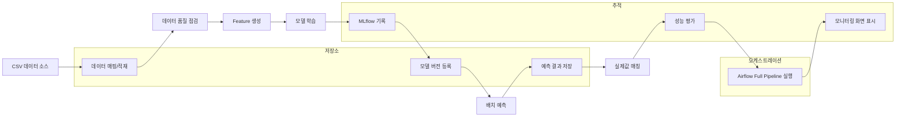

# THERMOps P0 완료 정리

> **문서 버전:** P0 완료 (2026-06)  
> **대상:** 내부 공유, 후속 개발, 제안·설명 자료 작성 시 참고  
> **데이터 기준:** 개발 샘플 CSV 및 시드 DB — 사업 적용 시 원천·운영 환경에 맞춰 재검증 필요

---

## 1. 개요

### THERMOps의 목적

THERMOps는 **열수요 예측 모델 운영 자동화 플랫폼**이다. 데이터 적재, 품질 점검, Feature 생성, 모델 학습, 배치 예측, 성능 평가, 워크플로 오케스트레이션을 하나의 MLOps 루프로 연결하고, 운영자가 웹 UI와 API로 전 과정을 확인·실행할 수 있도록 한다.

### P0 완료 기준

P0 단계의 완료 기준은 다음과 같다.

- CSV 기반 **실제 데이터 적재** API 및 DB 저장
- **데이터 품질 점검** 실제 로직 및 이력 저장
- **Feature Dataset 생성** 실제 로직
- **모델 학습** (LightGBM / sklearn fallback / baseline) 및 **MLflow** 실험 기록
- **모델 버전** DB 등록 및 Registry 조회
- **배치 예측** 및 예측 결과 DB 저장
- **예측–실제값 매칭** 및 성능 평가·모니터링
- **Airflow DAG** 7개 등록 및 Backend ↔ Airflow 실연동
- **Full Pipeline E2E** (`thermops_full_pipeline_dag`) 성공
- 핵심 화면/API **Mock 제거** (SystemConfig, eval_type, prediction-trend 등)
- 검증 스크립트·smoke test·frontend build **전체 통과**

### P0 버전의 의미

P0는 **“CSV 기반 MLOps 전체 루프가 실제로 동작하는 1차 완성 버전”** 이다. 시연·PoC·내부 검증 목적으로 설계·구현·테스트가 완료되었으며, DB/API/SCADA 연계, 2-Stage CatBoost, Drift 자동화, 인증 등은 P1 이후 확장 대상으로 남긴다.

---

## 2. P0 완료 요약

| 영역 | P0 구현 내용 |
|------|----------------|
| **CSV 기반 데이터 적재** | 열수요·기상 CSV 업로드/경로 적재, 매핑 기반 `tb_heat_demand_actual` / `tb_weather_observation` 저장 |
| **데이터 품질 점검** | 결측·중복·시간 간격·이상치·참조 정합성 점검, `tb_data_quality_run` 저장 |
| **Feature Dataset 생성** | Feature Set 정의 기반 lag/rolling/기상 Feature 생성, `tb_feature_dataset` 저장 |
| **모델 학습** | Training Config 기반 LightGBM 학습, 검증 지표 산출 |
| **MLflow 실험 기록** | 파라미터·지표·아티팩트 MLflow Tracking, MinIO artifact 저장 |
| **모델 버전 저장** | `tb_model_experiment`, `tb_model_version` 등록, Champion 지정 API |
| **배치 예측** | Feature Dataset 기간 내 배치 예측, `tb_heat_demand_prediction` 저장 |
| **실제값 매칭 및 성능 평가** | 예측–실적 join, MAPE/MAE/RMSE/R², `tb_prediction_actual_match`, `tb_model_performance_metric` |
| **Airflow DAG orchestration** | 7개 DAG, Backend trigger → DAG → Backend API → `tb_pipeline_run` 상태 갱신 |
| **PipelineRuns 화면** | 실행 이력, Airflow run ID, `result_summary` 단계별 결과, 자동 갱신 |
| **주요 Mock 제거** | SystemConfig localStorage 제거, performance `eval_type` 구분, prediction-trend dummy 제거 |

---

## 3. 전체 MLOps 흐름



**흐름 설명**

1. CSV 파일 또는 시드 데이터 소스에서 열수요·기상 데이터를 적재한다.
2. 품질 점검 후 Feature Set으로 Feature Dataset을 생성한다.
3. 학습 Job이 모델을 학습하고 MLflow·모델 Registry에 기록한다.
4. 배치 예측 Job이 예측값을 DB에 저장한다.
5. 평가 API가 실적과 매칭하여 성능 지표를 산출한다.
6. 위 단계는 개별 API 또는 Airflow Full Pipeline으로 일괄 실행할 수 있다.
7. 대시보드·모니터링·예측 결과 화면에서 결과를 조회한다.

---

## 4. 시스템 구성

| 계층 | 기술 | 역할 |
|------|------|------|
| **Frontend** | React + Vite + TypeScript | 운영 UI (대시보드, 데이터, Feature, 모델, 예측, 파이프라인, 설정) |
| **Backend** | FastAPI | REST API `/api/v1`, 비즈니스 로직, DB·MLflow·Airflow 연동 |
| **DB** | PostgreSQL 15 | 운영 메타·적재·Feature·모델·예측·파이프라인 이력 |
| **Workflow** | Apache Airflow 2.x | DAG 스케줄·수동 실행, Backend API 호출 |
| **Experiment Tracking** | MLflow | 학습 실험·모델 아티팩트 추적 |
| **Object Storage** | MinIO (S3 호환) | MLflow artifact 저장 |
| **ML** | LightGBM / sklearn fallback / baseline | 열수요 예측 모델 (P0는 구조·연동 중심) |
| **실행** | Docker Compose | postgres, backend, frontend, airflow, mlflow, minio 일괄 기동 |

**연동 흐름 (P0-7)**

```
Frontend/API → Backend → Airflow REST (trigger/unpause)
                ↑              ↓
                └── DAG task → Backend API → DB 상태 갱신
```

---

## 5. 주요 기능별 구현 현황

| 기능 영역 | 구현 내용 | 주요 API | 주요 테이블 | 검증 스크립트 | 상태 |
|-----------|-----------|----------|-------------|---------------|------|
| **데이터 소스/적재** | CSV 업로드·경로 적재, 매핑 검증, ingestion job | `POST /ingestion-jobs`, `GET /data-sources`, `GET/POST /mappings` | `tb_data_source`, `tb_data_mapping`, `tb_heat_demand_actual`, `tb_weather_observation` | `test_csv_ingestion.py` | ✅ 완료 |
| **데이터 품질 점검** | HEAT_DEMAND/WEATHER 도메인 품질 규칙 | `POST /data-quality/checks`, `GET /data-quality/runs` | `tb_data_quality_run` | `test_data_quality.py` | ✅ 완료 |
| **Feature 생성** | Feature Set preview/build, dataset version | `POST /feature-sets/{id}/preview`, `POST /feature-build-jobs` | `tb_feature`, `tb_feature_set`, `tb_feature_dataset`, `tb_dataset_version` | `test_feature_build.py` | ✅ 완료 |
| **모델 학습** | Config 기반 학습, MLflow run, 모델 등록 | `POST /training-jobs`, `GET /training-configs` | `tb_training_config`, `tb_training_job`, `tb_model_experiment` | `test_model_training.py` | ✅ 완료 |
| **모델 Registry** | 버전 목록, Champion 지정, stage 변경 | `GET /models`, `POST /models/{name}/versions/{ver}/champion` | `tb_model_version` | `test_model_training.py` | ✅ 완료 |
| **배치 예측** | Feature 기간 내 예측, overwrite 옵션 | `POST /prediction-jobs`, `GET /predictions` | `tb_prediction_job`, `tb_heat_demand_prediction` | `test_batch_prediction.py` | ✅ 완료 |
| **예측 성능 평가** | 예측–실적 매칭, 오차 분석, export | `POST /predictions/evaluate`, `GET /predictions/errors` | `tb_prediction_actual_match`, `tb_model_performance_metric` | `test_prediction_evaluation.py` | ✅ 완료 |
| **대시보드/모니터링** | overview, prediction-trend, performance-metrics | `GET /dashboard/overview`, `GET /dashboard/prediction-trend`, `GET /performance-metrics` | `tb_model_performance_metric`, `tb_prediction_actual_match` | `test_prediction_trend.py`, `test_performance_eval_type.py` | ✅ 완료 |
| **Airflow Pipeline** | trigger, sync, status, 7 DAG, Full Pipeline | `GET /pipelines`, `POST /pipelines/{id}/trigger`, `GET /pipeline-runs` | `tb_pipeline_run` | `test_airflow_pipeline.py`, `test_full_pipeline_airflow.py` | ✅ 완료 |
| **시스템 설정** | DB 기반 key-value 설정 CRUD | `GET/PUT /system-configs`, `POST /system-configs/reset` | `tb_system_config` | `test_system_config.py` | ✅ 완료 |
| **Mock 제거** | localStorage·dummy chart·eval_type 하드코딩 제거 | (위 API 실연동) | — | `test_system_config.py`, `test_performance_eval_type.py`, `test_prediction_trend.py` | ✅ 1차 완료 |

**Mock 제거 1차 상세**

| 구분 | 변경 내용 |
|------|-----------|
| **A** | `SystemConfigPage` — localStorage Mock → `tb_system_config` API |
| **B** | 성능 화면 — 학습(TRAINING) vs 운영(OPERATIONAL) `eval_type` API 필터 |
| **C** | 대시보드·모니터링 — `prediction-trend` dummy 제거, DB 매칭 데이터만 사용 (없으면 empty state) |

**아직 Mock/UI 장식으로 남은 항목**

- `VITE_USER_ROLE` 기반 UI 권한 (실제 인증 아님)
- Header 사용자명·알림 등 일부 UI 장식
- Drift/재학습 후보 — 시드 데이터 기반 조회 (자동화 미구현)

---

## 6. P0에서 추가·확장된 주요 API

| API | 메서드 | 용도 | P0 단계 |
|-----|--------|------|---------|
| `/api/v1/ingestion-jobs` | POST | CSV/소스 기반 데이터 적재 실행 | P0-1 |
| `/api/v1/ingestion-jobs/{job_id}` | GET | 적재 Job 상태 조회 | P0-1 |
| `/api/v1/data-quality/checks` | POST | 품질 점검 실행 | P0-2 |
| `/api/v1/data-quality/runs` | GET | 품질 점검 이력 | P0-2 |
| `/api/v1/feature-build-jobs` | POST | Feature Dataset 생성 | P0-3 |
| `/api/v1/feature-build-jobs/{job_id}` | GET | Feature build Job 상태 | P0-3 |
| `/api/v1/training-jobs` | POST | 모델 학습 실행 | P0-4 |
| `/api/v1/training-jobs/{job_id}` | GET | 학습 Job 상태·지표 | P0-4 |
| `/api/v1/prediction-jobs` | POST | 배치 예측 실행 | P0-5 |
| `/api/v1/predictions` | GET | 예측 결과 조회 | P0-5 |
| `/api/v1/predictions/evaluate` | POST | 예측–실적 매칭 및 성능 평가 | P0-6 |
| `/api/v1/predictions/errors` | GET | 오차 분석 목록 | P0-6 |
| `/api/v1/performance-metrics` | GET | 성능 지표 (eval_type 필터) | P0-6 |
| `/api/v1/dashboard/prediction-trend` | GET | 예측·실적 추이 (실데이터) | Mock 제거 C |
| `/api/v1/pipelines` | GET | 등록된 Airflow 파이프라인 목록 | P0-7 |
| `/api/v1/pipelines/{pipeline_id}/trigger` | POST | Airflow DAG 수동 실행 | P0-7 |
| `/api/v1/pipeline-runs` | GET | 파이프라인 실행 이력 | P0-7 |
| `/api/v1/pipeline-runs/{run_id}` | GET | 실행 상세 (Airflow sync 옵션) | P0-7 |
| `/api/v1/pipeline-runs/{run_id}/status` | POST | DAG task → DB 상태 갱신 (내부) | P0-7 |
| `/api/v1/pipeline-runs/{run_id}/retry` | POST | 실패 run 재시도 | P0-7 |
| `/api/v1/system-configs` | GET/PUT | 시스템 설정 조회·수정 | Mock 제거 A |

**기존 조회 API (P0 전반에서 사용)**

- `/api/v1/data-sources`, `/api/v1/mappings`, `/api/v1/features`, `/api/v1/feature-sets`
- `/api/v1/training-configs`, `/api/v1/models`
- `/api/v1/dashboard/overview`, `/api/v1/dashboard/model-health`
- `/api/v1/drift-reports`, `/api/v1/retraining-candidates` (시드 기반 조회)

---

## 7. 주요 DB 테이블

| 테이블 | 역할 | P0 연관 단계 |
|--------|------|--------------|
| `tb_data_source` | 데이터 소스 정의 (CSV 등) | P0-1 |
| `tb_data_mapping` | 소스 컬럼 → 대상 테이블 매핑 | P0-1 |
| `tb_heat_demand_actual` | 시간별 열수요 실적 | P0-1, P0-6 |
| `tb_weather_observation` | 시간별 기상 관측 | P0-1 |
| `tb_data_quality_run` | 품질 점검 실행 이력·요약 | P0-2 |
| `tb_feature` | Feature 정의 | P0-3 |
| `tb_feature_set` | Feature Set 구성 | P0-3 |
| `tb_feature_dataset` | 생성된 Feature 행 | P0-3, P0-5 |
| `tb_training_job` | 학습 Job 이력 | P0-4 |
| `tb_model_experiment` | MLflow 연계 실험 메타 | P0-4 |
| `tb_model_version` | 모델 Registry 버전 | P0-4, P0-5 |
| `tb_model_performance_metric` | 지사·기간별 성능 지표 | P0-6 |
| `tb_prediction_job` | 배치 예측 Job | P0-5 |
| `tb_heat_demand_prediction` | 예측 결과 | P0-5 |
| `tb_prediction_actual_match` | 예측–실적 매칭·오차 | P0-6 |
| `tb_pipeline_run` | Airflow 파이프라인 실행 이력 (`result_summary` JSONB) | P0-7 |
| `tb_system_config` | 시스템 설정 key-value | Mock 제거 A |

**P0-7 스키마 보완**

- `tb_pipeline_run.result_summary` (JSONB) — 단계별 결과·XCom 요약 저장
- 기존 DB 볼륨 사용 시: `python scripts/apply_dev_migrations.py` 실행

---

## 8. Airflow DAG 구성

| DAG ID | 목적 | 호출 Backend API | 주요 입력 conf | 주요 결과 | 상태 |
|--------|------|------------------|----------------|-----------|------|
| `data_ingestion_dag` | 열수요·기상 CSV/소스 적재 | `POST /ingestion-jobs` | `source_id`, `weather_source_id`, `pipeline_run_id` | `inserted_count`, `failed_count`, jobs 목록 | ✅ |
| `data_quality_dag` | 데이터 품질 점검 | `POST /data-quality/checks` | `data_domain`, `source_id`, `site_id`, `start_at`, `end_at` | `run_id`, `quality_score`, 결측·중복 등 | ✅ |
| `feature_build_dag` | Feature Dataset 생성 | `POST /feature-build-jobs` | `feature_set_id`, `site_id`, `start_at`, `end_at` | `job_id`, `dataset_version_id`, `generated_count` | ✅ |
| `model_training_dag` | 모델 학습·MLflow 등록 | `POST /training-jobs` | `config_id`, `register_model_yn`, `site_ids` | `model_version_id`, `mlflow_run_id`, `metrics` | ✅ |
| `batch_prediction_dag` | 배치 예측 | `POST /prediction-jobs` | `feature_set_id`, `model_version_id`/`model_name`, `start_at`, `end_at` | `prediction_job_id`, `predicted_count` | ✅ |
| `monitoring_dag` | 예측–실적 매칭·성능 평가 | `POST /predictions/evaluate` | `model_version_id`, `prediction_job_id`, `start_at`, `end_at` | `matched_count`, MAPE/MAE/RMSE/R² | ✅ |
| `thermops_full_pipeline_dag` | 전체 MLOps 루프 일괄 실행 | 위 6단계 API 순차 호출 | Full conf (source, feature, config, model, 기간 등) | `result_summary.steps` 6단계 누적 | ✅ |

**Full Pipeline task 순서**

```
mark_running → data_ingestion → data_quality → feature_build
  → model_training → batch_prediction → prediction_evaluation
```

**상태·실패 처리 (P0 안정화)**

- Full Pipeline 중간 task: `tb_pipeline_run.run_status = RUNNING`, `result_summary.steps`에 단계 결과 누적
- 마지막 task(`prediction_evaluation`) 성공 시: `run_status = SUCCESS`
- Airflow task 실패 시: `on_failure_callback` → `run_status = FAILED`, `failed_step`, `error_message`, `traceback` 기록
- Backend `GET /pipeline-runs/{id}?sync_airflow=true` — Airflow state와 DB 동기화 (조회 실패 시 DB + warning)

**기본 conf 예시 (Full Pipeline trigger)**

```json
{
  "business_date": "2026-06-20",
  "parameters": {
    "source_id": "DS-CSV-001",
    "weather_source_id": "DS-CSV-002",
    "feature_set_id": "FS-TPL-LAG-ROLL",
    "config_id": "TRC-TPL-LAG-ROLL",
    "model_name": "heat_demand_lightgbm",
    "data_domain": "HEAT_DEMAND",
    "start_at": "2026-06-01",
    "end_at": "2026-06-20"
  }
}
```

---

## 9. P0 검증 결과

### 자동 테스트 (전체 PASSED)

| 스크립트 | 검증 내용 | 결과 |
|----------|-----------|------|
| `scripts/test_system_config.py` | SystemConfig API, readonly 키 보호 | PASSED |
| `scripts/test_performance_eval_type.py` | TRAINING/OPERATIONAL eval_type 필터 | PASSED |
| `scripts/test_prediction_trend.py` | prediction-trend 실데이터/empty | PASSED |
| `scripts/test_csv_ingestion.py` | CSV 적재 P0-1 | PASSED |
| `scripts/test_data_quality.py` | 품질 점검 P0-2 | PASSED |
| `scripts/test_feature_build.py` | Feature 생성 P0-3 | PASSED |
| `scripts/test_model_training.py` | 학습·MLflow·Registry P0-4 | PASSED |
| `scripts/test_batch_prediction.py` | 배치 예측 P0-5 | PASSED |
| `scripts/test_prediction_evaluation.py` | 매칭·평가 P0-6 | PASSED |
| `scripts/test_airflow_pipeline.py` | 개별 DAG (`data_quality_dag`) | PASSED |
| `scripts/test_full_pipeline_airflow.py` | Full Pipeline E2E | PASSED |
| `scripts/smoke_test_api.py` | 14 endpoints HTTP 200 | PASSED |
| `frontend npm run build` | TypeScript + Vite production build | PASSED |
| `frontend/scripts/check-pages.mjs` | 10개 주요 화면 JS error 없음 | PASSED |

> **참고:** `smoke_test_api.py`는 `/predictions`, `/pipeline-runs` 등 데이터량이 많은 API에 60초 timeout을 적용한다.

### Full Pipeline E2E 결과 (개발 샘플 데이터 기준)

P0 최종 안정화 검증(`test_full_pipeline_airflow.py`)에서 확인된 결과이다. **수치는 개발 환경·샘플 CSV·시드 DB 기준이며, 사업 환경과 다를 수 있다.**

| 항목 | 결과 |
|------|------|
| 6단계 실행 | `data_ingestion` → `data_quality` → `feature_build` → `model_training` → `batch_prediction` → `prediction_evaluation` |
| DB `run_status` | `SUCCESS` |
| Airflow dag_run state | `success` |
| XCom 체인 | `model_training.model_version_id` → `batch_prediction.model_version_id` 전달 확인 |
| XCom 체인 | `batch_prediction.prediction_job_id` → `prediction_evaluation.prediction_job_id` 전달 확인 |
| `matched_count` 예시 | **1445** (해당 검증 run 기준) |
| 소요 시간 | 약 2~5분 (환경·학습 부하에 따라 5~20분 가능) |

### 브라우저 수동 확인 (check-pages.mjs)

| 경로 | 확인 |
|------|------|
| `/dashboard` | ✅ |
| `/data/sources` | ✅ |
| `/feature-sets` | ✅ |
| `/models/training-jobs` | ✅ |
| `/predictions/jobs` | ✅ |
| `/predictions/results` | ✅ |
| `/predictions/errors` | ✅ |
| `/ops/pipeline-runs` | ✅ |
| `/ops/model-monitoring` | ✅ |
| `/system/configs` | ✅ |

Airflow UI: DAG 7개 표시, Full pipeline 실행 이력 확인.

---

## 10. P0 완료 기준 충족 여부

| 기준 | 충족 | 비고 |
|------|------|------|
| 데이터 적재 실제화 | ✅ | CSV + 매핑, upsert |
| 품질 점검 실제화 | ✅ | HEAT_DEMAND/WEATHER |
| Feature 생성 실제화 | ✅ | Feature Set 기반 build |
| 모델 학습 실제화 | ✅ | LightGBM + fallback |
| MLflow 연동 | ✅ | Tracking + MinIO artifact |
| 배치 예측 실제화 | ✅ | Feature 기간 내 예측 |
| 예측–실제값 매칭 | ✅ | evaluate API + match 테이블 |
| Airflow DAG orchestration | ✅ | 7 DAG, Backend trigger |
| Full Pipeline E2E | ✅ | 6단계 SUCCESS 검증 |
| 주요 Mock 제거 | ✅ | A/B/C 1차 완료 |
| 테스트/빌드 통과 | ✅ | 14 scripts + build + browser |

**종합:** P0 완료 기준 **충족**

---

## 11. 현재 제한사항

- **데이터 소스:** 현재 실제 연동은 **CSV 중심**. DB/API/SCADA/PI Connector는 P1 이후 확장.
- **예측 범위:** 생성된 Feature Dataset **기간 내** 배치 예측 중심. 미래 시점 D+1/D+3 예측은 **미래 기상·Feature 생성 로직** 추가 필요.
- **모델:** **2-Stage CatBoost** 미구현. P0는 LightGBM/sklearn/baseline 구조.
- **Drift/재학습:** Drift 점검·재학습 후보 **자동화** 미구현. 시드 데이터 조회·UI만 존재.
- **인증:** 로그인·SSO·JWT·세션 **1차 범위 제외**. API 무인증, `VITE_USER_ROLE`은 UI Mock.
- **UI Mock:** Header 사용자명·알림 등 일부 장식, VIEWER/ADMIN 버튼 노출 Mock.
- **DB 마이그레이션:** Alembic 등 **대규모 마이그레이션 체계 없음**. dev용 `apply_dev_migrations.py`만 제공.
- **성능:** P0는 MLOps **연동·운영 흐름** 검증 목적. 모델 튜닝·운영 SLA는 사업 단계 과제.
- **README 일부 문구:** “시드 DB + Mock API” 등 1차 범위 설명이 P0 완료 후와 일부 불일치할 수 있음 — 본 문서를 P0 기준 문서로 사용.

---

## 12. P1 후보 작업 (우선순위)

| 순위 | 작업 | 설명 |
|------|------|------|
| **1** | Drift 감지 / 재학습 후보 자동화 | 스케줄 drift-check, 임계값 기반 후보 생성, monitoring_dag 실연동 |
| **2** | DB/API 데이터소스 Connector | SCADA/PI/REST API 적재, connection test 실구현 |
| **3** | 2-Stage CatBoost 모델 고도화 | 논문 기반 2-stage 구조, Feature Set `FS-TPL-TWO-STAGE` 실학습 |
| **4** | Figma/UI 설계 보완 | 데이터 적재 범위·적재 모드·컬럼 매핑·API/SCADA 태그 매핑 화면 |
| **5** | 인증/SSO/JWT | Bearer Token, 발주기관 SSO, 역할 기반 API·UI 권한 |
| **6** | Alembic 등 DB 마이그레이션 체계 | 버전 관리, prod 배포 스크립트 |
| **7** | Frontend code splitting | 번들 500kB+ 경고 해소, lazy route |
| **8** | Airflow retry 정책 세분화 | 단계별 retry/backoff, 알림 hook |

---

## 13. 실행 URL

| 서비스 | URL | 비고 |
|--------|-----|------|
| **Frontend** | http://localhost:5173 | 운영 UI |
| **Backend Docs** | http://localhost:8000/docs | Swagger OpenAPI |
| **Backend Health** | http://localhost:8000/health | 헬스체크 |
| **Airflow** | http://localhost:8080 | admin / admin |
| **MLflow** | http://localhost:5000 | 실험·모델 추적 |
| **MinIO Console** | http://localhost:9001 | minioadmin / minioadmin |

**Docker 기동**

```powershell
docker compose up -d --build
python scripts/apply_dev_migrations.py   # 기존 DB 볼륨 사용 시
```

**P0 전체 검증 (순서)**

```powershell
python scripts/test_csv_ingestion.py
python scripts/test_data_quality.py
python scripts/test_feature_build.py
python scripts/test_model_training.py
python scripts/test_batch_prediction.py
python scripts/test_prediction_evaluation.py
python scripts/test_airflow_pipeline.py
python scripts/test_full_pipeline_airflow.py
python scripts/smoke_test_api.py
cd frontend && npm run build
node frontend/scripts/check-pages.mjs
```

---

## 14. P0 한 줄 요약

**THERMOps P0는 CSV 기반 데이터 적재부터 Airflow Full Pipeline 기반 학습·예측·성능평가까지 연결된 열수요 예측 MLOps 운영 자동화 플랫폼의 1차 완성 버전이다.**

---

## 부록: 관련 문서

| 문서 | 경로 |
|------|------|
| API 설계서 | `docs/md/THERMOps_API_설계서.md` |
| DB 설계서 | `docs/md/THERMOps_DB_설계서.md` |
| 배치 파이프라인 설계서 | `docs/md/THERMOps_배치_파이프라인_설계서.md` |
| 화면 설계서 | `docs/md/THERMOps_화면_설계서.md` |
| 실행 절차 (README) | 프로젝트 루트 `README.md` — `## P0 전체 실행 절차` |
