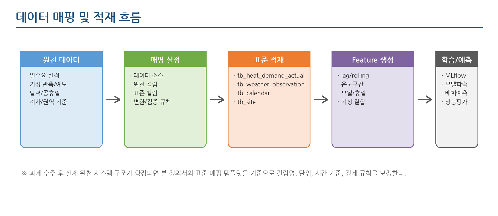

**THERMOps: 열수요 예측 모델 운영 자동화 플랫폼  
데이터 매핑 정의서**

Open-source MLOps Starter Kit for Heat Demand Forecasting  
작성일: 2026.06.24

# 문서 정보

| **항목**  | **내용**                                                                                |
|-----------|-----------------------------------------------------------------------------------------|
| 문서명    | THERMOps: 열수요 예측 모델 운영 자동화 플랫폼 데이터 매핑 정의서                                      |
| 문서 목적 | 수주 후 발주기관 원천 데이터를 표준 스키마에 신속히 매핑·적재하기 위한 기준 정의        |
| 작성 기준 | 기능정의서, 아키텍처 설계서, DB 설계서의 표준 스키마 기준                               |
| 작성 범위 | 열수요 실적, 기상, 달력/공휴일, 지사/권역, Feature 생성, 예측/성능평가 연계 데이터      |
| 비고      | 실제 원천 시스템명, 컬럼명, 단위, 품질 기준은 사업 착수 후 현장 데이터 확인을 통해 확정 |

# 목차

> 1\. 개요
>
> 2\. 매핑 대상 데이터 범위
>
> 3\. 데이터 매핑 원칙
>
> 4\. 데이터 매핑 및 적재 흐름
>
> 5\. 매핑 정의서 작성 템플릿
>
> 6\. 영역별 매핑 정의
>
> 7\. 변환 및 정제 규칙
>
> 8\. 데이터 품질 검증 기준
>
> 9\. 코드값 정의
>
> 10\. 인터페이스 및 적재 방식
>
> 11\. 수주 후 확정 필요사항
>
> 12\. 부록: 설정 파일 예시

# 1. 개요

## 1.1 목적

- THERMOps: 열수요 예측 모델 운영 자동화 플랫폼에 필요한 원천 데이터와 표준 스키마 간 매핑 기준을 정의한다.

- 과제 수주 후 발주기관의 실제 원천 시스템 구조가 확인되면, 본 문서를 기준으로 컬럼 매핑, 단위 변환, 데이터 품질 검증 규칙을 빠르게 확정한다.

- 데이터 매핑 화면, 적재 배치, Feature 생성 파이프라인, 모델 학습/예측 기능의 공통 기준으로 활용한다.

## 1.2 작성 전제

- 현 시점에서는 과제 공고 및 발주기관 원천 데이터 구조가 확정되지 않았으므로, 본 정의서는 스타터 솔루션 표준 스키마 기준의 사전 설계 문서이다.

- 원천 데이터는 CSV, DB 조회, API 수집 방식을 모두 수용할 수 있도록 설계한다.

- 열수요 예측 기본 단위는 시간별 예측을 우선 고려하되, 일별 예측으로 확장 가능하도록 기준 시각과 집계 규칙을 분리한다.

- MLflow, Airflow/Dagster 등 MLOps 도구 자체 메타데이터는 별도 관리하며, 본 문서는 예측 업무 데이터 매핑에 초점을 둔다.

# 2. 매핑 대상 데이터 범위

| **데이터 영역**  | **원천 후보**                | **표준 대상**               | **주요 내용**                            | **우선순위** |
|------------------|------------------------------|-----------------------------|------------------------------------------|--------------|
| 열수요 실적      | SCADA/계량/운영 DB, CSV      | tb_heat_demand_actual       | 시간 단위 실적값, 공급/회수온도, 유량    | 필수         |
| 기상 관측/예보   | 기상 API, 파일, 내부 수집 DB | tb_weather_observation      | 기온, 습도, 풍속, 강수량, 예보/관측 구분 | 필수         |
| 달력/공휴일      | 공휴일 기준 파일, 내부 코드  | tb_calendar                 | 요일, 주말, 공휴일, 계절                 | 필수         |
| 지사/권역 기준   | 운영 기준정보, 수기 등록     | tb_site                     | 예측 대상 단위, 상하위 구조, 사용 여부   | 필수         |
| 기상권역 매핑    | 기준정보, 수기 등록          | tb_site_weather_mapping     | 공급구역과 대표 기상권역 연결            | 필수         |
| Feature 데이터셋 | 표준 적재 데이터 기반 생성   | tb_feature_dataset          | lag, rolling, 기상/달력 결합 Feature     | 필수         |
| 예측 결과        | 모델 예측 산출물             | tb_heat_demand_prediction   | 예측 대상시각, 예측값, 모델버전          | 필수         |
| 성능 평가        | 예측값/실제값 비교           | tb_model_performance_metric | MAE, RMSE, MAPE, 샘플 수                 | 필수         |

<table>
<colgroup>
<col style="width: 100%" />
</colgroup>
<thead>
<tr class="header">
<th><strong>작성 기준 
</strong>본 문서의 표준 대상 테이블은 DB 설계서에서 정의한 업무 테이블을 기준으로 한다. 실제 원천 컬럼명은 발주기관 시스템 확인 후 본 매핑 정의서의 원천 컬럼 항목에 반영한다.</th>
</tr>
</thead>
<tbody>
</tbody>
</table>

# 3. 데이터 매핑 원칙

| **원칙**                   | **내용**                                                                                              |
|----------------------------|-------------------------------------------------------------------------------------------------------|
| 표준 스키마 우선           | 원천 시스템별 컬럼 구조가 다르더라도 내부 학습/예측 파이프라인은 표준 스키마를 기준으로 동작한다.     |
| 원천 보존과 표준 적재 분리 | 원천 파일 또는 원천 조회 결과는 필요 시 staging 영역에 보존하고, 정제·변환 후 표준 테이블에 적재한다. |
| 시간 기준 명확화           | measured_at, target_at, feature_at 등 시간 컬럼의 의미를 구분하고 KST 기준으로 통일한다.              |
| 단위 변환 명시             | 열수요, 유량, 온도, 강수량 등 수치형 데이터는 표준 단위를 명시하고 변환식을 관리한다.                 |
| 품질 플래그 관리           | 결측, 이상치, 추정값은 삭제보다 품질 상태를 남기는 방향을 우선한다.                                   |
| Feature 재현성 확보        | 학습 시점과 예측 시점의 Feature 생성 로직이 동일하게 실행되도록 파생 변수 계산 규칙을 문서화한다.     |
| 확장성 확보                | 현장별 추가 운영 변수는 feature_json 또는 확장 테이블로 수용하고, 핵심 컬럼은 고정 스키마로 유지한다. |

# 4. 데이터 매핑 및 적재 흐름

- 원천 데이터는 데이터 소스 설정을 통해 파일, DB, API 방식으로 수집한다.

- 매핑 설정은 원천 컬럼, 표준 컬럼, 데이터 타입, 단위, 변환 규칙, 검증 규칙을 포함한다.

- 표준 적재 이후 Feature 생성 파이프라인에서 lag, rolling, 기상/달력 결합 변수를 생성한다.

- 모델 학습과 배치 예측은 동일한 Feature 생성 규칙을 공유한다.

# 5. 매핑 정의서 작성 템플릿

| **항목**         | **작성 예시**         | **설명**                                  |
|------------------|-----------------------|-------------------------------------------|
| 매핑ID           | MAP-HEAT-001          | 매핑 항목의 고유 식별자                   |
| 데이터 영역      | 열수요 실적           | HEAT, WEATHER, CALENDAR, SITE, FEATURE 등 |
| 원천 시스템/파일 | 운영DB.heat_hourly    | 수주 후 실제 시스템명 또는 파일명을 기입  |
| 원천 컬럼명      | BRANCH_CD             | 원천 데이터의 실제 컬럼명                 |
| 표준 테이블      | tb_heat_demand_actual | 적재 대상 표준 테이블                     |
| 표준 컬럼명      | site_id               | 표준 스키마 컬럼명                        |
| 데이터 타입      | varchar(50)           | 표준 DB 기준 타입                         |
| 필수 여부        | Y/N                   | 누락 시 적재 가능 여부                    |
| 단위             | Gcal/h, ℃ 등          | 수치형 컬럼의 기준 단위                   |
| 변환 규칙        | 코드 매핑, 단위 변환  | 원천값을 표준값으로 변환하는 규칙         |
| 검증 규칙        | NOT NULL, 범위검사    | 적재 전/후 품질 검증 기준                 |
| 비고             | 수주 후 확정          | 현장 데이터 확인 후 보완 사항             |

# 6. 영역별 매핑 정의

## 6.1 열수요 실적 데이터 매핑

| **매핑ID**   | **항목명**     | **원천 컬럼 예시**     | **표준 컬럼**                       | **타입**      | **필수** | **단위**       | **변환/검증 규칙**                                                      |
|--------------|----------------|------------------------|-------------------------------------|---------------|----------|----------------|-------------------------------------------------------------------------|
| MAP-HEAT-001 | 지사/권역 코드 | BRANCH_CD / AREA_CD    | tb_heat_demand_actual.site_id       | varchar(50)   | Y        | \-             | tb_site.site_id와 매핑. 원천 코드가 복수 체계면 기준코드 변환표 적용    |
| MAP-HEAT-002 | 측정 시각      | MEASURE_DTM / LOG_TIME | tb_heat_demand_actual.measured_at   | timestamp     | Y        | KST            | 초/분 단위 데이터는 예측 기준 단위(1시간/1일)에 맞춰 집계               |
| MAP-HEAT-003 | 열수요 실적    | HEAT_LOAD / DEMAND_VAL | tb_heat_demand_actual.heat_demand   | numeric(18,6) | Y        | Gcal/h 또는 MW | 원천 단위 확인 후 표준 단위로 변환. 음수/비정상 범위는 품질 플래그 처리 |
| MAP-HEAT-004 | 공급온도       | SUPPLY_TEMP            | tb_heat_demand_actual.supply_temp   | numeric(10,3) | N        | ℃              | 미수집 시 NULL 허용                                                     |
| MAP-HEAT-005 | 회수온도       | RETURN_TEMP            | tb_heat_demand_actual.return_temp   | numeric(10,3) | N        | ℃              | 미수집 시 NULL 허용                                                     |
| MAP-HEAT-006 | 유량           | FLOW_RATE              | tb_heat_demand_actual.flow_rate     | numeric(18,6) | N        | m3/h           | 단위가 다른 경우 변환 규칙 별도 정의                                    |
| MAP-HEAT-007 | 품질 상태      | STATUS_CD / QUALITY_CD | tb_heat_demand_actual.quality_flag  | varchar(20)   | N        | \-             | 정상/결측/이상/추정 등 표준 코드로 변환                                 |
| MAP-HEAT-008 | 원천 시스템    | SOURCE_SYSTEM          | tb_heat_demand_actual.source_system | varchar(100)  | N        | \-             | 원천 시스템 구분값 없으면 data_source_id 기준 자동 부여                 |

## 6.2 기상 관측/예보 데이터 매핑

| **매핑ID**  | **항목명**     | **원천 컬럼 예시** | **표준 컬럼**                          | **타입**      | **필수** | **단위** | **변환/검증 규칙**                         |
|-------------|----------------|--------------------|----------------------------------------|---------------|----------|----------|--------------------------------------------|
| MAP-WTH-001 | 기상권역 코드  | STN_ID / AREA_ID   | tb_weather_observation.weather_area_id | varchar(50)   | Y        | \-       | tb_weather_area.weather_area_id와 매핑     |
| MAP-WTH-002 | 관측/예보 시각 | OBS_DTM / FCST_DTM | tb_weather_observation.measured_at     | timestamp     | Y        | KST      | 예보 데이터는 예보 대상 시각 기준으로 적재 |
| MAP-WTH-003 | 데이터 구분    | DATA_TYPE          | tb_weather_observation.data_type       | varchar(20)   | Y        | \-       | OBSERVED 또는 FORECAST로 표준화            |
| MAP-WTH-004 | 기온           | TEMP               | tb_weather_observation.temperature     | numeric(10,3) | N        | ℃        | 비정상 범위는 이상치 플래그 또는 NULL 처리 |
| MAP-WTH-005 | 습도           | HUMIDITY           | tb_weather_observation.humidity        | numeric(10,3) | N        | %        | 0~100 범위 검증                            |
| MAP-WTH-006 | 풍속           | WIND_SPEED         | tb_weather_observation.wind_speed      | numeric(10,3) | N        | m/s      | 원천 단위 확인 후 변환                     |
| MAP-WTH-007 | 강수량         | RAINFALL           | tb_weather_observation.rainfall        | numeric(10,3) | N        | mm       | 미강수는 0, 미수집은 NULL로 구분           |
| MAP-WTH-008 | 체감온도       | APPARENT_TEMP      | tb_weather_observation.apparent_temp   | numeric(10,3) | N        | ℃        | 미제공 시 기온/습도/풍속 기반 파생 가능    |

## 6.3 달력/공휴일 데이터 매핑

| **매핑ID**  | **항목명**  | **원천 컬럼 예시** | **표준 컬럼**             | **타입**     | **필수** | **단위** | **변환/검증 규칙**                              |
|-------------|-------------|--------------------|---------------------------|--------------|----------|----------|-------------------------------------------------|
| MAP-CAL-001 | 기준 일자   | DATE               | tb_calendar.calendar_date | date         | Y        | \-       | 예측 대상 기간 전체 일자를 사전 생성            |
| MAP-CAL-002 | 요일        | DAY_OF_WEEK        | tb_calendar.day_of_week   | integer      | Y        | 1~7      | 월=1 기준 등 규칙을 프로젝트에서 확정           |
| MAP-CAL-003 | 주말 여부   | IS_WEEKEND         | tb_calendar.is_weekend    | char(1)      | Y        | Y/N      | 토/일 기준. 발주처 운영일 기준과 다를 경우 보정 |
| MAP-CAL-004 | 공휴일 여부 | IS_HOLIDAY         | tb_calendar.is_holiday    | char(1)      | Y        | Y/N      | 공휴일/대체공휴일 반영                          |
| MAP-CAL-005 | 공휴일명    | HOLIDAY_NAME       | tb_calendar.holiday_name  | varchar(100) | N        | \-       | 공휴일이 아닌 경우 NULL                         |
| MAP-CAL-006 | 계절        | SEASON             | tb_calendar.season        | varchar(20)  | N        | \-       | 월 기준 또는 난방시즌 기준 중 선택              |

## 6.4 지사/권역 기준정보 매핑

| **매핑ID**   | **항목명**     | **원천 컬럼 예시**  | **표준 컬럼**          | **타입**     | **필수** | **단위** | **변환/검증 규칙**                       |
|--------------|----------------|---------------------|------------------------|--------------|----------|----------|------------------------------------------|
| MAP-SITE-001 | 예측 대상 코드 | SITE_CD / BRANCH_CD | tb_site.site_id        | varchar(50)  | Y        | \-       | 열수요 실적의 site_id와 동일 체계로 관리 |
| MAP-SITE-002 | 예측 대상명    | SITE_NM / BRANCH_NM | tb_site.site_name      | varchar(100) | Y        | \-       | 지사/권역/공급구역명                     |
| MAP-SITE-003 | 예측 단위 구분 | SITE_TYPE           | tb_site.site_type      | varchar(20)  | Y        | \-       | BRANCH, REGION, AREA 등 표준 코드        |
| MAP-SITE-004 | 상위 코드      | PARENT_CD           | tb_site.parent_site_id | varchar(50)  | N        | \-       | 권역-지사-공급구역 계층이 있을 경우 적용 |
| MAP-SITE-005 | 사용 여부      | USE_YN              | tb_site.active_yn      | char(1)      | Y        | Y/N      | 미사용 대상은 학습/예측 대상에서 제외    |

## 6.5 공급구역-기상권역 매핑

| **매핑ID** | **항목명**     | **원천 컬럼 예시** | **표준 컬럼**                           | **타입**    | **필수** | **단위** | **변환/검증 규칙**                     |
|------------|----------------|--------------------|-----------------------------------------|-------------|----------|----------|----------------------------------------|
| MAP-SW-001 | 예측 대상 코드 | SITE_CD            | tb_site_weather_mapping.site_id         | varchar(50) | Y        | \-       | tb_site.site_id 참조                   |
| MAP-SW-002 | 기상권역 코드  | WEATHER_AREA_CD    | tb_site_weather_mapping.weather_area_id | varchar(50) | Y        | \-       | tb_weather_area.weather_area_id 참조   |
| MAP-SW-003 | 우선순위       | PRIORITY_NO        | tb_site_weather_mapping.priority_no     | integer     | Y        | \-       | 동일 구역에 복수 기상권역 적용 시 사용 |
| MAP-SW-004 | 적용 시작일    | VALID_FROM         | tb_site_weather_mapping.valid_from      | date        | N        | \-       | 변경 이력 관리가 필요한 경우 사용      |
| MAP-SW-005 | 적용 종료일    | VALID_TO           | tb_site_weather_mapping.valid_to        | date        | N        | \-       | 현재 유효 매핑은 NULL 허용             |

## 6.6 Feature 데이터셋 매핑

| **매핑ID**  | **항목명**        | **원천/계산 기준**                 | **표준 컬럼**                         | **타입**      | **필수** | **단위**         | **변환/검증 규칙**                                    |
|-------------|-------------------|------------------------------------|---------------------------------------|---------------|----------|------------------|-------------------------------------------------------|
| MAP-FTR-001 | Feature 기준 시각 | measured_at / target_at            | tb_feature_dataset.feature_at         | timestamp     | Y        | KST              | 학습 시 target_heat_demand의 기준 시각과 일치         |
| MAP-FTR-002 | 정답 열수요       | tb_heat_demand_actual.heat_demand  | tb_feature_dataset.target_heat_demand | numeric(18,6) | N        | 표준 열수요 단위 | 학습 데이터셋일 때만 필수. 예측 대상 미래 시점은 NULL |
| MAP-FTR-003 | 기온 Feature      | tb_weather_observation.temperature | tb_feature_dataset.temp               | numeric(10,3) | N        | ℃                | site_weather_mapping 기준으로 결합                    |
| MAP-FTR-004 | 습도 Feature      | tb_weather_observation.humidity    | tb_feature_dataset.humidity           | numeric(10,3) | N        | %                | 결측 시 보간 또는 NULL 허용 정책 적용                 |
| MAP-FTR-005 | 24시간 전 수요    | heat_demand lag 24                 | tb_feature_dataset.lag_24h_demand     | numeric(18,6) | N        | 표준 열수요 단위 | 시간별 모델 기준. 일별 모델이면 lag_1d로 해석 가능    |
| MAP-FTR-006 | 168시간 전 수요   | heat_demand lag 168                | tb_feature_dataset.lag_168h_demand    | numeric(18,6) | N        | 표준 열수요 단위 | 전주 동일시간 수요                                    |
| MAP-FTR-007 | 24시간 이동평균   | rolling mean 24h                   | tb_feature_dataset.rolling_24h_avg    | numeric(18,6) | N        | 표준 열수요 단위 | 이상치/결측 처리 후 계산                              |
| MAP-FTR-008 | 확장 Feature      | derived variables                  | tb_feature_dataset.feature_json       | jsonb         | N        | \-               | 온도구간, 공휴일전후, 난방도일 등 추가 변수 저장      |

# 7. 변환 및 정제 규칙

| **구분**     | **정의**                                                                                                                   |
|--------------|----------------------------------------------------------------------------------------------------------------------------|
| 시간 기준    | 모든 시각은 KST 기준으로 저장하고, 원천이 UTC 또는 다른 기준이면 변환한다.                                                 |
| 집계 단위    | 원천 데이터가 5분/15분 단위인 경우 시간별 예측 모델은 1시간 단위로 평균/합계/최종값 기준을 정한다.                         |
| 열수요 단위  | 원천 단위가 MW, Gcal/h, GJ 등으로 다를 수 있으므로 표준 단위를 사업 착수 시 확정하고 변환식을 관리한다.                    |
| 결측 처리    | 단기 결측은 직전값/선형보간/동일요일 동일시간 평균 중 선택하고, 장기 결측은 학습 제외 후보로 처리한다.                     |
| 이상치 처리  | 운영 장애, 계량 오류, 급격한 튐값은 품질 플래그를 부여하고 학습 포함 여부를 Feature 설정에서 통제한다.                     |
| 기상 결합    | site_weather_mapping 기준으로 공급구역별 대표 기상권역을 연결하고, 복수 기상권역은 우선순위 또는 가중평균 정책을 적용한다. |
| Feature 산출 | lag/rolling Feature는 품질 처리 완료 후 계산하며, 학습 기간과 예측 기간의 계산 방식이 동일해야 한다.                       |

## 7.1 열수요 단위 변환 관리

<table>
<colgroup>
<col style="width: 100%" />
</colgroup>
<thead>
<tr class="header">
<th><strong>단위 변환 확정 필요 
</strong>열수요 원천 단위가 발주기관 시스템에 따라 MW, Gcal/h, GJ/h 등으로 다를 수 있으므로, 사업 착수 시 표준 단위를 확정해야 한다. 단위 변환식은 데이터 매핑 설정 또는 시스템 설정 테이블에서 관리한다.</th>
</tr>
</thead>
<tbody>
</tbody>
</table>

<table>
<colgroup>
<col style="width: 100%" />
</colgroup>
<thead>
<tr class="header">
<th>예시) 
- 원천 단위가 MW이고 표준 단위가 Gcal/h인 경우: heat_demand_std = heat_demand_raw * 변환계수 
- 원천 단위가 이미 표준 단위인 경우: heat_demand_std = heat_demand_raw 
- 단위 미확정 데이터는 학습 대상에서 제외하거나 매핑 검토 상태로 분리</th>
</tr>
</thead>
<tbody>
</tbody>
</table>

# 8. 데이터 품질 검증 기준

| **검증 항목**    | **검증 기준**                               | **목적**                        | **처리 방안**                                         |
|------------------|---------------------------------------------|---------------------------------|-------------------------------------------------------|
| 시간 중복        | site_id + measured_at 중복 여부             | 동일 시각 중복 데이터 적재 방지 | 중복 발견 시 최신 적재건 또는 원천 우선순위 기준 선택 |
| 시간 누락        | 예측 단위 기준 연속 시계열 여부             | 학습 데이터 누락 구간 식별      | 짧은 결측은 보간, 장기 결측은 학습 제외 후보          |
| 열수요 범위      | 음수, 비정상 고값, 급격한 변동              | 비정상 실적값 탐지              | quality_flag=OUTLIER 또는 제외                        |
| 기상 범위        | 기온/습도/풍속/강수량 물리적 범위           | 입력 Feature 품질 확보          | 비정상값 NULL 또는 이상치 처리                        |
| 코드 정합성      | site_id, weather_area_id 기준정보 존재 여부 | 조인 실패 방지                  | 기준정보 미존재 시 적재 오류 처리                     |
| 단위 정합성      | Gcal/h, MW, ℃, %, mm 등                     | 모델 입력값 일관성 확보         | 표준 단위 변환 후 적재                                |
| 미래 시점 정합성 | 예측 대상시각의 기상 예보 존재 여부         | 배치 예측 실행 가능성 확보      | 미존재 시 최근 예보 또는 기본값 정책 적용             |

## 8.1 적재 상태 코드 처리

- 적재 성공: 표준 테이블 반영 및 적재 이력 SUCCESS 처리

- 부분 성공: 일부 레코드 오류 발생 시 정상 레코드는 적재하고 오류 레코드는 검토 대상으로 분리

- 적재 실패: 필수 컬럼 누락, 시간 형식 오류, 기준정보 미존재 등으로 전체 적재가 불가능한 경우 FAILED 처리

- 검토 필요: 단위 미확정, 원천 코드 미매핑, 품질 기준 초과 등 업무 확인이 필요한 경우 REVIEW 상태로 분류

# 9. 코드값 정의

| **코드그룹**  | **코드**  | **코드명**   | **비고**               |
|---------------|-----------|--------------|------------------------|
| SOURCE_TYPE   | CSV       | CSV 파일     | 샘플/수동 적재         |
| SOURCE_TYPE   | DB        | 데이터베이스 | 운영/복제 DB 연계      |
| SOURCE_TYPE   | API       | API 연계     | 기상/외부 데이터 수집  |
| DATA_CATEGORY | HEAT      | 열수요 실적  | 필수                   |
| DATA_CATEGORY | WEATHER   | 기상 데이터  | 필수                   |
| DATA_CATEGORY | CALENDAR  | 달력/공휴일  | 필수                   |
| QUALITY_FLAG  | NORMAL    | 정상         | 기본값                 |
| QUALITY_FLAG  | MISSING   | 결측         | 원천 누락 또는 보간 전 |
| QUALITY_FLAG  | OUTLIER   | 이상치       | 범위/변동성 기준 초과  |
| QUALITY_FLAG  | ESTIMATED | 추정/보정값  | 보간 또는 수동 보정    |
| DATA_TYPE     | OBSERVED  | 관측값       | 실적 기반              |
| DATA_TYPE     | FORECAST  | 예보값       | 미래 예측 입력         |

# 10. 인터페이스 및 적재 방식

| **적재 방식**      | **설명**                                             | **확정 필요사항**                                     |
|--------------------|------------------------------------------------------|-------------------------------------------------------|
| CSV 파일 적재      | 정해진 폴더에 파일 업로드 후 배치 적재               | 파일명 규칙, 구분자, 인코딩, 헤더 여부 확정 필요      |
| DB 직접 조회       | 복제 DB 또는 조회 전용 계정으로 원천 테이블 조회     | 운영계 직접 부하 방지, 방화벽/계정/조회권한 확정 필요 |
| API 수집           | 기상/외부 데이터 API를 주기 호출                     | API 키, 호출 제한, 장애 시 재시도 정책 필요           |
| 수기 기준정보 등록 | 지사/권역/기상권역 매핑을 관리 화면 또는 파일로 등록 | 최초 구축 시 기준정보 정합성 검토 필요                |

## 10.1 적재 주기 기준

| **데이터 영역** | **권장 적재 주기**     | **비고**                                          |
|-----------------|------------------------|---------------------------------------------------|
| 열수요 실적     | 시간별 또는 일별 배치  | 운영 데이터 생성 주기에 맞춰 조정                 |
| 기상 관측       | 시간별 배치            | 예측 성능에 영향이 크므로 누락 여부 모니터링 필요 |
| 기상 예보       | 예측 실행 전 배치      | D+1/D+7 예측 대상 기간의 예보 확보 필요           |
| 달력/공휴일     | 연 1회 또는 수동 갱신  | 대체공휴일, 기관 휴무일 반영 필요                 |
| 기준정보        | 변경 시 수동/배치 반영 | 지사/권역 변경 이력 관리 필요                     |

# 11. 수주 후 확정 필요사항

| **우선순위** | **확정 항목**       | **상세 내용**                                                     | **영향 범위**               |
|--------------|---------------------|-------------------------------------------------------------------|-----------------------------|
| 1            | 원천 시스템 목록    | 열수요 실적, 기상, 기준정보의 실제 원천 시스템/파일/API 목록 확정 | 데이터 소스 설정, 적재 배치 |
| 2            | 원천 컬럼명/타입    | 실제 테이블 또는 파일의 컬럼명, 타입, 필수 여부 확인              | 매핑 설정, DB 적재          |
| 3            | 열수요 표준 단위    | 열수요 실적과 예측 결과의 표준 단위 확정                          | 모델 학습, 예측 결과 해석   |
| 4            | 예측 단위/주기      | 시간별/일별, D+1/D+7 등 대상 범위 확정                            | Feature 생성, 배치 스케줄   |
| 5            | 기상권역 매핑       | 공급구역별 대표 기상 관측소 또는 예보 권역 확정                   | 기상 Feature 품질           |
| 6            | 결측/이상치 정책    | 보간, 제외, 품질 플래그 부여 기준 확정                            | 학습 데이터 품질, 성능 평가 |
| 7            | 운영 변수 추가 여부 | 공급온도, 회수온도, 유량 외 추가 운영 변수 사용 여부 결정         | Feature 설정, 모델 성능     |
| 8            | 보안/접근 방식      | 조회 전용 계정, 파일 전달 방식, API 인증 방식 확정                | 연계 구현, 운영 안정성      |

# 12. 부록: 설정 파일 예시

## 12.1 데이터 소스 설정 예시

<table>
<colgroup>
<col style="width: 100%" />
</colgroup>
<thead>
<tr class="header">
<th>data_sources: 
- id: heat_actual_db 
type: DB 
category: HEAT 
connection_ref: HEAT_DB_READONLY 
source_table: OP_HEAT_HOURLY 
load_cycle: HOURLY 
 
- id: weather_api 
type: API 
category: WEATHER 
connection_ref: WEATHER_API_KEY 
load_cycle: HOURLY</th>
</tr>
</thead>
<tbody>
</tbody>
</table>

## 12.2 컬럼 매핑 설정 예시

<table>
<colgroup>
<col style="width: 100%" />
</colgroup>
<thead>
<tr class="header">
<th>mappings: 
heat_actual: 
target_table: tb_heat_demand_actual 
columns: 
site_id: 
source: BRANCH_CD 
required: true 
transform: code_mapping(site_code) 
measured_at: 
source: MEASURE_DTM 
required: true 
transform: parse_datetime('%Y%m%d%H%M%S') 
heat_demand: 
source: HEAT_LOAD 
required: true 
unit: Gcal/h 
validation: non_negative</th>
</tr>
</thead>
<tbody>
</tbody>
</table>

## 12.3 Feature 설정 예시

<table>
<colgroup>
<col style="width: 100%" />
</colgroup>
<thead>
<tr class="header">
<th>feature_set: 
id: default_hourly_v1 
target: heat_demand 
time_unit: HOUR 
features: 
- temperature 
- humidity 
- is_weekend 
- is_holiday 
- lag_24h_demand 
- lag_168h_demand 
- rolling_24h_avg 
missing_policy: 
short_gap: interpolate 
long_gap: exclude_from_training</th>
</tr>
</thead>
<tbody>
</tbody>
</table>

<table>
<colgroup>
<col style="width: 100%" />
</colgroup>
<thead>
<tr class="header">
<th><strong>활용 방법 
</strong>본 데이터 매핑 정의서는 화면 설계서의 데이터 매핑 설정 화면, 배치/파이프라인 설계서의 적재 DAG, API 설계서의 조회 응답 구조, 모델 학습/평가 설계서의 Feature 정의와 직접 연결된다. 따라서 다음 단계에서는 배치/파이프라인 설계서와 API 설계서를 함께 정리하는 것이 좋다.</th>
</tr>
</thead>
<tbody>
</tbody>
</table>
