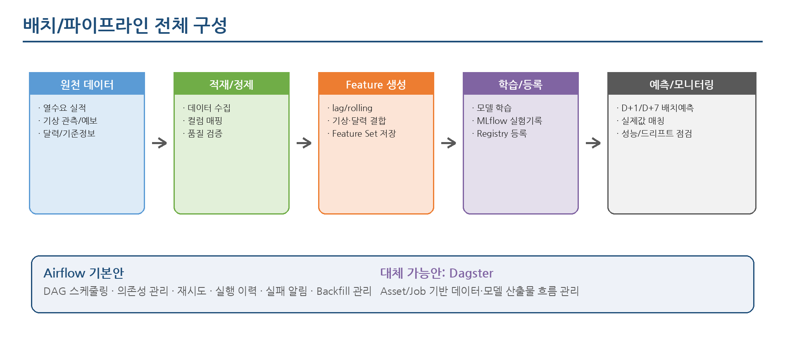
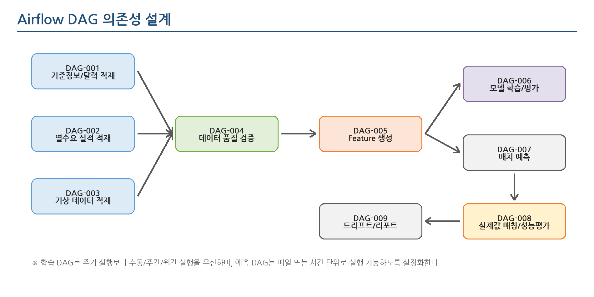
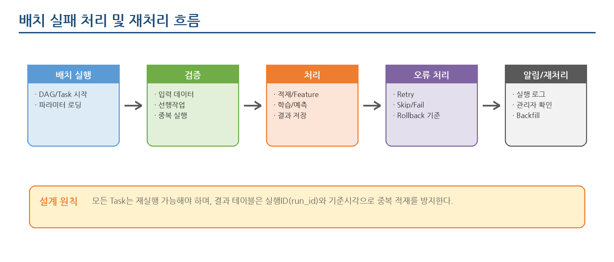

**THERMOps: 열수요 예측 모델 운영 자동화 플랫폼  
배치/파이프라인 설계서**

Open-source MLOps Starter Kit for Heat Demand Forecasting  
작성일: 2026.06.24

# 문서 정보

| **항목**  | **내용**                                                                                   |
|-----------|--------------------------------------------------------------------------------------------|
| 문서명    | THERMOps: 열수요 예측 모델 운영 자동화 플랫폼 배치/파이프라인 설계서                                     |
| 문서 목적 | 열수요 예측 솔루션의 데이터 적재, Feature 생성, 모델 학습, 예측, 모니터링 배치 흐름을 정의 |
| 작성 기준 | 기능정의서, 아키텍처 설계서, DB 설계서, 데이터 매핑 정의서의 표준 구조 기준                |
| 기본 도구 | Airflow + MLflow + PostgreSQL + MinIO + FastAPI + 모니터링 도구                            |
| 비고      | 실제 실행 주기, 원천 연계 방식, 장애 대응 기준은 수주 후 운영환경 확인을 통해 확정         |

# 목차

> 1\. 개요
>
> 2\. 설계 범위 및 전제
>
> 3\. 전체 파이프라인 구성
>
> 4\. Airflow DAG 구성
>
> 5\. 실행 주기 및 의존성
>
> 6\. DAG 상세 설계
>
> 7\. 실행 파라미터 및 설정 관리
>
> 8\. 실패 처리 및 재처리 정책
>
> 9\. 데이터 정합성 및 멱등성 설계
>
> 10\. 모니터링 및 알림 설계
>
> 11\. Dagster 전환 가능 설계
>
> 12\. 배포 및 폴더 구조
>
> 13\. 수주 후 확정 필요사항
>
> 14\. 후속 설계 작업

# 1. 개요

## 1.1 목적

- 본 문서는 THERMOps: 열수요 예측 모델 운영 자동화 플랫폼의 배치 및 파이프라인 실행 구조를 정의한다.

- 과제 수주 후 발주기관 데이터 구조와 운영 환경에 맞춰 데이터 적재, Feature 생성, 모델 학습, 예측, 모니터링을 빠르게 적용할 수 있도록 사전 설계 기준을 제공한다.

- Airflow를 기본 오케스트레이터로 설정하되, 향후 Dagster 기반 데이터/모델 Asset 중심 구조로 전환할 수 있도록 단계별 산출물과 의존성을 분리한다.

## 1.2 설계 방향

- 운영계 직접 변경 없이 조회/복제/파일 기반 수집을 우선한다.

- 모든 파이프라인은 수동 실행, 스케줄 실행, 과거기간 재처리(Backfill)가 가능하도록 설계한다.

- 학습 파이프라인과 예측 파이프라인은 동일한 Feature 생성 로직을 공유하여 모델 재현성을 확보한다.

- 자동 재학습은 즉시 운영 반영이 아니라 후보 모델 생성 및 검토/승인 대상으로 관리한다.

# 2. 설계 범위 및 전제

| **구분**            | **내용**                                                                                                        |
|---------------------|-----------------------------------------------------------------------------------------------------------------|
| 대상 파이프라인     | 데이터 적재, 품질 검증, Feature 생성, 모델 학습/평가, 모델 등록, 배치 예측, 실제값 매칭, 성능/드리프트 모니터링 |
| 기본 오케스트레이터 | Airflow 기준 설계. DAG, Task, Schedule, Retry, 실행 이력, Backfill 관리                                         |
| 대체 가능 구조      | Dagster 기준 Asset/Job 구조로 전환 가능하도록 파이프라인 단계와 산출물을 분리                                   |
| 실행 환경           | Docker Compose 기반 단일 서버 설치형을 기본으로 하며, 수주 후 Kubernetes/운영 배포 구조로 확장 가능             |
| 연계 데이터         | 열수요 실적, 기상 관측/예보, 달력/공휴일, 지사/권역 기준정보, Feature 데이터셋, 모델/예측 결과                  |
| 비대상              | 운영계 직접 제어, 실시간 초단위 처리, 완전 자동 재학습 승인, 고가용성 클러스터 구성                             |

<table>
<colgroup>
<col style="width: 100%" />
</colgroup>
<thead>
<tr class="header">
<th><strong>설계 전제 
</strong>본 설계서는 제안 전 사전 구축형 솔루션 기준의 표준 설계이다. 실제 발주기관 환경에서는 데이터 제공 주기, 보안 정책, DBMS, 기상 데이터 수집 방식, 예측 기준시각에 따라 DAG 실행 주기와 재처리 정책을 조정한다.</th>
</tr>
</thead>
<tbody>
</tbody>
</table>

# 3. 전체 파이프라인 구성

- 원천 데이터 수집 단계에서는 열수요 실적, 기상 관측/예보, 달력/기준정보를 표준 스키마로 적재한다.

- Feature 생성 단계에서는 예측 모델에 필요한 lag, rolling, 요일/공휴일, 기상 결합 변수를 생성한다.

- 모델 학습 단계에서는 Baseline 모델과 ML 모델을 학습하고 MLflow에 파라미터, 지표, 모델 artifact를 기록한다.

- 배치 예측 단계에서는 Champion 모델 또는 지정 모델 버전을 로딩하여 D+1/D+7 예측 결과를 생성한다.

- 모니터링 단계에서는 실제값 매칭, 성능 평가, 드리프트 점검, 재학습 후보 판단을 수행한다.

# 4. Airflow DAG 구성

## 4.1 DAG 목록

| **DAG ID** | **DAG 명**                     | **주요 목적**                                            | **기본 실행 주기** | **우선순위** |
|------------|--------------------------------|----------------------------------------------------------|--------------------|--------------|
| DAG-001    | reference_data_dag             | 지사/권역, 기상권역, 달력/공휴일 기준정보 적재           | 수동/일 1회        | 필수         |
| DAG-002    | heat_actual_ingestion_dag      | 열수요 실적 데이터 적재 및 표준 테이블 반영              | 시간/일 단위       | 필수         |
| DAG-003    | weather_ingestion_dag          | 기상 관측/예보 데이터 적재 및 기상권역 매핑              | 1~3시간/일 단위    | 필수         |
| DAG-004    | data_quality_dag               | 결측, 중복, 이상치, 코드 정합성, 시간 누락 검증          | 적재 후 자동       | 필수         |
| DAG-005    | feature_build_dag              | 학습/예측 공통 Feature 생성 및 Feature Set 저장          | 적재/품질검증 후   | 필수         |
| DAG-006    | model_training_dag             | Baseline/ML 모델 학습, 평가, MLflow 실험 기록            | 수동/주간/월간     | 필수         |
| DAG-007    | model_registry_dag             | 후보 모델 등록, Champion 후보 지정, 모델 버전 상태 관리  | 학습 후 수동/자동  | 선택         |
| DAG-008    | batch_prediction_dag           | 등록 모델 기반 D+1/D+7 열수요 배치 예측                  | 일 1회/시간 단위   | 필수         |
| DAG-009    | actual_matching_evaluation_dag | 실제값 수집 후 예측값 매칭 및 오차 계산                  | 실제값 확정 후     | 필수         |
| DAG-010    | monitoring_report_dag          | 모델 성능 추이, 데이터 드리프트, 재학습 후보 리포트 생성 | 일/주 단위         | 선택         |
| DAG-011    | maintenance_cleanup_dag        | 임시 파일, 오래된 실행 로그, 중간 산출물 정리            | 주/월 단위         | 선택         |

## 4.2 DAG 의존성

<table>
<colgroup>
<col style="width: 100%" />
</colgroup>
<thead>
<tr class="header">
<th><strong>DAG 구성 원칙 
</strong>데이터 적재 DAG는 원천별로 분리하고, 품질 검증과 Feature 생성은 표준 스키마 기준으로 통합한다. 모델 학습 DAG와 배치 예측 DAG는 독립 실행이 가능해야 하며, 예측 DAG는 승인된 모델 버전을 사용한다.</th>
</tr>
</thead>
<tbody>
</tbody>
</table>

# 5. 실행 주기 및 의존성

## 5.1 기본 실행 주기

| **배치 영역**        | **권장 실행 주기**            | **설계 메모**                                                        |
|----------------------|-------------------------------|----------------------------------------------------------------------|
| 기준정보/달력 적재   | 매일 00:10 또는 수동          | 지사/권역/공휴일 변경 반영. 기준정보 변경이 적은 경우 수동 실행 가능 |
| 열수요 실적 적재     | 매시간 또는 매일 01:00        | 시간별 예측이면 시간 단위, 일별 예측이면 전일 실적 확정 후 실행      |
| 기상 관측/예보 적재  | 1~3시간 단위 또는 매일 02:00  | 기상 API 제공 주기 및 호출 제한에 맞춰 설정                          |
| 데이터 품질 검증     | 적재 완료 직후                | 열수요/기상/기준정보 적재 성공 후 실행                               |
| Feature 생성         | 품질 검증 완료 직후           | 학습용 Feature와 예측용 Feature 생성 기준 분리                       |
| 모델 학습            | 수동/주 1회/월 1회            | 성능 저하, 계절 변경, 데이터 패턴 변화 시 실행                       |
| 배치 예측            | 매일 05:00 또는 운영 기준시각 | D+1/D+7 예측. 기상 예보 데이터 수집 완료 이후 실행                   |
| 실제값 매칭/성능평가 | 매일 08:00 또는 실적 확정 후  | 전일 예측값과 실제 열수요를 매칭하여 오차 계산                       |
| 모니터링 리포트      | 매일/매주                     | 성능 추이, 드리프트, 재학습 후보 판단 결과 생성                      |

## 5.2 의존성 기준

- 배치 예측은 기상 예보 데이터와 기준정보가 정상 적재된 이후 실행한다.

- Feature 생성은 데이터 품질 검증 결과가 정상 또는 허용 가능한 경고 수준일 때만 실행한다.

- 모델 학습은 학습 기간의 Feature 데이터셋이 충분하고, 정답 열수요 실적이 확보된 경우 실행한다.

- 성능 평가는 예측 대상 시각의 실제값이 적재된 이후 실행한다.

- 모니터링 리포트는 성능 평가 결과와 데이터 품질 결과를 기준으로 생성한다.

# 6. DAG 상세 설계

| **DAG ID** | **DAG 명**                     | **주요 Task 흐름**                                                                                       | **주요 저장 대상**                                             | **산출물**                          |
|------------|--------------------------------|----------------------------------------------------------------------------------------------------------|----------------------------------------------------------------|-------------------------------------|
| DAG-001    | reference_data_dag             | load_site_master → load_weather_area → build_calendar → validate_reference                               | tb_site, tb_weather_area, tb_calendar, tb_site_weather_mapping | 기준정보 정합성 검증 결과           |
| DAG-002    | heat_actual_ingestion_dag      | extract_heat_actual → map_columns → transform_units → upsert_actual → log_result                         | tb_heat_demand_actual                                          | 열수요 실적 적재 이력, 품질 플래그  |
| DAG-003    | weather_ingestion_dag          | extract_weather → normalize_weather_time → map_weather_area → upsert_weather                             | tb_weather_observation                                         | 관측/예보 기상 데이터               |
| DAG-004    | data_quality_dag               | check_missing → check_duplicate → check_range → check_code_integrity → save_quality_result               | tb_data_quality_check_result                                   | 품질 검증 결과, 중단/경고 상태      |
| DAG-005    | feature_build_dag              | load_clean_data → join_weather_calendar → build_lag_features → build_rolling_features → save_feature_set | tb_feature_dataset                                             | 학습/예측 Feature Set               |
| DAG-006    | model_training_dag             | prepare_train_dataset → train_baseline → train_ml_model → evaluate_model → log_mlflow                    | MLflow, tb_model_performance_metric                            | 실험 이력, 모델 artifact, 성능 지표 |
| DAG-007    | model_registry_dag             | select_candidate → register_model → update_model_version → set_champion_candidate                        | MLflow Registry, tb_model_registry_snapshot                    | 모델 버전/상태 정보                 |
| DAG-008    | batch_prediction_dag           | load_champion_model → build_future_features → predict → save_prediction → publish_result                 | tb_heat_demand_prediction                                      | D+1/D+7 예측 결과                   |
| DAG-009    | actual_matching_evaluation_dag | load_prediction → load_actual → match_by_site_time → calculate_error → save_metric                       | tb_prediction_actual_match, tb_model_performance_metric        | 예측오차, 모델 성능 집계            |
| DAG-010    | monitoring_report_dag          | collect_recent_metrics → check_threshold → run_drift_report → create_monitoring_report                   | tb_monitoring_report, artifact storage                         | 성능/드리프트 리포트, 재학습 후보   |

## 6.1 주요 처리 단계 설명

| **단계**       | **설명**                                                          | **설계 포인트**                                             |
|----------------|-------------------------------------------------------------------|-------------------------------------------------------------|
| Extract        | CSV, DB, API 등 원천 데이터를 수집한다.                           | 원천별 커넥터를 분리하고 실행 로그를 저장한다.              |
| Map/Transform  | 데이터 매핑 정의서 기준으로 컬럼명, 단위, 시간 기준을 표준화한다. | 변환 규칙은 설정 파일 또는 매핑 테이블로 관리한다.          |
| Validate       | 결측, 중복, 이상치, 코드 정합성, 시간 누락을 검증한다.            | 필수 데이터 오류는 중단, 선택 Feature 오류는 경고 처리 가능 |
| Build Features | 학습/예측 공통 Feature를 생성한다.                                | Feature Set ID와 생성 버전을 저장한다.                      |
| Train/Evaluate | 모델을 학습하고 검증 지표를 산출한다.                             | MLflow에 파라미터, 지표, artifact를 기록한다.               |
| Predict        | 승인 모델을 로딩하여 예측 결과를 생성한다.                        | 예측 결과는 모델 버전과 run_id를 함께 저장한다.             |
| Monitor        | 실제값과 비교하고 성능/드리프트 리포트를 생성한다.                | 임계치 초과 시 재학습 후보로 표시한다.                      |

# 7. 실행 파라미터 및 설정 관리

## 7.1 실행 파라미터

| **파라미터**       | **설명**                                                                           |
|--------------------|------------------------------------------------------------------------------------|
| run_id             | 모든 DAG 실행에 부여되는 고유 실행 ID. 적재/예측/평가 결과와 실행 로그를 연결한다. |
| business_date      | 배치가 처리하는 업무 기준일. 실행일과 처리 대상일을 분리한다.                      |
| site_scope         | 전체/특정 지사/권역 단위 실행 범위. 부분 재처리와 장애 대응에 활용한다.            |
| prediction_horizon | D+1, D+7 등 예측 기간. 예측 DAG와 Feature 생성 DAG의 공통 파라미터이다.            |
| feature_set_id     | 학습/예측에 사용할 Feature 설정 묶음 식별자. 모델 재현성 확보에 사용한다.          |
| model_version      | 예측에 사용할 모델 버전. 지정하지 않으면 Champion 모델을 사용한다.                 |
| backfill_yn        | 과거 기간 재처리 여부. 중복 적재 방지와 재계산 정책에 활용한다.                    |

## 7.2 설정 파일 예시

<table>
<colgroup>
<col style="width: 100%" />
</colgroup>
<thead>
<tr class="header">
<th># configs/pipeline.yml 
orchestrator: airflow 
timezone: Asia/Seoul 
prediction: 
default_horizon: D+1 
target_frequency: hourly 
champion_model_policy: mlflow_stage 
training: 
train_period_months: 24 
validation_period_months: 3 
algorithms: [baseline, lightgbm, xgboost] 
primary_metric: mape 
quality: 
max_missing_rate: 0.05 
max_outlier_rate: 0.03 
fail_on_required_feature_missing: true 
schedule: 
heat_actual_ingestion: "0 * * * *" 
weather_ingestion: "30 */3 * * *" 
batch_prediction: "0 5 * * *" 
monitoring_report: "0 8 * * *"</th>
</tr>
</thead>
<tbody>
</tbody>
</table>

<table>
<colgroup>
<col style="width: 100%" />
</colgroup>
<thead>
<tr class="header">
<th><strong>설정 관리 원칙 
</strong>실행 주기, 예측 기간, Feature Set, 모델 학습 기간, 품질 임계치 등은 코드에 고정하지 않고 설정 파일 또는 관리 화면에서 변경 가능하도록 설계한다.</th>
</tr>
</thead>
<tbody>
</tbody>
</table>

# 8. 실패 처리 및 재처리 정책

## 8.1 오류 유형별 처리 정책

| **오류 유형**         | **발생 예시**                                 | **처리 정책**                                                   |
|-----------------------|-----------------------------------------------|-----------------------------------------------------------------|
| 입력 데이터 없음      | 선행 적재 데이터 또는 기상 예보 데이터 미존재 | 필수 데이터면 FAIL, 선택 Feature면 WARN 후 대체값 적용          |
| 데이터 품질 기준 초과 | 결측률/이상치 비율이 임계치 초과              | 학습/예측 중단 또는 관리자 확인 필요 상태로 전환                |
| 중복 적재             | 동일 site_id, measured_at, source_system 중복 | UPSERT 또는 최신 원천 우선순위 기준 반영                        |
| 모델 로딩 실패        | MLflow 모델 artifact 또는 Registry 접근 실패  | 이전 Champion 모델 fallback 여부를 설정값으로 제어              |
| 예측 결과 저장 실패   | DB 연결 오류, 제약조건 오류                   | Task retry 후 실패 시 알림. 부분 저장은 run_id 기준 정합성 점검 |
| 외부 API 호출 실패    | 기상 API 장애 또는 호출 제한                  | 재시도 후 실패 시 최근 예보 사용/예측 중단 정책 선택            |

## 8.2 재처리 기준

- Task 단위 재실행을 기본으로 하며, 데이터 정합성 문제가 있는 경우 DAG 전체 재실행을 허용한다.

- 과거기간 재처리는 business_date 범위를 명시하여 실행하고, 기존 산출물 덮어쓰기 여부를 파라미터로 통제한다.

- 모델 학습 결과는 같은 run_id로 덮어쓰지 않고, 신규 MLflow run으로 보존한다.

- 예측 결과는 운영 조회용 최신 성공 결과와 이력 보관용 결과를 구분한다.

# 9. 데이터 정합성 및 멱등성 설계

| **대상**       | **멱등성/정합성 기준**                                                                                                     |
|----------------|----------------------------------------------------------------------------------------------------------------------------|
| 적재 테이블    | site_id + measured_at + source_system 기준 UPSERT를 기본으로 한다.                                                         |
| Feature 테이블 | feature_set_id + site_id + feature_at 기준 재생성 가능해야 한다.                                                           |
| 예측 결과      | model_version + site_id + target_at + prediction_horizon + run_id를 저장하고, 운영 조회는 최신 성공 run 기준으로 제공한다. |
| 성능 평가      | prediction_id 또는 model_version + site_id + 평가기간 기준으로 중복 계산을 방지한다.                                       |
| Backfill       | 과거 기간 재처리 시 기존 결과를 덮어쓸지 신규 버전으로 보존할지 실행 옵션으로 통제한다.                                    |

<table>
<colgroup>
<col style="width: 100%" />
</colgroup>
<thead>
<tr class="header">
<th><strong>멱등성 설계 의미 
</strong>동일 기준일의 배치를 여러 번 실행해도 데이터가 중복되거나 서로 다른 결과가 무분별하게 섞이지 않도록 하는 설계이다. 열수요 예측 솔루션은 재처리와 Backfill이 필요하므로 run_id, business_date, 기준시각, 모델 버전을 반드시 함께 관리한다.</th>
</tr>
</thead>
<tbody>
</tbody>
</table>

# 10. 모니터링 및 알림 설계

| **모니터링 영역** | **주요 지표**                                                            |
|-------------------|--------------------------------------------------------------------------|
| 파이프라인 상태   | DAG 성공/실패, Task 실패, 재시도 횟수, 실행 소요시간, 대기시간           |
| 데이터 품질       | 결측률, 중복 건수, 이상치 건수, 시간 누락 건수, 코드 매핑 실패 건수      |
| 예측 성능         | MAE, RMSE, MAPE, 지사/권역별 오차, 시간대별 오차                         |
| 모델 운영         | Champion 모델 버전, 최근 학습일, 최근 예측일, 모델별 성능 추이           |
| 드리프트          | 학습 기준 데이터와 최근 입력 데이터의 분포 차이, 주요 Feature 변화량     |
| 운영 알림         | 배치 실패, 품질 임계치 초과, 성능 저하, 모델 로딩 실패, 예측 결과 미생성 |

## 10.1 알림 기준

| **알림 조건**                 | **알림 등급** | **후속 조치**                                       |
|-------------------------------|---------------|-----------------------------------------------------|
| DAG 실패 또는 재시도 초과     | 긴급          | 운영 담당자 확인, 실패 Task 로그 확인, 재실행       |
| 필수 데이터 미적재            | 긴급          | 원천 시스템/API 상태 확인, 적재 재실행              |
| 데이터 품질 임계치 초과       | 주의/긴급     | 결측/이상치 원인 확인, 학습/예측 실행 여부 판단     |
| MAPE 등 성능 지표 임계치 초과 | 주의          | 재학습 후보 등록, Feature/모델 성능 분석            |
| 드리프트 감지                 | 주의          | 최근 입력 데이터 분포 확인, 모델 재학습 필요성 검토 |

# 11. Dagster 전환 가능 설계

- 초기 사전 구축은 Airflow DAG 기준으로 하되, 파이프라인 단계와 산출물을 분리하여 Dagster Asset 구조로 전환 가능하도록 설계한다.

- Dagster 적용 시 원천 데이터, 정제 데이터, Feature Table, 학습 모델, 예측 결과, 리포트를 Asset으로 표현할 수 있다.

- 발주기관이 데이터/모델 lineage와 산출물 중심 관리를 중시할 경우 Dagster 구성을 대안으로 제시할 수 있다.

| **Airflow DAG**           | **Dagster 전환 개념**               | **설명**                                            |
|---------------------------|-------------------------------------|-----------------------------------------------------|
| reference_data_dag        | reference_data_assets               | site, weather_area, calendar 등 기준정보 Asset 생성 |
| heat_actual_ingestion_dag | raw_heat_demand / clean_heat_demand | 열수요 원천/정제 데이터 Asset 분리                  |
| weather_ingestion_dag     | raw_weather / normalized_weather    | 기상 관측/예보 Asset 관리                           |
| feature_build_dag         | feature_table / training_dataset    | 학습/예측 공통 Feature Asset 생성                   |
| model_training_dag        | trained_model / model_metrics       | 학습 모델과 평가 지표를 Asset으로 추적              |
| batch_prediction_dag      | prediction_result                   | 모델 버전별 예측 결과 Asset 생성                    |
| monitoring_report_dag     | performance_report / drift_report   | 운영 성능 및 드리프트 리포트 Asset 생성             |

# 12. 배포 및 폴더 구조

## 12.1 폴더 구조 예시

<table>
<colgroup>
<col style="width: 100%" />
</colgroup>
<thead>
<tr class="header">
<th>heat-demand-mlops/ 
├─ airflow/dags/ 
│ ├─ reference_data_dag.py 
│ ├─ heat_actual_ingestion_dag.py 
│ ├─ weather_ingestion_dag.py 
│ ├─ data_quality_dag.py 
│ ├─ feature_build_dag.py 
│ ├─ model_training_dag.py 
│ ├─ batch_prediction_dag.py 
│ └─ monitoring_report_dag.py 
├─ pipelines/ 
│ ├─ ingestion/ 
│ ├─ quality/ 
│ ├─ features/ 
│ ├─ training/ 
│ ├─ prediction/ 
│ └─ monitoring/ 
├─ configs/ 
│ ├─ pipeline.yml 
│ ├─ data_sources.yml 
│ ├─ feature_sets.yml 
│ └─ model_config.yml 
└─ scripts/ 
├─ backfill.py 
└─ run_once.py</th>
</tr>
</thead>
<tbody>
</tbody>
</table>

## 12.2 Airflow DAG 코드 예시

<table>
<colgroup>
<col style="width: 100%" />
</colgroup>
<thead>
<tr class="header">
<th># airflow/dags/batch_prediction_dag.py 개념 예시 
with DAG( 
dag_id="batch_prediction_dag", 
schedule="0 5 * * *", 
catchup=False, 
default_args={"retries": 2, "retry_delay": timedelta(minutes=10)}, 
) as dag: 
load_model = load_champion_model() 
build_features = build_future_features() 
predict = run_batch_prediction() 
save = save_prediction_result() 
 
[load_model, build_features] &gt;&gt; predict &gt;&gt; save</th>
</tr>
</thead>
<tbody>
</tbody>
</table>

## 12.3 배포 방식

| **구분**          | **설명**                                                                                                                    |
|-------------------|-----------------------------------------------------------------------------------------------------------------------------|
| 개발/시연 환경    | Docker Compose 기반으로 Airflow, MLflow, PostgreSQL, MinIO, FastAPI, Dashboard를 단일 서버에 구성한다.                      |
| 수주 후 적용 환경 | 발주기관 보안 정책에 따라 내부망 서버, DB 접속 계정, 파일 적재 경로, API 호출 정책을 반영한다.                              |
| 운영 확장         | 데이터 규모와 운영 안정성 요구가 커질 경우 Airflow worker 분리, DB 분리, artifact storage 분리, Kubernetes 배포를 검토한다. |

# 13. 수주 후 확정 필요사항

| **확정 항목**         | **확인 내용**                                 | **설계 영향**                                 |
|-----------------------|-----------------------------------------------|-----------------------------------------------|
| 원천 데이터 제공 방식 | DB 직접 조회, 복제 DB, CSV, API 여부          | 커넥터 방식과 적재 DAG 구현 범위 결정         |
| 데이터 제공 주기      | 실적/기상 데이터 확정 시각, 예보 갱신 주기    | DAG 스케줄과 의존성 결정                      |
| 예측 기준             | 시간별/일별, D+1/D+7, 지사/권역/공급구역 단위 | Feature 생성 및 예측 결과 테이블 기준 결정    |
| 품질 임계치           | 결측률, 이상치 기준, 학습 제외 기준           | 품질검증 DAG의 중단/경고 정책 결정            |
| 모델 승인 절차        | 자동 등록/수동 승인/운영 반영 기준            | 모델 Registry 및 Champion 전환 절차 결정      |
| 운영 알림 채널        | 이메일, 메신저, SMS, 관제 시스템 연계 여부    | 알림 Task 및 운영 로그 설계 결정              |
| 보안/접근권한         | DB 계정, API 키, 서버 접근, 로그 보관 정책    | 설정 파일 암호화, Secret 관리, 감사 로그 적용 |

# 14. 후속 설계 작업

| **우선순위** | **후속 설계서**       | **주요 내용**                                                                        | **비고**                       |
|--------------|-----------------------|--------------------------------------------------------------------------------------|--------------------------------|
| 1            | API 설계서            | 예측 결과 조회, 모델 성능 조회, 배치 실행 상태 조회, 모델/Feature 설정 조회 API 정의 | 화면 설계 전 선행 권장         |
| 2            | 모델 학습/평가 설계서 | Feature Set, 알고리즘, 학습/검증 기간, 평가 지표, 재학습 후보 기준 정의              | 모델 품질 설명자료로 중요      |
| 3            | 화면 설계서           | 대시보드, 데이터 매핑, Feature 설정, 모델 학습 설정, 예측 결과, 실행 이력 화면 정의  | Figma 샘플 UI의 기준           |
| 4            | 인터페이스 설계서     | 원천 DB/API/파일 연계, 인증, 배치 파일 규칙, 오류 응답, 수집 이력 정의               | 수주 후 실제 연계 확정 시 보완 |
| 5            | 설치/운영 가이드      | Docker Compose 설치, 환경 설정, DAG 실행, 장애 대응, 로그 확인 절차                  | 스타터 솔루션 제품화에 필요    |

<table>
<colgroup>
<col style="width: 100%" />
</colgroup>
<thead>
<tr class="header">
<th><strong>권장 다음 단계 
</strong>API 설계서를 먼저 작성하면 화면 설계서와 Figma 샘플 UI에서 사용할 데이터 항목과 버튼 동작을 안정적으로 정리할 수 있다. 다만 모델 차별성을 먼저 강조하려면 모델 학습/평가 설계서를 먼저 작성해도 된다.</th>
</tr>
</thead>
<tbody>
</tbody>
</table>
