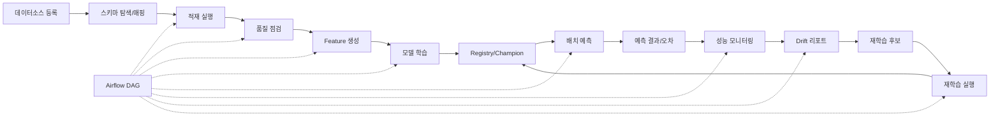

# THERMOps 사용자 가이드 근거 자료

> **문서 목적**: Word 사용자 가이드 작성을 위한 **실제 구현 기준** 화면·기능·API·흐름 정리  
> **기준 일자**: 2026-06-24  
> **코드 기준**: `frontend/src/pages/*`, `backend/app/api/v1/*`, `backend/app/services/*`  
> **API 베이스**: `/api/v1` (`VITE_API_BASE_URL` 미설정 시 프록시 경로)

---

## 목차

1. [전체 사용자 흐름](#1-전체-사용자-흐름)
2. [화면별 상세 정리](#2-화면별-상세-정리)
3. [실습 시나리오](#3-실습-시나리오)
4. [용어 설명 초안](#4-용어-설명-초안)
5. [화면 캡처 경로](#5-화면-캡처-경로)
6. [Word 가이드 보완 필요 항목](#6-word-가이드-보완-필요-항목)

---

## 1. 전체 사용자 흐름

THERMOps는 **열수요 예측 MLOps** 플랫폼으로, 데이터 적재부터 모델 운영·재학습까지 다음 순서로 연결됩니다.



### 1.1 단계별 요약

| 순서 | 업무 | 주요 화면 | 주요 API/파이프라인 | 비고 |
|------|------|-----------|---------------------|------|
| 1 | 표준 데이터셋 유형 (R7·R9-S2-1) | `/standard-datasets` | `GET /standard-dataset-types`, Wizard `POST ...` | 논리 구조·`std_` 내부 테이블 생성 |
| 2 | 데이터소스 등록 | `/data/sources` | `POST /data-sources` | CSV, PostgreSQL, REST API 지원 |
| 3 | 스키마 탐색 | `/data/mappings` (등록 모달) | `GET /data-sources/{id}/discover-schema` | 매핑 등록 시 소스 컬럼 자동 탐색 |
| 4 | 데이터 매핑 | `/data/mappings` | `POST/PUT /mappings`, `GET /standard-target-tables` | 표준 대상 테이블 선택 + allowlist 검증 |
| 4 | 적재 실행 | `/data/sources` | `POST /ingestion-jobs?source_id=...` | UI 수동 적재 또는 `data_ingestion_dag` |
| 5 | 품질 점검 | `/data/quality` | `POST /data-quality/checks` | `data_quality_dag` |
| 6 | Feature 정의 | `/features` | `POST /features` | 개별 Feature 메타 등록 |
| 7 | Feature Set 구성 | `/feature-sets`, `/feature-sets/:id` | `POST/PUT /feature-sets` | Feature 묶음·전처리 옵션 |
| 8 | Feature 생성 | `/feature-sets/:id` | `POST /feature-build-jobs?feature_set_id=...` | `feature_build_dag` |
| 9 | 학습 설정 | `/models/training-configs` | `POST /training-configs` | 알고리즘·기간·Feature Set 연결 |
| 10 | 모델 학습 | `/models/training-configs`, `/models/training-jobs` | `POST /training-jobs` | `model_training_dag`, MLflow 등록 |
| 11 | Registry 확인 | `/models/registry` | `GET /models`, `GET .../versions` | Champion/Candidate 단계 |
| 12 | 배치 예측 | `/predictions/jobs` | `POST /prediction-jobs` | `batch_prediction_dag` |
| 13 | 예측 결과 조회 | `/predictions/results` | `GET /predictions`, `GET /predictions/export` | 필터·엑셀 다운로드 |
| 14 | 실제값 매칭·오차 | `/predictions/errors` | `GET /predictions/errors` | `monitoring_dag`가 매칭 수행 |
| 15 | 성능 모니터링 | `/ops/model-monitoring` | `GET /dashboard/prediction-trend`, `GET /performance-metrics` | 운영 MAPE 추이 |
| 16 | Drift 리포트 | `/ops/drift-reports` | `POST /drift-checks`, `GET /drift-reports` | `drift_detection_dag` |
| 17 | 재학습 후보 승인/반려 | `/ops/retraining-candidates` | `POST .../approve`, `POST .../reject` | Drift·성능 저하 시 자동 생성 |
| 18 | 재학습 실행 | `/ops/retraining-candidates` | `POST .../train?execution_mode=AIRFLOW` | `retraining_dag` (candidate_id 필수) |
| 19 | Pipeline Builder (R8) | `/pipeline-builder` | `GET/POST /pipeline-definitions`, `POST .../validate` | Flow Chart·노드 설정·Runtime Preview (실행 미연동) |
| 20 | 파이프라인 이력 | `/ops/pipeline-runs` | `GET /pipeline-runs`, `POST /pipelines/{id}/trigger` | Airflow 동기화 |
| 21 | 시스템 설정 | `/system/configs` | `GET /system-configs`, `PUT ...`, `POST .../reset` | MAPE 임계치 등 |

### 1.2 Airflow DAG 목록 (8개)

| pipeline_id | 유형 | 설명 | 스케줄 |
|-------------|------|------|--------|
| `data_ingestion_dag` | INGESTION | CSV/DB 데이터 적재 | 매시 정각 |
| `data_quality_dag` | INGESTION | 데이터 품질 점검 | 수동 |
| `feature_build_dag` | FEATURE | Feature 생성 | 수동 |
| `model_training_dag` | TRAINING | 모델 학습·MLflow 등록 | 수동 |
| `batch_prediction_dag` | PREDICTION | 배치 예측 | 05:00 |
| `monitoring_dag` | MONITORING | 예측-실제 매칭·성능 평가 | 08:00 |
| `drift_detection_dag` | MONITORING | Drift 감지·재학습 후보 생성 | 09:00 |
| `retraining_dag` | TRAINING | 승인된 후보 재학습 | 수동 (candidate_id 필수) |
| `thermops_full_pipeline_dag` | INGESTION | 전체 파이프라인 일괄 실행 | 수동 |

### 1.3 권한 (Mock)

실제 로그인/SSO는 미구현. `VITE_USER_ROLE` 환경 변수로 UI만 제어:

| 역할 | Feature Set 생성 | 파이프라인 수동 실행 | 재학습 승인/실행 |
|------|------------------|----------------------|------------------|
| VIEWER (기본) | 불가 | 불가 | 불가 |
| OPERATOR | 가능 | 가능 | 가능 |
| ADMIN | 가능 | 가능 | 가능 |

> 백엔드 API 권한 검증은 1차 범위에 포함되지 않음.

### 1.4 테스트 fixture 참고 ID (운영 seed 아님)

| 구분 | ID | 설명 |
|------|-----|------|
| Feature Set | `TEST-FS-LAG-ROLL` | Lag/Rolling (회귀 테스트 fixture) |
| Feature Set | `TEST-FS-TWO-STAGE` | 2-Stage CatBoost용 fixture |
| 학습 설정 | `TEST-TRC-LGBM` | LightGBM fixture |
| 학습 설정 | `TEST-TRC-CATBOOST` | CatBoost fixture |
| 학습 설정 | `TEST-TRC-TWO-STAGE` | 2-Stage CatBoost fixture |

> **초기 설치(clean seed)** 에는 데이터 소스·매핑·표준 데이터셋·Feature Set·모델·Pipeline Definition이 **포함되지 않습니다**. **표준 데이터셋(내부 테이블) → 데이터 소스 → 데이터 매핑** 순으로 UI에서 등록한 뒤 적재·학습을 진행합니다. 회귀 테스트는 `scripts/test_fixtures.py`가 `scripts/fixtures/test_platform_seed.sql` 및 `data/samples/` CSV로 테스트용 리소스를 런타임 생성합니다.

---

## 2. 화면별 상세 정리

각 화면은 사이드바(`frontend/src/components/Sidebar.tsx`) 메뉴와 1:1 대응합니다.

---

### 2.1 `/dashboard` — 대시보드

**캡처**: `docs/images/user-guide/01_dashboard.png`

| 항목 | 내용 |
|------|------|
| **화면 목적** | 열수요 예측 현황·모델 운영 상태·7일 MAPE·Champion 모델·운영 알림을 한눈에 표시 |
| **주요 입력값** | 없음 (페이지 로드 시 자동 조회) |
| **주요 버튼** | 없음 (오류 시 **재시도**만 표시) |
| **버튼 클릭 시 동작** | 재시도 → 3개 API 재호출 |
| **호출 API** | `GET /dashboard/overview`, `GET /dashboard/prediction-trend`, `GET /dashboard/model-health` |
| **결과 확인 위치** | 상단 4개 Metric 카드, 예측 추이·시간대별 오차 차트, 모델 운영 상태 테이블 |
| **주의할 점** | 실제값 매칭 전에는 오차 차트가 비어 있을 수 있음. MAPE 출처는 `OPERATIONAL` / `TRAINING` / `NONE` 구분 표시 |
| **선행 작업** | 배치 예측·실제값 매칭·모델 학습(Registry 등록) |
| **후속 작업** | 성능 모니터링, Drift 리포트, 재학습 후보 관리 |

---

### 2.2 `/data/sources` — 데이터 소스 관리

**캡처**: `docs/images/user-guide/02_data_sources.png`

| 항목 | 내용 |
|------|------|
| **화면 목적** | 원천 데이터 소스(CSV/PostgreSQL/REST API) 등록·연결 테스트·수동 적재 |
| **주요 입력값** | 소스명, 유형(`DB_POSTGRES`/`REST_API`/`CSV`/`FILE_CSV`), 도메인(`HEAT_DEMAND`/`WEATHER`/`OPERATION`/`CALENDAR`), 연결 정보(호스트·URL·파일 경로 등), 적재 시 `start_at`/`end_at`/`limit`/`load_mode` |
| **주요 버튼** | **신규 등록**, 행별 **상세** / **수정** / **연결 테스트** / **적재 실행** / **삭제** |
| **버튼 클릭 시 동작** | 신규 등록→모달 저장 후 목록 갱신. 연결 테스트→결과 모달(응답시간·샘플 건수·컬럼). 적재 실행→적재 모달 확인 후 `ingestion-jobs` 호출, 토스트에 신규/갱신/실패/건너뜀 건수 표시 |
| **호출 API** | `GET /data-sources`, `POST /data-sources`, `PUT /data-sources/{id}`, `DELETE /data-sources/{id}`, `GET /data-sources/{id}`, `POST /data-sources/{id}/test-connection`, `POST /ingestion-jobs?source_id=...&load_mode=...` |
| **결과 확인 위치** | 목록의 **최근 적재** 컬럼, 연결 테스트 모달, 적재 완료 토스트 |
| **주의할 점** | DB/API는 `start_at`/`end_at` 미입력 시 connector 기본 범위. 열수요 소스에만 `data_domain=HEAT_DEMAND` 전달(기상 소스 혼동 주의). REST API 샘플 endpoint: `/sample-external/heat-demand` |
| **선행 작업** | 없음 (최초 단계) |
| **후속 작업** | 데이터 매핑 설정, 품질 점검 |

---

### 2.3 `/data/mappings` — 데이터 매핑 설정

**캡처**: `docs/images/user-guide/03_data_mappings.png`

| 항목 | 내용 |
|------|------|
| **화면 목적** | 원천 컬럼과 표준 스키마(대상 테이블) 간 매핑 규칙 및 **Column Role(컬럼 역할)** 관리 |
| **주요 입력값** | 데이터 소스, 매핑명, **표준 대상 테이블(드롭다운 선택)**, 컬럼 매핑(원천→표준 컬럼 드롭다운), 컬럼 역할 |
| **주요 버튼** | **신규 매핑**, **수정**, **검증**, **미리보기**, 모달 내 **스키마 탐색**, **표준 역할 적용**, **역할 검증**, **컬럼 역할 저장**, **매핑 저장** |
| **버튼 클릭 시 동작** | 스키마 탐색→소스 필드 목록 조회 후 매핑 행 자동 추가. 추천 역할 적용→자동 추론 결과를 화면에 반영(저장 전). 컬럼 역할 저장→`PUT /feature-column-roles`. Recipe 준비도 카드 표시 |
| **호출 API** | `GET /mappings`, `GET /feature-column-role-codes`, `GET /feature-column-roles`, `POST /feature-column-roles/infer`, `POST /feature-column-roles/validate`, `PUT /feature-column-roles`, `POST/PUT /mappings`, `POST /mappings/{id}/validate`, `POST /mappings/{id}/preview`, `GET /data-sources/{id}/discover-schema` |
| **결과 확인 위치** | 목록(컬럼 수·상태), 검증 토스트, 미리보기 모달, Column Role 검증·Recipe 준비도 패널 |
| **주의할 점** | 대상 테이블 **자유 입력 불가**(ACTIVE 표준 테이블만). 신규 도메인은 `/standard-datasets`에서 DRAFT 설계 후 ACTIVE 전환. **자동 추론은 제안**이며 저장해야 확정 |
| **선행 작업** | 데이터 소스 등록 |
| **후속 작업** | 적재 실행, 품질 점검, Recipe 템플릿 확인(R2) |

**R2 Recipe Template Catalog**: 매핑 수정 화면에서 Column Role 저장 후 **사용 가능한 Recipe 템플릿** 카드로 LAG/ROLLING 등 사용 가능 여부를 확인합니다. `POST /feature-recipes/validate`는 draft 검증만 수행하며 저장·Preview·실행은 하지 않습니다.

**R3 Recipe Preview**: RAW_COLUMN·DATE_PART 템플릿에 한해 `POST /feature-recipes/preview`로 샘플 결과를 확인합니다. 결과는 저장되지 않으며 Feature Build·학습·예측에 반영되지 않습니다. DATE_PART 표준 Feature(`hour` 등)는 기존 Catalog/Registry 재사용 가능 안내가 표시됩니다.

**R4 Recipe Preview**: LAG·ROLLING_MEAN·ROLLING_SUM 템플릿 Preview가 추가되었습니다. `entity_keys`와 `time_key`로 정렬한 뒤 **row step** 기반으로 계산하며, 시간 간격 불규칙·이력 부족·target 누수 가능성은 Preview 응답의 warnings로 안내됩니다. DIFF·RATIO 등은 후속 Preview입니다. 결과는 여전히 저장되지 않습니다.

**R5 Recipe 저장·Builder**: `/feature-recipes`에서 Recipe를 저장·검증·Preview·발행할 수 있습니다. Publish는 Feature Catalog 등록과 feature_name 확정을 의미하며, 발행된 TEMPLATE Feature를 Feature Set(사용자 정의)에 추가할 수 있습니다. 공식 `FS-TPL-*`에는 Recipe Feature 추가가 차단됩니다.

**R6 Recipe Engine Build**: 발행된 TEMPLATE Recipe 중 `RAW_COLUMN`, `DATE_PART`, `LAG`, `ROLLING_MEAN`, `ROLLING_SUM`은 Feature Build 시 Recipe Engine으로 계산되어 기존 CODE Feature와 함께 `feature_json`에 저장됩니다. `DIFF`/`RATIO` 등은 Build 미지원이며 WARNING으로 안내됩니다. Preview 결과는 여전히 DB에 저장되지 않습니다.

**R6-S1 Build 안정화**: Build `result_summary`에 Feature별 상태·진단 코드가 추가되며, Recipe별 최근 Build 이력(`GET .../build-history`)과 Preview vs Build 샘플 비교 API로 운영 검증을 보강합니다. Feature Set 상세 **Recipe Engine Build 상세**, Lineage TEMPLATE 메타데이터, Feature Quality TEMPLATE coverage를 확인합니다. LAG/ROLLING 초기 null은 이력 부족 warning으로 안내됩니다.

**R6-S2 운영 UI 마감**: Recipe 목록 최근 Build 상태, Builder **Preview/Build 비교** 버튼·결과 모달, 진단 패널·Quality·Lineage UX 보강. `compare-preview-build`에서 `dataset_version_id` 생략 시 최근 Build Job 자동 선택.

**R9-S2-1 표준 데이터셋 Wizard**: clean 설치 후 표준 데이터셋 0건으로 시작합니다. `/standard-datasets` Wizard에서 논리 데이터셋·컬럼을 정의하고 Backend가 생성한 **SQL Preview**(읽기 전용)를 확인한 뒤 `std_` prefix 물리 테이블을 생성합니다. 사용자가 SQL을 직접 입력·실행하는 방식은 허용하지 않습니다. `/data/mappings` 대상 테이블은 **ACTIVE + 물리 테이블 존재**한 Wizard 생성 테이블만 선택 가능합니다.

**R9-S2-2 Dataset Metadata 분류**: `dataset_category`는 데이터 구조/성격(MASTER, FACT, TIMESERIES 등), `business_domain`·`tags`는 선택 메타데이터입니다. 업무 영역은 시스템 고정값이 아니며 clean 설치 시 seed가 없습니다. `열수요`·`기상` 등은 문서/입력 예시일 뿐 기본 옵션으로 제공하지 않습니다.

**R9-S2-3 사용자 친화 용어**: 화면 메뉴·제목·빈 상태 안내는 `frontend/src/constants/displayLabels.ts` 기준 업무 용어를 사용합니다. 예: Feature→학습 변수, Feature Set→변수 구성, Feature Recipe→변수 생성 규칙, Pipeline→작업 흐름, Drift→데이터 변화 리포트. 내부 API·DB 식별자는 유지합니다.

**R9-S2-3A 데이터 준비 순서**: Sidebar **데이터 준비** 그룹은 **표준 데이터셋 → 데이터 소스 → 예측 대상 → 데이터 매핑 → 데이터 품질** 순입니다. clean 설치 후에도 동일한 업무 흐름을 따릅니다.

**R10-S1 예측 대상 / 기상 매핑**: `/prediction-entities`(예측 대상)에서 열수요 지점·설비·지역 등 예측 기준 대상을 등록하고, **위치 정보**(주소·위도·경도), **단기예보 격자(nx/ny)**, **ASOS 관측소** 매핑을 관리합니다. 단기예보와 ASOS는 기준이 다르므로 각각 별도 매핑합니다. 위도/경도 입력 후 **nx/ny 계산**으로 격자 좌표를 제안할 수 있으며, 저장 전 검토가 필요합니다. 준비 상태 카드에서 위치·단기예보·관측 기상 준비 여부를 확인합니다. REST API 연결의 기상청 단기예보 API는 예측 대상의 nx/ny가 필요하며, ASOS 관측 자료는 관측소 매핑을 기준으로 후속 R10-S4/S5에서 연결됩니다. 운영 seed에는 예측 대상·격자·관측소 샘플이 없습니다.

**R9-S2 Dataset Version 운영 정책**: Feature Build로 생성되는 학습 데이터 버전에 역할·상태·생성 범위를 부여합니다. 대표 버전(`PRIMARY`)은 학습/예측 자동 선택 시 우선 사용되며, 일부 생성(`PARTIAL`)·임시(`TEMPORARY`)·보관(`ARCHIVED`)·생성 실패(`BUILD_FAILED`) 버전은 자동 선택에서 제외됩니다. 명시적 운영 후보가 없을 때만 `record_count DESC` fallback을 사용합니다(R9-S1 임시 복구 유지). 화면 `/dataset-versions`(학습 데이터 버전), API `GET/POST /api/v1/dataset-versions/*`.

**R10 REST API Connector Builder**: 데이터 소스 화면 **REST API 연결**에서 API 작업(Operation)을 등록합니다. serviceKey는 Decoding 키 입력을 권장하며 저장 후 마스킹만 표시됩니다. 요청 파라미터·페이징·응답 데이터 경로(`response_item_path`) 설정 후 테스트 호출·적재 미리보기·적재 실행이 가능합니다. 표준 데이터셋 Wizard로 생성한 ACTIVE 물리 테이블만 적재 대상으로 허용합니다.

**R10-S0 UI 고도화**: **새 API 작업 만들기** 8단계 Wizard로 기본 정보·인증·파라미터·페이징·응답 경로·적재 대상·테스트 호출·저장을 순서대로 설정합니다. 호출 이력·적재 이력·원본 응답 스냅샷 상세 보기를 지원합니다. 기상청 단기예보 API는 **예측 대상** 화면에서 nx/ny 기상 매핑을 먼저 등록하세요.

**R8 작업 흐름 구성** (구 Pipeline Builder): `/pipeline-builder`에서 작업 흐름 템플릿 Flow Chart를 확인하고 노드별 실행 파라미터를 저장합니다.

**R9 Pipeline 실행 연계**: ACTIVE/VALIDATED Pipeline Definition에서 **실행** 버튼으로 연결된 `airflow_dag_id`를 trigger합니다. 실행 이력은 `tb_pipeline_run_link`와 `/ops/pipeline-runs` metadata로 확인합니다. 기존 DAG 수동 실행은 `DIRECT_DAG`로 구분됩니다.

**R9-S1 학습/예측 회귀 복구**: Feature Set에 여러 `dataset_version`이 있을 때 학습·예측·기간 검증 API는 **row 수(`record_count`)가 가장 큰 버전**을 사용합니다. 짧은 기간만 재빌드한 경우에도 전체 Feature Dataset 기간이 유지됩니다.

---

### 2.4 `/data/quality` — 데이터 품질 점검

**캡처**: `docs/images/user-guide/04_data_quality.png`

| 항목 | 내용 |
|------|------|
| **화면 목적** | 적재 후 품질 규칙 실행 및 이력·점수 확인 |
| **주요 입력값** | 없음 (실행 버튼만) |
| **주요 버튼** | **품질 점검 실행** |
| **버튼 클릭 시 동작** | 즉시 품질 점검 API 호출 → 완료 토스트(점수·run_id) → 1페이지 이력 갱신 |
| **호출 API** | `GET /data-quality/runs`, `POST /data-quality/checks` |
| **결과 확인 위치** | 상단 Metric(총 횟수·성공·최근 점수·최근 상태), 이력 테이블(결측·중복·시간누락·이상치 요약) |
| **주의할 점** | 상단 Metric은 **현재 페이지** 기준 성공 건수. Airflow `data_quality_dag`와 동일 로직 |
| **선행 작업** | 데이터 적재 |
| **후속 작업** | Feature 생성 |

---

### 2.5 `/features` — Feature 목록

**캡처**: `docs/images/user-guide/05_features.png`

| 항목 | 내용 |
|------|------|
| **화면 목적** | 모델 학습에 사용할 Feature **메타데이터(카탈로그)** 정의·관리. **등록만으로는 값이 생성되지 않음** |
| **등록 유형** | **계산 가능**(Registry+코드), **카탈로그 전용**, **레거시** — Feature명 입력 시 검증 API로 확인 |
| **사용 절차 안내** | 메타 등록 → 코드/Registry 구현 → Feature Set 포함 → Feature 생성 → 품질 검증 → 학습 설정 |
| **주요 입력값** | Feature명, 그룹, 유형(`NUMERIC`/`CATEGORICAL`/`DATETIME`), **계산식 메모**, 설명 |
| **주요 버튼** | **신규 Feature**, **상세**, **삭제** |
| **버튼 클릭 시 동작** | 등록 모달 저장 → 목록 1페이지 갱신. **상세** → Registry 정보 모달. 삭제 확인 모달 |
| **호출 API** | `GET /features`, `GET /features/validate-name`, `POST /features`, `DELETE /features/{id}`, `GET /feature-registry` |
| **결과 확인 위치** | Feature 목록 **등록 유형** 뱃지, Registry 컬럼·상세 모달, 등록 모달 검증 결과 |
| **주의할 점** | **등록만으로 Feature 값이 생성되거나 학습에 반영되지 않음** (1단계). `calc_expression`은 **설명용**이며 `LAG(...)` 등은 자동 실행되지 않음. **카탈로그 전용** Feature는 Feature 생성 시 값이 없을 수 있음. **레거시 별칭** 입력 시 공식명 추천·등록 차단. Feature Set 포함 + Feature 생성 + 품질 검증 + 학습 설정 연결 필요. |
| **선행 작업** | (값 생성 시) 데이터 적재 |
| **후속 작업** | Feature Set 구성 → Feature 생성 |

---

### 2.6 `/feature-sets` — Feature Set 관리

**캡처**: `docs/images/user-guide/06_feature_sets.png`

| 항목 | 내용 |
|------|------|
| **화면 목적** | 학습용 Feature 묶음(Feature Set) 목록·생성·복사·삭제 |
| **주요 입력값** | Feature Set 명, 적용 범위(`ALL`/`SITE`/`REGION`), 설명 |
| **주요 버튼** | **신규 Feature Set**(OPERATOR 이상), **상세**, **복사**, **삭제** |
| **버튼 클릭 시 동작** | 생성·복사 성공 시 상세 페이지(`/feature-sets/{id}`)로 이동 |
| **호출 API** | `GET /feature-sets`, `POST /feature-sets`, `DELETE /feature-sets/{id}` |
| **결과 확인 위치** | 목록 테이블, 상세 페이지 |
| **주의할 점** | VIEWER는 생성 버튼 비활성 + 권한 없음 모달 |
| **선행 작업** | Feature 정의 |
| **후속 작업** | Feature Set 상세에서 Feature 추가·생성 |

---

### 2.7 `/feature-sets/:id` — Feature Set 상세

**캡처**: `docs/images/user-guide/06b_feature_set_detail.png` (예: `FS-TPL-LAG-ROLL`)

| 항목 | 내용 |
|------|------|
| **화면 목적** | Feature Set 기본 정보·전처리 옵션·포함 Feature 편집, 미리보기·Feature 생성 실행 |
| **주요 입력값** | Feature Set 명, 대상 도메인, 설명, 적용 대상, 결측 처리, 정규화, **Feature 추가 모달**(필터: 전체/계산 가능/카탈로그 전용/레거시, 검색) |
| **주요 버튼** | **목록**, **Feature 미리보기**, **Feature 생성**, **삭제**, **저장**, **Feature 추가**, **공식명으로 대체**, **Feature 품질 점검 실행** |
| **버튼 클릭 시 동작** | **공식명으로 대체** → `replace-legacy-features` dry-run 모달 → 확인 후 적용. Feature 추가 모달에서 등록 유형·경고 확인 |
| **호출 API** | `GET /feature-sets/{id}`, `PUT /feature-sets/{id}`, `POST /feature-sets/{id}/replace-legacy-features`, `POST/GET /feature-quality-runs` 등 |
| **결과 확인 위치** | 포함 Feature **등록 유형** 컬럼, Build missing 요약, **Feature 품질 검증**의 **등록 상태** 컬럼·registration 집계 |
| **주의할 점** | Legacy 자동 대체는 **명칭 정리**용(계산 로직 자동 생성 아님). Catalog-only는 대체 대상 아님. 적용 후 Feature 생성·품질 검증 재실행 권장 |
| **선행 작업** | Feature Set 생성, 원천 데이터 적재 |
| **후속 작업** | 모델 학습 설정(`feature_set_id` 연결) |

---

### 2.8 `/models/training-configs` — 모델 학습 설정

**캡처**: `docs/images/user-guide/07_training_configs.png`

| 항목 | 내용 |
|------|------|
| **화면 목적** | 알고리즘·Feature Set·학습/검증 기간 등 학습 파라미터 관리 및 학습 실행 트리거 |
| **주요 입력값** | 설정명, Feature Set ID, 알고리즘(`lightgbm`/`catboost`/`two_stage_catboost`/`sklearn_gbdt`/`baseline`), 학습 기간(월), 검증 기간(월) |
| **주요 버튼** | **신규 설정**, **수정**, **성능 보기**, **학습 실행** |
| **버튼 클릭 시 동작** | 학습 실행 확인 모달 → `POST /training-jobs` (`register_model_yn: true`) → `/models/training-jobs` 이동 |
| **호출 API** | `GET /training-configs`, `POST /training-configs`, `PUT /training-configs/{id}`, `POST /training-jobs` |
| **결과 확인 위치** | 설정 목록, 학습 작업 화면, Registry |
| **주의할 점** | `two_stage_catboost`는 `FS-TPL-TWO-STAGE` 등 호환 Feature Set 필요. 학습은 Airflow `model_training_dag` 연동 |
| **선행 작업** | Feature 생성 완료 |
| **후속 작업** | 학습 작업 모니터링, Registry Champion 지정 |

---

### 2.9 `/models/training-jobs` — 모델 학습 실행

**캡처**: `docs/images/user-guide/08_training_jobs.png`

| 항목 | 내용 |
|------|------|
| **화면 목적** | 모델 학습 파이프라인 실행 이력·상태·성능 지표 확인 |
| **주요 입력값** | 없음 (목록·상세 조회) |
| **주요 버튼** | **상세**, 상세 모달 내 **취소**(RUNNING만) |
| **버튼 클릭 시 동작** | 상세→작업 메타·MLflow Run·MAE/RMSE/MAPE/R² 표시. 취소→`POST .../cancel` |
| **호출 API** | `GET /training-jobs`, `GET /training-jobs/{id}`, `POST /training-jobs/{id}/cancel` |
| **결과 확인 위치** | 목록 MAPE 컬럼, 상세 모달, MLflow UI(별도) |
| **주의할 점** | `pipeline_run_id`로 Airflow 실행과 연결. 완료 후 Registry에 CANDIDATE 등록 |
| **선행 작업** | 학습 설정·학습 실행 요청 |
| **후속 작업** | Registry Champion 지정, 성능 비교 |

---

### 2.10 `/models/performance` — 모델 성능 비교

**캡처**: `docs/images/user-guide/09_model_performance.png`

| 항목 | 내용 |
|------|------|
| **화면 목적** | Champion(또는 최신) 모델의 지사별 성능 비교 — 운영 예측 vs 학습 검증 |
| **주요 입력값** | 성능 유형: `PREDICTION_ACTUAL_MATCH`(운영) / `TRAINING_VALIDATION`(학습 검증) |
| **주요 버튼** | 검색 패널 **조회**, **초기화** |
| **버튼 클릭 시 동작** | `eval_type` 변경 후 성능 API 재조회 → Metric·차트·테이블 갱신 |
| **호출 API** | `GET /performance-metrics?eval_type=...` |
| **결과 확인 위치** | 평균 MAPE/R² Metric, 지사별 Bar 차트, 상세 테이블 |
| **주의할 점** | 운영 유형은 실제값 매칭 데이터 필요. 데이터 없으면 경고 문구 표시 |
| **선행 작업** | 모델 학습·배치 예측·실제값 매칭 |
| **후속 작업** | Champion 지정, Drift/재학습 판단 |

---

### 2.11 `/models/registry` — 모델 Registry 관리

**캡처**: `docs/images/user-guide/10_model_registry.png`

| 항목 | 내용 |
|------|------|
| **화면 목적** | MLflow 연동 모델 버전 목록·상세·Champion(운영) 모델 지정 |
| **주요 입력값** | Champion 지정 시 사유(고정: "운영 모델 변경") |
| **주요 버튼** | **상세**, **Champion 지정**(CHAMPION이 아닌 버전만) |
| **버튼 클릭 시 동작** | Champion 지정→기존 Champion은 CANDIDATE로 변경, 선택 버전 CHAMPION 승격 |
| **호출 API** | `GET /models`, `GET /models/{name}/versions`, `GET /models/{name}/versions/{ver}`, `POST /models/{name}/versions/{ver}/champion` |
| **결과 확인 위치** | Registry 테이블(상태·MAPE), 상세 모달(MLflow URI·Artifact URI) |
| **주의할 점** | 배치 예측 시 모델 미지정이면 Champion→CANDIDATE 자동 선택(단, Feature Set 호환 필요) |
| **선행 작업** | 모델 학습 완료 |
| **후속 작업** | 배치 예측, 성능 모니터링 |

---

### 2.12 `/predictions/jobs` — 배치 예측 실행

**캡처**: `docs/images/user-guide/11_prediction_jobs.png`

| 항목 | 내용 |
|------|------|
| **화면 목적** | 학습된 모델로 Feature Dataset 기반 배치 예측 실행 |
| **주요 입력값** | Feature Set, 모델 버전(빈 값=자동), 지사(선택), 예측 기간 시작/종료(`datetime-local`), 예측 구간(`BATCH`/`D_PLUS_1`/`D_PLUS_3`/`D_PLUS_7`) |
| **주요 버튼** | **예측 실행** → 확인 모달 **실행** |
| **버튼 클릭 시 동작** | `POST /prediction-jobs` (`overwrite_yn: true`) → 완료 토스트(건수·모델) → `/predictions/results` 이동 |
| **호출 API** | `GET /sites`, `GET /feature-sets`, `GET /feature-sets/{id}/dataset-range`, `GET /models`, `GET /models/{name}/versions`, `POST /prediction-jobs` |
| **결과 확인 위치** | 완료 토스트, 예측 결과 화면 |
| **주의할 점** | Feature Set과 모델 Feature Set 불일치 시 400 (`MODEL_FEATURE_SET_MISMATCH`). **예측 기간은 Feature Dataset 생성 범위 안**이어야 함. Feature Set 선택 시 사용 가능 기간 표시·최신 24시간 자동 설정. 범위 밖이면 실행 전 경고·400 (`PREDICTION_PERIOD_OUT_OF_FEATURE_RANGE`). Dataset 없으면 400 (`NO_FEATURE_DATASET`) |
| **선행 작업** | Feature 생성, Champion/Candidate 모델 등록 |
| **후속 작업** | 예측 결과 조회, 오차 분석 |

---

### 2.13 `/predictions/results` — 예측 결과 조회

**캡처**: `docs/images/user-guide/12_prediction_results.png`

| 항목 | 내용 |
|------|------|
| **화면 목적** | 배치 예측 결과 검색·페이지 조회·엑셀 다운로드 |
| **주요 입력값** | 조회 기간(기본 7일), 지사, 모델명 |
| **주요 버튼** | **엑셀 다운로드**, 검색 패널 **조회** / **초기화** |
| **버튼 클릭 시 동작** | 조회→필터 적용 목록. 다운로드→`GET /predictions/export?site_id=...` 새 탭 (지사 미선택 시 기본 지사(예: `SITE-001`)) |
| **호출 API** | `GET /sites`, `GET /predictions`, `GET /predictions/export` |
| **결과 확인 위치** | 결과 테이블(예측값·실제값·오차·APE·모델) |
| **주의할 점** | 실제값은 매칭 후에만 표시. 페이지 변경 시 필터 유지되나 초기 로드는 page만 의존 |
| **선행 작업** | 배치 예측 |
| **후속 작업** | 오차 분석, 성능 모니터링 |

---

### 2.14 `/predictions/errors` — 실제값 매칭 및 오차 분석

**캡처**: `docs/images/user-guide/13_prediction_errors.png`

| 항목 | 내용 |
|------|------|
| **화면 목적** | 예측값과 실제값이 매칭된 건만 대상으로 오차 통계·차트·상세 조회 |
| **주요 입력값** | 조회 기간, 지사, 모델 버전 |
| **주요 버튼** | 검색 패널 **조회** / **초기화** |
| **버튼 클릭 시 동작** | `GET /predictions/errors` → Metric·Bar 차트·테이블 갱신 |
| **호출 API** | `GET /sites`, `GET /models`, `GET /predictions/errors` |
| **결과 확인 위치** | 매칭 건수·평균/최대 절대오차·평균 APE Metric, 시간대별 절대오차 차트, 상세 테이블 |
| **주의할 점** | `monitoring_dag` 또는 수동 매칭 없으면 데이터 부족. 차트는 최대 12건 샘플 |
| **선행 작업** | 배치 예측, 실제값 적재, monitoring 파이프라인 |
| **후속 작업** | Drift 점검, 재학습 후보 검토 |

---

### 2.15 `/pipeline-builder` — Pipeline Builder (R8)

| 항목 | 내용 |
|------|------|
| **화면 목적** | Pipeline Template Flow Chart 확인, 노드별 실행 파라미터 저장·검증 |
| **주요 입력값** | Template 선택, Pipeline 이름, 노드별 data_source/mapping/feature_set 등 |
| **주요 버튼** | **새 Pipeline 만들기**, **저장**, **검증**, **활성화**, **실행**, **실행 전 conf 확인**, **Runtime Preview** |
| **버튼 클릭 시 동작** | 저장→`PUT /pipeline-definitions/{id}`. 검증→`POST .../validate`. **실행**→`POST .../run` (Airflow trigger). dry-run→`POST .../run` `dry_run=true` |
| **호출 API** | `GET /pipeline-templates`, `GET/POST/PUT /pipeline-definitions`, `POST .../run`, `GET .../runs`, `GET /pipeline-node-options` |
| **결과 확인 위치** | Flow Chart 노드 상태, 검증 패널, **최근 실행 이력**, Runtime Params / conf snapshot |
| **주의할 점** | DRAFT는 실행 불가. **Airflow DAG 동적 생성 없음**. schedule_config는 저장만 됨 |
| **선행 작업** | 데이터소스·매핑·표준 데이터셋·Feature Set 등 노드 참조 대상 준비 |
| **후속 작업** | (R9+) Definition 기반 실행 연계 |

---

### 2.16 `/ops/pipeline-runs` — 파이프라인 실행 이력

**캡처**: `docs/images/user-guide/14_pipeline_runs.png`

| 항목 | 내용 |
|------|------|
| **화면 목적** | Airflow DAG 실행 상태·이력 조회, 수동 트리거·실패 재시도. Pipeline Definition 실행 이력(metadata) 표시 |
| **주요 입력값** | 실행 기간 필터(기본 14일), 파이프라인 수동 실행 시 기준일(`dateRange.to`) |
| **주요 버튼** | 파이프라인별 **{name} 수동 실행**, **새로고침**, 행 **상세** / **재시도**(FAILED), 확인 모달 **Airflow 실행** |
| **버튼 클릭 시 동작** | 수동 실행→`POST /pipelines/{id}/trigger`. 재시도→`POST /pipeline-runs/{id}/retry`. QUEUED/RUNNING 시 10초 자동 새로고침(옵션) |
| **호출 API** | `GET /pipeline-runs?sync_airflow=true`, `GET /pipelines`, `GET /pipeline-runs/{id}`, `POST /pipeline-runs/{id}/retry`, `POST /pipelines/{id}/trigger` |
| **결과 확인 위치** | 이력 테이블, 상세 모달(Airflow dag_run_id·result_summary JSON) |
| **주의할 점** | `retraining_dag`는 UI에서 수동 실행 시 `candidate_id` conf 없음 → **재학습 후보 화면에서 실행 권장**. OPERATOR 이상만 수동 실행 |
| **선행 작업** | Airflow·백엔드 기동 |
| **후속 작업** | 각 단계별 결과 화면(적재·학습·예측 등) |

---

### 2.16 `/ops/model-monitoring` — 성능 모니터링

**캡처**: `docs/images/user-guide/15_model_monitoring.png`

| 항목 | 내용 |
|------|------|
| **화면 목적** | 운영 기간별 예측 추이·지사별 운영 성능(MAPE/MAE/RMSE/R²) 모니터링 |
| **주요 입력값** | 모니터링 기간, 지사, 모델, 모델 버전 |
| **주요 버튼** | 검색 패널 **조회** / **초기화** |
| **버튼 클릭 시 동작** | 예측 추이 + `PREDICTION_ACTUAL_MATCH` 성능 지표 동시 조회 |
| **호출 API** | `GET /sites`, `GET /models`, `GET /models/{name}/versions`, `GET /dashboard/prediction-trend`, `GET /performance-metrics?eval_type=PREDICTION_ACTUAL_MATCH` |
| **결과 확인 위치** | 5개 Metric, 예측·실제·오차 Line 차트, 지사별 성능 테이블 |
| **주의할 점** | 대시보드와 동일 trend API이나 필터·기간 파라미터 확장. 실제값 없으면 예측선만 표시 |
| **선행 작업** | 배치 예측, 실제값 매칭 |
| **후속 작업** | Drift 점검, 재학습 |

---

### 2.17 `/ops/drift-reports` — 드리프트 리포트

**캡처**: `docs/images/user-guide/16_drift_reports.png`

| 항목 | 내용 |
|------|------|
| **화면 목적** | 운영 성능·예측 오차·Feature 분포 Drift 점검 및 리포트 조회 |
| **주요 입력값** | 필터: 계산 결과만 / 전체 / Seed·Sample. **드리프트 점검** 버튼은 UI에서 기간·Feature Set을 기준으로 시작합니다(가이드 예시: `FS-TPL-LAG-ROLL`, 2026-05-22~06-20). |
| **주요 버튼** | **드리프트 점검**, 필터 버튼 3종, 행 **보기** |
| **버튼 클릭 시 동작** | 점검→`POST /drift-checks` → 리포트 생성·재학습 후보 자동 생성 가능 → 계산 결과 필터로 전환 |
| **호출 API** | `GET /drift-reports`, `GET /drift-reports/{id}`, `POST /drift-checks` |
| **결과 확인 위치** | 리포트 테이블, 상세 모달(metric_summary_json, feature_drift_json, recommendation) |
| **주의할 점** | SEED 리포트는 시연용(실제 Drift 아님). 임계치는 시스템 설정(`mape_warning_threshold`, `retraining_mape_threshold`) 참조 |
| **선행 작업** | 운영 예측·실제값·Feature 데이터 |
| **후속 작업** | 재학습 후보 승인 |

---

### 2.18 `/ops/retraining-candidates` — 재학습 후보 관리

**캡처**: `docs/images/user-guide/17_retraining_candidates.png`

| 항목 | 내용 |
|------|------|
| **화면 목적** | Drift·성능 저하로 자동 생성된 재학습 후보 검토, 승인/반려, Airflow 재학습 실행 |
| **주요 입력값** | 필터: 자동 산출만 / 전체 / Seed·Sample |
| **주요 버튼** | **승인** / **반려**(PENDING·REVIEW), **재학습 실행**(APPROVED+COMPUTED), **새로고침**, **결과**(TRAINED) |
| **버튼 클릭 시 동작** | 승인·반려→상태 변경. 재학습 실행→`POST .../train?execution_mode=AIRFLOW` → `retraining_dag` 트리거. TRAINING 시 10초 자동 sync |
| **호출 API** | `GET /retraining-candidates`, `POST /retraining-candidates/{id}/approve`, `POST .../reject`, `POST .../train?execution_mode=AIRFLOW` |
| **결과 확인 위치** | 후보 테이블(상태·사유·DAG Run ID), 결과 모달(train_result_summary) |
| **주의할 점** | SEED 후보는 학습 불가. OPERATOR 이상만 액션 버튼 표시. 상태 흐름: PENDING/REVIEW → APPROVED → TRAINING → TRAINED/FAILED |
| **선행 작업** | Drift 점검 또는 성능 저하 감지 |
| **후속 작업** | Registry 신규 버전 확인, Champion 재지정 |

**사유 유형 (`reason_type`)**:

| 코드 | 표시명 |
|------|--------|
| `PERFORMANCE_DEGRADATION` | 성능 저하 |
| `FEATURE_DRIFT` | Feature Drift |
| `ERROR_DRIFT` | 예측 오차 Drift |
| `MANUAL` | 수동 |

---

### 2.19 `/system/configs` — 공통 코드/설정 관리

**캡처**: `docs/images/user-guide/18_system_configs.png`

| 항목 | 내용 |
|------|------|
| **화면 목적** | 공통 코드 조회, 시스템 운영 설정(MAPE 임계치 등) 조회·수정·기본값 초기화 |
| **주요 입력값** | 설정 수정 모달: `config_value` |
| **주요 버튼** | **기본값 초기화**, 행별 **수정**, 모달 **저장** |
| **버튼 클릭 시 동작** | 수정→`PUT /system-configs/{key}`. 초기화→`POST /system-configs/reset` (editable 항목만) |
| **호출 API** | `GET /codes`, `GET /system-configs`, `PUT /system-configs/{key}`, `POST /system-configs/reset` |
| **결과 확인 위치** | 공통 코드 테이블, 시스템 설정 테이블 |
| **주의할 점** | `system_version` 등 일부 키는 읽기 전용. Drift·재학습 로직이 설정값 참조 |

**기본 설정값**:

| config_key | 기본값 | 설명 |
|------------|--------|------|
| `default_model_name` | `heat_demand_lightgbm` | 기본 모델명 |
| `mape_warning_threshold` | `8.0` | MAPE 경고 임계치(%) |
| `drift_warning_threshold` | `0.40` | Drift 경고 점수 |
| `retraining_mape_threshold` | `10.0` | 재학습 MAPE 임계치(%) |
| `batch_prediction_default_horizon` | `24` | 배치 예측 기본 horizon |
| `system_version` | `0.1.0` | 시스템 버전 (읽기 전용) |

---

## 3. 실습 시나리오

### 3.1 CSV 데이터로 처음부터 예측 결과 확인까지

**목표**: 표준 데이터셋 정의 후 데이터 소스 등록·적재 → Feature → 학습 → 예측 → 결과 확인

| 단계 | 화면 | 작업 | 참고 |
|------|------|------|------|
| 0 | `/standard-datasets` | **표준 데이터셋** 정의·내부 테이블 생성 | clean seed에는 표준 데이터셋 없음 |
| 1 | `/data/sources` | 열수요·기상 **CSV/API 소스 등록** | |
| 2 | `/data/mappings` | 표준 데이터셋·소스 **매핑** 생성 | |
| 3 | `/data/sources` | 등록한 소스로 **적재 실행** (limit 1000, UPSERT) | CSV는 `data/samples/` 참고 |
| 4 | `/data/quality` | **품질 점검 실행** | 점수·이력 확인 |
| 5 | `/feature-sets/<feature_set_id>` | **Feature 생성** | inserted_count 토스트 확인 (가이드 예시: `FS-TPL-LAG-ROLL`) |
| 6 | `/models/training-configs` | `<training_config_id>` **학습 실행** | 또는 기존 학습 결과 활용 (가이드 예시: `TRC-TPL-LAG-ROLL`) |
| 7 | `/models/training-jobs` | 상태 `SUCCESS`·MAPE 확인 | |
| 8 | `/models/registry` | 필요 시 **Champion 지정** | `heat_demand_lightgbm` |
| 9 | `/predictions/jobs` | Feature Set `<feature_set_id>` 선택 → **사용 가능 기간** 확인 후 **예측 실행** (기본: 최신 24시간 자동 설정) | 모델 자동 선택 가능 (가이드 예시: `FS-TPL-LAG-ROLL`) |
| 10 | `/predictions/results` | 기간·지사 필터 **조회** | 예측값 확인 |
| 11 | (선택) `/ops/pipeline-runs` | `thermops_full_pipeline_dag` 수동 실행 | 일괄 검증용 |

**대안(일괄)**: `/ops/pipeline-runs` → `thermops_full_pipeline_dag` 수동 실행 → 각 결과 화면 확인

---

### 3.2 PostgreSQL 데이터소스로 적재하기

**전제**: `scripts/apply_dev_migrations.py`로 `external_heat_demand_sample` 테이블·샘플 데이터 존재

| 단계 | 작업 |
|------|------|
| 1 | `/data/sources` → **신규 등록** |
| 2 | 유형 `PostgreSQL`, 도메인 `열수요`, 호스트 `postgres`, DB `thermops`, 스키마 `public`, 테이블 `external_heat_demand_sample`, 사용자/비밀번호 `thermops`, 시간 컬럼 `measured_at` |
| 3 | **연결 테스트** → 성공·컬럼 목록 확인 |
| 4 | `/data/mappings` → 신규 매핑, **스키마 탐색**, `site_id`→`site_id`, `measured_at`→`measured_at`, `heat_demand`→`heat_demand` 등 매핑 후 **검증**·**미리보기** |
| 5 | `/data/sources` → **적재 실행**, `start_at`/`end_at` 기간 지정(예: `2026-05-22T00:00:00` ~ `2026-05-23T23:00:00`) |
| 6 | `/data/quality` → 품질 점검 |

---

### 3.3 REST API 데이터소스로 적재하기

**전제**: 백엔드 `GET /api/v1/sample-external/heat-demand` 샘플 API 가동

| 단계 | 작업 |
|------|------|
| 1 | `/data/sources` → **신규 등록**, 유형 `REST API` |
| 2 | Base URL `http://localhost:8000/api/v1`, Endpoint `/sample-external/heat-demand`, Item Path `data.items`, Method `GET` |
| 3 | **연결 테스트** |
| 4 | 매핑 등록·스키마 탐색·검증 (3.2와 동일 패턴) |
| 5 | **적재 실행** — `start_at`/`end_at` 쿼리 파라미터로 기간 필터 (`{start_at}`, `{end_at}` placeholder) |
| 6 | 품질 점검 → 이후 Feature/학습 흐름은 3.1과 동일 |

---

### 3.4 Drift 발생 후 재학습 후보 승인 및 재학습 실행

| 단계 | 화면 | 작업 |
|------|------|------|
| 1 | `/ops/drift-reports` | **드리프트 점검** 실행 (UI 고정 기간) 또는 `drift_detection_dag` 수동 실행 |
| 2 | `/ops/drift-reports` | `COMPUTED` 리포트 **보기** — drift_status·recommendation 확인 |
| 3 | `/ops/retraining-candidates` | 필터 **자동 산출만**, 신규 후보 확인 (`reason_type`, `severity`) |
| 4 | 동일 화면 | **승인** (PENDING/REVIEW → APPROVED) |
| 5 | 동일 화면 | **재학습 실행** → `retraining_dag` Airflow Run ID 토스트 |
| 6 | `/ops/pipeline-runs` | `retraining_dag` 실행 이력·상태 모니터링 (자동 새로고침) |
| 7 | `/ops/retraining-candidates` | 상태 `TRAINED` → **결과** 모달 (training_job_id, new_model_version_id) |
| 8 | `/models/registry` | 신규 버전 확인 → **Champion 지정** (선택) |
| 9 | `/models/performance` | 운영/검증 성능 비교 |

**운영 팁**: `retraining_mape_threshold`(기본 10%)는 `/system/configs`에서 조정 가능.

---

## 4. 용어 설명 초안

| 용어 | 설명 (Word 가이드용 초안) |
|------|---------------------------|
| **MLOps** | Machine Learning Operations. 모델 개발·배포·모니터링·재학습을 운영 프로세스로 통합하는 방법론. THERMOps는 열수요 예측에 특화된 MLOps 플랫폼이다. |
| **Feature** | 모델 입력 변수. `/features`에서는 **카탈로그(메타데이터)** 로 등록하며, 실제 값은 Feature Set + Feature 생성으로 `tb_feature_dataset`에 저장된다. `calc_expression`은 설명용 메모이다. |
| **Feature Set** | 학습·예측에 함께 사용하는 Feature 묶음. 결측 처리·정규화 옵션을 포함할 수 있다. |
| **Model Registry** | 학습된 모델 버전을 등록·관리하는 저장소. THERMOps는 MLflow Model Registry와 연동한다. |
| **MLflow** | 실험 추적·모델 아티팩트·버전 관리 오픈소스. 학습 Run ID·메트릭·모델 URI가 UI에 표시된다. |
| **Airflow DAG** | Directed Acyclic Graph. THERMOps의 적재·품질·Feature·학습·예측·모니터링·Drift·재학습 작업을 Airflow가 스케줄·실행한다. |
| **Batch Prediction** | 지정 기간·지사에 대해 저장된 Feature를 일괄 추론하여 예측값을 DB에 적재하는 방식. |
| **MAPE** | Mean Absolute Percentage Error. 평균 절대 백분율 오차(%). 열수요 예측 정확도의 대표 지표. |
| **MAE** | Mean Absolute Error. 평균 절대 오차(Gcal/h). |
| **RMSE** | Root Mean Square Error. 제곱근 평균 제곱 오차. 큰 오차에 더 민감. |
| **R²** | 결정계수. 1에 가까울수록 설명력이 높음. |
| **Drift** | 시간에 따른 데이터 분포·모델 성능의 변화. THERMOps는 성능·오차·Feature 분포 Drift를 리포트한다. |
| **Retraining Candidate** | Drift 또는 성능 저하로 자동(또는 수동) 생성된 재학습 검토 대상. 승인 후 `retraining_dag`로 학습한다. |
| **Champion 모델** | 현재 운영(프로덕션)에 사용하는 모델 버전. 배치 예측 시 기본 선택 대상. |
| **Candidate 모델** | Champion이 아닌 등록 모델 버전. Champion 미지정·호환 시 예측 fallback 대상. |

---

## 5. 화면 캡처 경로

### 5.1 생성 완료 (Playwright, localhost:5173, 1440×900)

| 파일 | 경로 | 비고 |
|------|------|------|
| 대시보드 | `docs/images/user-guide/01_dashboard.png` | |
| 데이터 소스 | `docs/images/user-guide/02_data_sources.png` | |
| 데이터 매핑 | `docs/images/user-guide/03_data_mappings.png` | |
| 데이터 품질 | `docs/images/user-guide/04_data_quality.png` | |
| Feature 목록 | `docs/images/user-guide/05_features.png` | |
| Feature Set | `docs/images/user-guide/06_feature_sets.png` | |
| Feature Set 상세 | `docs/images/user-guide/06b_feature_set_detail.png` | `FS-TPL-LAG-ROLL` |
| 학습 설정 | `docs/images/user-guide/07_training_configs.png` | |
| 학습 실행 | `docs/images/user-guide/08_training_jobs.png` | |
| 모델 성능 | `docs/images/user-guide/09_model_performance.png` | |
| Registry | `docs/images/user-guide/10_model_registry.png` | |
| 배치 예측 | `docs/images/user-guide/11_prediction_jobs.png` | |
| 예측 결과 | `docs/images/user-guide/12_prediction_results.png` | |
| 오차 분석 | `docs/images/user-guide/13_prediction_errors.png` | |
| 파이프라인 이력 | `docs/images/user-guide/14_pipeline_runs.png` | |
| 성능 모니터링 | `docs/images/user-guide/15_model_monitoring.png` | |
| Drift 리포트 | `docs/images/user-guide/16_drift_reports.png` | |
| 재학습 후보 | `docs/images/user-guide/17_retraining_candidates.png` | |
| 시스템 설정 | `docs/images/user-guide/18_system_configs.png` | |

### 5.2 check-pages.mjs 대비

`frontend/scripts/check-pages.mjs`는 **12경로**만 JS 오류 검증 (mappings, training-configs, registry, features, data/quality 미포함):

- 포함: dashboard, sources, feature-sets, training-jobs, predictions/*, ops/*, system/configs
- 미포함: mappings, quality, features, training-configs, registry, performance

### 5.3 추가 캡처 권장 (모달·상태별)

Word 가이드 품질을 위해 아래 **상호작용 후** 캡처를 추가하면 좋다:

| # | 화면 | 캡처 시점 | 제안 파일명 |
|---|------|-----------|-------------|
| 1 | `/data/sources` | 연결 테스트 성공 모달 | `02a_source_test_modal.png` |
| 2 | `/data/sources` | 적재 실행 모달·완료 토스트 | `02b_source_ingest_modal.png` |
| 3 | `/data/mappings` | 스키마 탐색·미리보기 모달 | `03a_mapping_preview.png` |
| 4 | `/feature-sets/:id` | Feature 미리보기 모달 | `06c_feature_preview_modal.png` |
| 5 | `/models/training-configs` | 학습 실행 확인 모달 | `07a_training_run_confirm.png` |
| 6 | `/models/training-jobs` | SUCCESS 상세 모달 | `08a_training_job_detail.png` |
| 7 | `/models/registry` | Champion 지정 모달 | `10a_champion_modal.png` |
| 8 | `/predictions/jobs` | 예측 실행 확인 모달 | `11a_prediction_confirm.png` |
| 9 | `/ops/pipeline-runs` | 실행 상세·FAILED 재시도 | `14a_pipeline_detail.png` |
| 10 | `/ops/drift-reports` | Drift 상세 모달 | `16a_drift_detail.png` |
| 11 | `/ops/retraining-candidates` | 승인 후 재학습 실행 | `17a_retraining_train.png` |
| 12 | `/system/configs` | 설정 수정 모달 | `18a_config_edit_modal.png` |

**재캡처 명령 예시** (frontend 디렉터리, dev 서버·백엔드 기동 후):

```bash
node --input-type=module -e "
import { chromium } from 'playwright';
import { mkdirSync } from 'fs';
import { join } from 'path';
const BASE='http://localhost:5173';
const OUT=join('..','docs','images','user-guide');
mkdirSync(OUT,{recursive:true});
const browser=await chromium.launch();
const page=await browser.newPage({viewport:{width:1440,height:900}});
for (const [name,path] of [['01_dashboard','/dashboard']]) {
  await page.goto(BASE+path,{waitUntil:'networkidle',timeout:60000});
  await page.waitForTimeout(1200);
  await page.screenshot({path:join(OUT,name+'.png'),fullPage:true});
}
await browser.close();
"
```

---

## 6. Word 가이드 보완 필요 항목

다음은 구현·근거 자료 기준으로 Word 본문 작성 시 **추가 설명·스크린샷·정책 확정**이 필요한 항목이다.

| 구분 | 보완 필요 내용 |
|------|----------------|
| **인증·권한** | 실제 로그인/SSO 미구현. `VITE_USER_ROLE` Mock 권한 설명, 운영 환경 IAM 연계 계획 |
| **백엔드 권한** | API는 역할 검증 없음 — 운영 보안 가이드 별도 필요 |
| **Drift UI 한계** | 드리프트 점검 버튼이 기간·Feature Set 고정 — 사용자 입력 UI 추가 전까지 운영 절차 문서화 |
| **예측 결과 다운로드** | 지사 미선택 시 기본 지사(가이드 예시: `SITE-001`)를 안내합니다 — 사용자 안내 문구 |
| **모델–Feature Set 호환** | 불일치 시 오류 코드(`MODEL_FEATURE_SET_MISMATCH`) 및 해결 절차 |
| **retraining_dag** | 파이프라인 화면 직접 실행 vs 재학습 후보 화면 실행 차이, `candidate_id` 필수 |
| **SEED vs COMPUTED** | Drift·재학습 후보의 시연용 Seed 데이터 구분 — 교육/데모 시나리오 명시 |
| **Airflow·MLflow 외부 UI** | dag_run_id·mlflow_run_id로 외부 도구 접속 URL·포트 (docker-compose 기준) |
| **알고리즘 선택 가이드** | lightgbm / catboost / two_stage_catboost / baseline 용도·제약 |
| **데이터 도메인** | HEAT_DEMAND vs WEATHER 적재 시 `data_domain` 파라미터(풀 파이프라인·DAG conf) |
| **장애·복구** | 파이프라인 FAILED 재시도, 학습 취소, 적재 실패 메시지(connector_type) 해석 |
| **비기능** | 동시 사용자, 대용량 적재 limit, 스케줄 타임존 |
| **용어 통일** | UI 한글 라벨 ↔ API 영문 코드 대조표 (상태값: SUCCESS/RUNNING/CHAMPION 등) |
| **check-pages 범위** | 회귀 검증 12화면만 — Word 가이드 전체 화면 수동 QA 체크리스트 별도 권장 |
| **모달 캡처** | §5.3 추가 캡처 12종 — 단계별 가이드 삽입용 |

---

## 부록: API 엔드포인트 요약 (화면별)

| 화면 | Method | Path |
|------|--------|------|
| Dashboard | GET | `/dashboard/overview`, `/dashboard/prediction-trend`, `/dashboard/model-health` |
| Data Sources | GET/POST | `/data-sources` |
| Data Sources | GET/PUT/DELETE | `/data-sources/{id}` |
| Data Sources | POST | `/data-sources/{id}/test-connection` |
| Ingestion | POST | `/ingestion-jobs` |
| Mappings | GET/POST | `/mappings` |
| Mappings | PUT | `/mappings/{id}` |
| Mappings | POST | `/mappings/{id}/validate`, `/mappings/{id}/preview` |
| Schema | GET | `/data-sources/{id}/discover-schema` |
| Quality | GET/POST | `/data-quality/runs`, `/data-quality/checks` |
| Features | GET/POST/DELETE | `/features`, `/features/{id}` |
| Feature Sets | GET/POST | `/feature-sets` |
| Feature Sets | GET/PUT/DELETE | `/feature-sets/{id}` |
| Feature Sets | POST | `/feature-sets/{id}/preview` |
| Feature Build | POST | `/feature-build-jobs` |
| Training | GET/POST | `/training-configs`, `/training-jobs` |
| Training | GET/POST | `/training-jobs/{id}`, `/training-jobs/{id}/cancel` |
| Models | GET/POST | `/models`, `/models/{name}/versions`, `.../champion` |
| Performance | GET | `/performance-metrics` |
| Predictions | GET/POST | `/predictions`, `/prediction-jobs`, `/predictions/errors`, `/predictions/export` |
| Pipelines | GET/POST | `/pipelines`, `/pipeline-runs`, `/pipeline-runs/{id}/retry`, `/pipelines/{id}/trigger` |
| Monitoring | GET/POST | `/drift-reports`, `/drift-reports/{id}`, `/drift-checks` |
| Retraining | GET/POST | `/retraining-candidates`, `.../approve`, `.../reject`, `.../train` |
| System | GET/PUT/POST | `/codes`, `/system-configs`, `/system-configs/{key}`, `/system-configs/reset` |
| Common | GET | `/sites` |

---

*본 문서는 코드 변경 없이 분석·캡처만 수행하여 작성되었습니다.*
