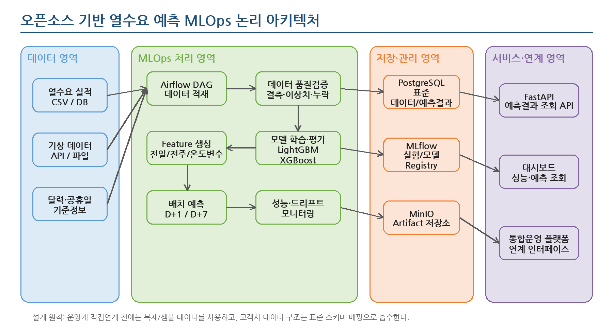
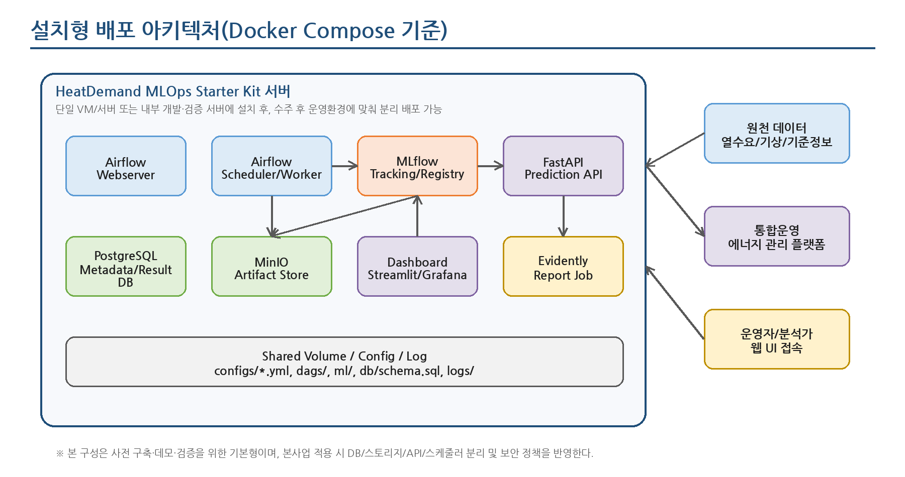
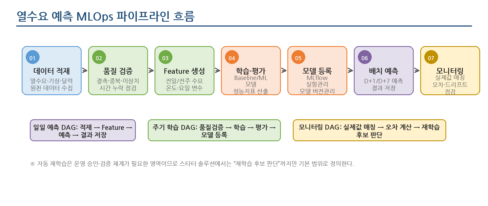

**THERMOps: 열수요 예측 모델 운영 자동화 플랫폼**

**아키텍처 설계서**

**오픈소스 기반 설치형 예측·MLOps 플랫폼 사전 구축안**

문서 버전: v0.1  
작성일: 2026.06.24  
적용 대상: 한국지역난방공사 스마트 통합운영 시스템 제안 사전 준비

# **1. 문서 개요**

## **1.1 문서 목적**

본 문서는 열수요 예측 기능을 수주 후 신속히 설치·적용할 수 있도록 사전에 구축 가능한 오픈소스 기반 MLOps 스타터 솔루션의 아키텍처를 정의한다. 설계 범위는 데이터 적재, 품질 검증, Feature 생성, 모델 학습·평가, 모델 등록, 배치 예측, 성능 모니터링, 예측 API 및 대시보드까지의 기본 구조를 포함한다.

본 설계서는 실제 발주기관 운영환경이 확정되기 전 단계의 사전 구축형 설계안이므로, 운영계 직접 연계나 실제 성능 보장은 범위에서 제외하고 고객사 데이터 구조 확정 후 매핑·보정할 수 있는 표준 구조를 중심으로 작성한다.

## **1.2 설계 범위**

| **구분** | **내용**                                                                                                                |
|----------|-------------------------------------------------------------------------------------------------------------------------|
| **포함** | 설치형 오픈소스 MLOps 구성, 표준 데이터 모델, 배치 파이프라인, 모델 실험/버전관리, 예측 API, 대시보드, 모니터링 구조    |
| **제외** | 발주기관 운영계 직접 연계, 실제 운영 데이터 기반 성능 보증, 완전 자동 재학습, 고가용성 운영 구성, 상세 보안 심사 산출물 |
| **전제** | 초기에는 Docker Compose 기반 단일 서버 설치를 기본으로 하고, 본사업 적용 시 서비스 분리·보안·운영 기준을 반영한다.      |

## **1.3 아키텍처 설계 목표**

- 수주 후 발주기관 데이터 구조에 맞춰 빠르게 데이터 매핑과 모델 재학습을 수행할 수 있는 표준 구조를 확보한다.

- Airflow 기반 배치 오케스트레이션과 MLflow 기반 실험·모델 버전관리를 통해 MLOps 운영 흐름을 명확히 한다.

- 예측 결과, 실제값, 오차, 모델 버전, 파이프라인 실행 이력을 추적 가능한 형태로 저장한다.

- 초기 설치는 단일 서버 기반으로 단순화하되, 운영 전환 시 서비스 분리와 확장 가능한 구조를 유지한다.

# **2. 전체 아키텍처 개요**

## **2.1 논리 아키텍처**

스타터 솔루션은 데이터 영역, MLOps 처리 영역, 저장·관리 영역, 서비스·연계 영역으로 구분한다. 데이터 영역은 열수요 실적, 기상, 달력·공휴일 등 원천 데이터를 표준 스키마로 수용하며, MLOps 처리 영역은 Airflow DAG를 통해 데이터 적재, 품질 검증, Feature 생성, 모델 학습, 배치 예측, 모니터링 작업을 실행한다.

그림 1. 오픈소스 기반 열수요 예측 MLOps 논리 아키텍처

## **2.2 구성 원칙**

| **설계 원칙**   | **내용**                                                                                           |
|-----------------|----------------------------------------------------------------------------------------------------|
| **표준화**      | 원천 데이터 구조가 달라도 표준 테이블과 컬럼 매핑으로 흡수한다.                                    |
| **느슨한 결합** | 운영계 시스템, API, 대시보드는 표준 DB/API를 통해 연계하고 특정 시스템에 강결합하지 않는다.        |
| **재현성**      | 데이터셋 버전, 학습 파라미터, 모델 버전, 성능지표를 기록하여 학습·예측 결과를 추적한다.            |
| **단계적 확장** | 단일 서버 설치형 구성에서 시작해 운영 전환 시 스케줄러, DB, 스토리지, API를 분리할 수 있도록 한다. |
| **운영 안전성** | 자동 재학습은 기본 범위에서 제외하고, 성능 저하 시 재학습 후보를 표시하는 방식으로 설계한다.       |

# **3. 기술 아키텍처**

## **3.1 오픈소스 구성요소**

| **영역**                      | **도구**                                | **적용 방안**                                                                     |
|-------------------------------|-----------------------------------------|-----------------------------------------------------------------------------------|
| **워크플로우 오케스트레이션** | Apache Airflow                          | 데이터 적재, Feature 생성, 모델 학습, 배치 예측, 모니터링 DAG 실행 및 스케줄 관리 |
| **실험·모델 관리**            | MLflow                                  | 학습 파라미터, 성능지표, 모델 Artifact, 모델 Registry, Champion 모델 관리         |
| **예측 모델**                 | Python, scikit-learn, LightGBM, XGBoost | Baseline 및 ML 기반 열수요 예측 모델 학습·평가                                    |
| **데이터 저장소**             | PostgreSQL                              | 표준 데이터, 예측 결과, 실제값, 오차, 파이프라인 실행 이력 저장                   |
| **Artifact 저장소**           | MinIO                                   | 모델 파일, 리포트, 데이터셋 스냅샷, 학습 산출물 저장                              |
| **예측 API**                  | FastAPI                                 | 최신 예측 결과, 모델 성능, 예측 이력 조회 API 제공                                |
| **대시보드**                  | Streamlit 또는 Grafana                  | 예측값/실제값/오차/모델 버전/배치 상태 조회                                       |
| **모니터링 리포트**           | Evidently                               | 데이터 품질, 데이터 드리프트, 성능 변화 리포트 생성                               |

## **3.2 주요 컴포넌트 역할**

| **컴포넌트**                    | **역할**                                                           |
|---------------------------------|--------------------------------------------------------------------|
| **Airflow Scheduler/Webserver** | 정기 배치 스케줄 관리, DAG 실행, 실패 재시도, 실행 로그 확인       |
| **Data Ingestion 모듈**         | CSV/DB/API 기반 원천 데이터 수집, 표준 스키마 적재, 적재 결과 검증 |
| **Feature Engineering 모듈**    | 전일/전주 수요, 이동평균, 온도구간, 시간대, 요일, 공휴일 변수 생성 |
| **Training 모듈**               | Baseline 및 ML 모델 학습, 검증/테스트 성능 산출, MLflow 기록       |
| **Model Registry**              | 검증 모델 등록, 모델 버전 관리, 운영 후보 모델 지정                |
| **Prediction 모듈**             | 운영 후보 모델 로딩, D+1/D+7 예측 수행, 예측 결과 저장             |
| **Monitoring 모듈**             | 실제값 매칭, 오차 계산, 성능 추이 및 드리프트 리포트 생성          |
| **API/Dashboard**               | 통합운영 플랫폼 또는 운영자 화면에서 예측 결과와 성능 정보를 조회  |

# **4. 배포 아키텍처**

## **4.1 기본 배포 구성**

사전 구축 단계에서는 Docker Compose 기반 단일 서버 구성을 기본으로 한다. 이는 설치와 내부 검증을 빠르게 수행하기 위한 방식이며, 본사업 적용 시 보안 정책, 운영환경, 부하 수준, 장애 대응 기준에 따라 컨테이너 또는 서버 단위로 분리 배포할 수 있다.

그림 2. 설치형 배포 아키텍처(Docker Compose 기준)

## **4.2 배포 단위**

| **구성안** | **배포 형태**                 | **내용**                                                                       | **적용 시점**              |
|------------|-------------------------------|--------------------------------------------------------------------------------|----------------------------|
| **기본형** | 단일 VM/서버                  | Airflow, MLflow, PostgreSQL, MinIO, FastAPI, Dashboard를 Docker Compose로 구성 | 사전 구축, 데모, 내부 검증 |
| **검증형** | 2~3대 서버 분리               | DB/스토리지와 애플리케이션 컨테이너를 분리하고, API와 대시보드를 별도 구성     | 고객사 검증환경 적용       |
| **운영형** | 서비스별 분리 또는 Kubernetes | 스케줄러, Worker, DB, 스토리지, API, 모니터링을 운영 기준에 맞게 분리          | 본사업 운영환경 적용       |

## **4.3 네트워크 및 접근 구조**

| **구분**             | **접근 대상**                    | **설계 내용**                                                        |
|----------------------|----------------------------------|----------------------------------------------------------------------|
| **운영자 접근**      | Airflow UI, MLflow UI, Dashboard | 내부망 접근을 기본으로 하고 계정/권한을 적용한다.                    |
| **시스템 연계**      | FastAPI, DB View, File Export    | 통합운영 플랫폼은 API 또는 DB View 방식으로 예측 결과를 조회한다.    |
| **원천 데이터 접근** | DB Connector, CSV, API           | 본사업 착수 후 발주기관의 데이터 제공 방식에 맞춰 커넥터를 선택한다. |
| **외부 기상 데이터** | 공공 API 또는 수신 파일          | 내부망 정책에 따라 직접 호출, 중계 서버, 파일 반입 방식 중 선택한다. |

# **5. 데이터 아키텍처**

## **5.1 표준 데이터 모델**

스타터 솔루션은 발주기관의 원천 데이터 구조를 사전에 알 수 없다는 점을 고려하여, 고객사 컬럼을 내부 표준 스키마로 매핑하는 구조를 채택한다. 표준 데이터 모델은 최소한의 공통 컬럼을 중심으로 구성하고, 현장 적용 시 공급구역, 열원, 설비, 계통 등 추가 기준정보를 확장한다.

| **테이블**              | **용도**     | **주요 컬럼**                                                                                       |
|-------------------------|--------------|-----------------------------------------------------------------------------------------------------|
| **heat_demand_actual**  | 열수요 실적  | site_id, measured_at, heat_demand, supply_temp, return_temp, flow_rate, source_system, created_at   |
| **weather_observation** | 기상 관측    | weather_area_id, measured_at, temperature, humidity, wind_speed, rainfall, apparent_temp            |
| **calendar_dim**        | 달력/공휴일  | date_id, date, day_of_week, is_weekend, is_holiday, season, month, hour                             |
| **feature_table**       | 학습 Feature | site_id, target_at, lag_24h, lag_168h, rolling_mean, temperature, holiday_flag, feature_version     |
| **prediction_result**   | 예측 결과    | prediction_id, site_id, target_at, predicted_demand, model_name, model_version, horizon, created_at |
| **model_evaluation**    | 성능 평가    | eval_id, site_id, model_version, eval_start_at, eval_end_at, mae, rmse, mape, created_at            |
| **pipeline_run_log**    | 실행 이력    | run_id, dag_id, task_id, status, started_at, ended_at, message                                      |

## **5.2 데이터 처리 흐름**

> 1\. 원천 데이터는 고객사 DB, CSV 파일, API 중 하나 이상의 방식으로 수집한다.
>
> 2\. 수집 데이터는 표준 스키마에 적재되며, 컬럼명·단위·시간대·측정주기 차이는 매핑 설정으로 관리한다.
>
> 3\. 품질 검증 단계에서 결측, 중복, 시간 누락, 비정상 수요값을 탐지하고 검증 결과를 저장한다.
>
> 4\. Feature 생성 단계에서 학습/예측에 필요한 파생 변수를 생성하고 Feature 버전을 부여한다.
>
> 5\. 예측 결과는 모델 버전과 함께 저장하여, 특정 예측값이 어떤 데이터와 모델로 생성되었는지 추적 가능하도록 한다.

## **5.3 데이터 매핑 전략**

| **전략**        | **설계 내용**                                                                 |
|-----------------|-------------------------------------------------------------------------------|
| **컬럼 매핑**   | 원천 컬럼명과 표준 컬럼명을 YAML 또는 DB 설정으로 매핑한다.                   |
| **단위 변환**   | Gcal, MWh, GJ 등 수요 단위가 다를 경우 표준 단위로 변환하는 규칙을 등록한다.  |
| **시간 정규화** | 분/시간/일 단위 데이터를 예측 기준 시간 단위로 정렬하고 누락 구간을 식별한다. |
| **지역 매핑**   | 지사, 공급구역, 기상 관측지역 간 매핑 테이블을 구성한다.                      |
| **품질 규칙**   | 결측 허용률, 이상치 기준, 최소 학습기간 등 검증 규칙을 설정화한다.            |

# **6. MLOps 파이프라인 아키텍처**

## **6.1 파이프라인 구성**

열수요 예측 MLOps 파이프라인은 일일 예측 DAG, 주기 학습 DAG, 모니터링 DAG로 분리한다. 일일 예측 DAG는 운영상 필요한 예측 결과를 생성하고, 주기 학습 DAG는 모델 개선과 버전 등록을 수행하며, 모니터링 DAG는 예측값과 실제값을 비교하여 성능 저하 여부를 판단한다.

그림 3. 열수요 예측 MLOps 파이프라인 흐름

## **6.2 Airflow DAG 설계**

| **DAG**                  | **실행 주기**           | **주요 작업**                                                           |
|--------------------------|-------------------------|-------------------------------------------------------------------------|
| **data_ingestion_dag**   | 일 1회 또는 수동        | 열수요/기상/달력 데이터 적재, 적재 건수 및 누락시간 검증                |
| **feature_build_dag**    | 일 1회                  | Feature Table 생성, Feature 버전 기록, 학습/예측 데이터셋 생성          |
| **model_training_dag**   | 주 1회/월 1회 또는 수동 | Baseline/ML 모델 학습, 성능 평가, MLflow 실험 기록, 후보 모델 등록      |
| **batch_prediction_dag** | 일 1회 또는 운영 기준   | Champion 모델 로딩, D+1/D+7 예측, prediction_result 저장                |
| **monitoring_dag**       | 일 1회                  | 실제값 매칭, MAE/RMSE/MAPE 계산, 드리프트 리포트 생성, 재학습 후보 판단 |

## **6.3 모델 학습·등록 흐름**

> 1\. 학습 실행 시 데이터셋 버전, 학습 기간, 검증 기간, 알고리즘, 하이퍼파라미터를 MLflow에 기록한다.
>
> 2\. Baseline 모델과 ML 모델을 동일한 테스트 구간에서 비교하고 MAE, RMSE, MAPE를 산출한다.
>
> 3\. 검증 기준을 통과한 모델은 MLflow Model Registry에 등록하고, 운영 후보 모델로 전환할 수 있도록 한다.
>
> 4\. 운영 예측 배치는 Registry에서 지정된 Champion 모델을 조회하여 예측을 수행한다.

## **6.4 재학습 판단 기준**

| **판단 기준**      | **내용**                                                              |
|--------------------|-----------------------------------------------------------------------|
| **성능 저하**      | 최근 N일 MAPE가 기준값을 초과하거나 기존 모델 대비 악화될 경우        |
| **데이터 변화**    | 기온, 수요, 시간대별 패턴이 학습 기준 데이터와 유의미하게 달라질 경우 |
| **운영 조건 변화** | 공급구역, 설비, 운전정책, 계절 패턴 변경 등 외부 조건 변화 발생 시    |
| **정기 개선**      | 월/분기 단위로 신규 데이터를 반영한 모델 재학습 필요 시               |

※ 스타터 솔루션 기본 범위에서는 자동 재학습 실행이 아니라 “재학습 후보 표시 및 수동 승인 후 학습 실행” 구조를 권장한다.

# **7. 서비스/API 아키텍처**

## **7.1 API 제공 범위**

| **API**                      | **기능**            | **주요 파라미터**                        | **설명**                                            |
|------------------------------|---------------------|------------------------------------------|-----------------------------------------------------|
| **GET /predictions/latest**  | 최신 예측 결과 조회 | site_id, horizon                         | 대상 지사/권역의 최신 D+1/D+7 예측 조회             |
| **GET /predictions/history** | 예측 이력 조회      | site_id, start_at, end_at, model_version | 기간별 예측값, 실제값, 오차 조회                    |
| **GET /models/current**      | 운영 모델 조회      | site_id                                  | 현재 사용 중인 모델명, 버전, 등록일, 주요 성능 조회 |
| **GET /models/performance**  | 모델 성능 조회      | site_id, model_version, period           | MAE, RMSE, MAPE 추이 조회                           |
| **POST /predictions/run**    | 수동 예측 실행      | site_id, target_date, horizon            | 관리자 또는 검증환경에서 수동 예측 실행             |

## **7.2 통합운영 플랫폼 연계 방식**

| **연계 방식**    | **내용**                                                             | **적용 고려사항**                             |
|------------------|----------------------------------------------------------------------|-----------------------------------------------|
| **API 연계**     | 통합운영 플랫폼에서 FastAPI를 호출하여 최신 예측값과 성능지표를 조회 | 서비스 분리가 명확하고 화면 연계가 쉬움       |
| **DB View 연계** | 예측 결과 테이블을 기반으로 조회 전용 View 제공                      | 내부 시스템이 DB 조회 방식에 익숙한 경우 적합 |
| **파일 Export**  | 일별 예측 결과를 CSV/JSON 파일로 반출                                | 초기 검증 또는 폐쇄망 연계 시 사용 가능       |

## **7.3 대시보드 구성**

| **화면 영역**       | **주요 내용**                                  |
|---------------------|------------------------------------------------|
| **예측 현황**       | 지사/권역별 D+1/D+7 예측값, 시간대별 예측 곡선 |
| **실제 대비 오차**  | 예측값·실제값 비교, MAE/RMSE/MAPE 기간별 추이  |
| **모델 관리**       | 모델 버전, 학습일, 사용 여부, 주요 성능지표    |
| **파이프라인 상태** | DAG 실행 성공/실패, 최근 실행일시, 실패 메시지 |
| **모니터링 리포트** | 데이터 품질, 드리프트 결과, 재학습 후보 표시   |

# **8. 보안·운영 아키텍처**

## **8.1 보안 설계 기준**

| **항목**          | **설계 내용**                                                                     |
|-------------------|-----------------------------------------------------------------------------------|
| **접근통제**      | Airflow, MLflow, Dashboard, API는 내부망 접근과 계정 기반 인증을 기본으로 한다.   |
| **권한분리**      | 운영자, 분석가, 관리자 역할을 분리하고 모델 등록·전환은 관리자 권한으로 제한한다. |
| **비밀정보 관리** | DB 접속정보, API Key, MinIO Access Key는 .env 또는 Secret 저장소로 분리한다.      |
| **데이터 보호**   | 운영계 원천 데이터는 직접 변경하지 않고 복제/추출 데이터 기반으로 처리한다.       |
| **감사로그**      | 예측 실행, 모델 등록, 모델 전환, 수동 재학습 실행 이력을 로그로 남긴다.           |

## **8.2 로그 및 모니터링**

| **로그/지표**         | **내용**                                     | **저장/조회 방식**                |
|-----------------------|----------------------------------------------|-----------------------------------|
| **애플리케이션 로그** | API 요청/응답, 오류, 예측 실행 결과          | FastAPI 로그, 파일 또는 표준 출력 |
| **파이프라인 로그**   | DAG/Task 실행 상태, 실패 원인, 재시도 이력   | Airflow 로그/Metadata DB          |
| **모델 로그**         | 학습 파라미터, 성능지표, Artifact 위치       | MLflow Tracking                   |
| **데이터 품질 로그**  | 결측/이상치/시간 누락 검증 결과              | PostgreSQL, Evidently 리포트      |
| **운영 지표**         | 컨테이너 상태, CPU/Memory/Disk, API 응답시간 | Grafana/Prometheus 연계 가능      |

## **8.3 장애 대응 및 재처리**

- 데이터 적재 실패 시 원천별 실패 로그를 남기고 동일 기간 재적재 기능을 제공한다.

- Feature 생성 실패 시 대상 기간과 site_id를 기준으로 부분 재실행할 수 있도록 설계한다.

- 배치 예측 실패 시 마지막 정상 모델과 입력 데이터 기준으로 재실행하며, 예측 결과 중복 저장을 방지한다.

- MLflow Registry 또는 Artifact 저장소 장애 시 운영 모델 로딩 실패를 감지하고 관리자에게 알림 대상 이벤트로 기록한다.

# **9. 인프라 및 성능 고려사항**

## **9.1 사전 구축 권장 사양**

| **구분**           | **권장 사양**                    | **비고**                                                    |
|--------------------|----------------------------------|-------------------------------------------------------------|
| **개발/데모 서버** | 8 vCPU, RAM 32GB, SSD 500GB 이상 | 단일 서버 Docker Compose 설치, 샘플 데이터 기반 검증        |
| **검증 서버**      | 16 vCPU, RAM 64GB, SSD 1TB 이상  | 다수 지사/권역 데이터 및 반복 학습 검증                     |
| **운영 전환**      | 부하 산정 후 분리 구성           | DB/스토리지/API/스케줄러 분리, 백업·모니터링·보안 정책 반영 |

## **9.2 성능 설계 고려사항**

| **항목**      | **고려사항**                                                                         |
|---------------|--------------------------------------------------------------------------------------|
| **예측 주기** | 시간별/일별 예측 단위에 따라 Feature 생성량과 배치 실행 시간을 산정한다.             |
| **대상 수**   | 지사/권역/site_id 수가 증가하면 모델 단위와 병렬 실행 전략을 결정해야 한다.          |
| **학습 기간** | 최소 2~3년 이상의 과거 데이터가 확보될수록 계절성과 기온 민감도 학습에 유리하다.     |
| **모델 전략** | 전체 통합 모델, 권역별 모델, 지사별 모델 중 데이터 규모와 운영 목적에 맞게 선택한다. |
| **저장 용량** | 원천 데이터, Feature, 모델 Artifact, 리포트, 로그의 보관 기간을 기준으로 산정한다.   |

# **10. 본사업 적용 및 확장 방안**

## **10.1 수주 후 적용 절차**

| **단계**  | **작업**    | **주요 내용**                                                          |
|-----------|-------------|------------------------------------------------------------------------|
| **1단계** | 환경 설치   | 내부 검증 서버 또는 고객사 검증환경에 스타터 솔루션 설치               |
| **2단계** | 데이터 진단 | 원천 시스템, 컬럼, 측정주기, 단위, 누락 데이터 현황 분석               |
| **3단계** | 표준 매핑   | 고객사 데이터 컬럼을 표준 스키마에 매핑하고 단위/시간 정규화 규칙 설정 |
| **4단계** | 모델 재학습 | 실제 과거 데이터 기반 Feature 보정, Baseline/ML 모델 학습 및 성능 비교 |
| **5단계** | 배치 운영   | 일일 예측, 실제값 매칭, 성능 모니터링 DAG 실행                         |
| **6단계** | 통합 연계   | 통합운영 플랫폼 화면/API/DB View와 예측 결과 연계                      |

## **10.2 확장 후보**

| **확장 항목**          | **내용**                                                                      |
|------------------------|-------------------------------------------------------------------------------|
| **Feature Store 도입** | Feast 등 오픈소스 Feature Store를 활용하여 학습/예측 Feature 일관성 강화      |
| **Kubernetes 전환**    | 운영 규모 확대 시 스케줄러, Worker, API, 모델 서버를 Kubernetes 기반으로 배포 |
| **모델 서빙 고도화**   | Batch 중심에서 실시간 또는 준실시간 예측 API로 확장                           |
| **알림 연계**          | 예측 실패, 성능 저하, 드리프트 발생 시 메신저/메일/SMS 알림 연계              |
| **AIOps 연계**         | 예측 성능 저하와 운영 이벤트를 결합하여 원인 분석·가이드 제공                 |

## **10.3 리스크 및 대응방안**

| **리스크**                | **내용**                                      | **대응방안**                                                    |
|---------------------------|-----------------------------------------------|-----------------------------------------------------------------|
| **원천 데이터 품질 부족** | 결측·이상치·단위 불일치로 모델 성능 저하 가능 | 데이터 품질 진단 리포트와 보정 규칙을 우선 구축                 |
| **운영환경 차이**         | 사전 구축 환경과 실제 고객사 환경 차이 발생   | Docker Compose 기본형과 분리 배포형을 모두 지원하는 구조로 준비 |
| **모델 성능 불확실성**    | 실제 데이터 확보 전 성능 보장 불가            | Baseline 대비 개선율, 지사별 성능 비교 방식으로 검증            |
| **자동 재학습 위험**      | 검증 없는 모델 교체 시 운영 리스크 발생       | 재학습 후보 판단 후 수동 승인·검증 절차 적용                    |
| **오픈소스 운영 부담**    | 패치, 보안, 버전 호환성 관리 필요             | 버전 고정, 설치 가이드, 운영 점검표, 백업 절차 마련             |

# **11. 부록**

## **11.1 디렉터리 구조 예시**

heat-demand-mlops/  
├─ docker-compose.yml  
├─ .env.example  
├─ airflow/  
│ └─ dags/  
│ ├─ 01_data_ingestion_dag.py  
│ ├─ 02_feature_build_dag.py  
│ ├─ 03_model_training_dag.py  
│ ├─ 04_batch_prediction_dag.py  
│ └─ 05_monitoring_dag.py  
├─ ml/  
│ ├─ features/  
│ ├─ training/  
│ ├─ evaluation/  
│ └─ prediction/  
├─ api/  
│ └─ app.py  
├─ dashboard/  
├─ db/  
│ ├─ schema.sql  
│ └─ seed_sample_data.sql  
├─ configs/  
│ ├─ sites.yml  
│ ├─ data_sources.yml  
│ └─ model_config.yml  
└─ docs/  
├─ 설치가이드.md  
├─ 데이터매핑가이드.md  
└─ 운영가이드.md

## **11.2 주요 설정 파일 예시**

| **파일**                   | **내용**                                                      |
|----------------------------|---------------------------------------------------------------|
| **sites.yml**              | site_id, 지사/권역명, 기상 관측지역 매핑, 예측 단위 설정      |
| **data_sources.yml**       | 원천 DB/CSV/API 접속정보, 컬럼 매핑, 수집 주기 설정           |
| **model_config.yml**       | 알고리즘, 학습기간, 검증기간, Feature 목록, 성능 기준 설정    |
| **airflow_variables.json** | DAG 실행 파라미터, 재처리 기간, 알림 여부 설정                |
| **.env**                   | DB 계정, MinIO Key, MLflow Tracking URI, API 포트 등 환경변수 |

## **11.3 설계 요약**

본 아키텍처는 오픈소스 기반 MLOps 도구를 활용하여 열수요 예측 모델의 개발·운영 생명주기를 빠르게 구성하기 위한 사전 구축형 설계안이다. 핵심은 발주기관 데이터 구조가 확정되기 전에도 설치 가능한 공통 플랫폼 골격을 확보하고, 수주 후 표준 스키마 매핑, Feature 보정, 모델 재학습, 통합운영 플랫폼 연계를 통해 신속히 적용하는 것이다. 초기에는 Docker Compose 기반 단일 서버형으로 구축하되, 본사업 적용 시 운영 보안, 성능, 장애 대응, 서비스 분리 기준에 따라 확장할 수 있다.
