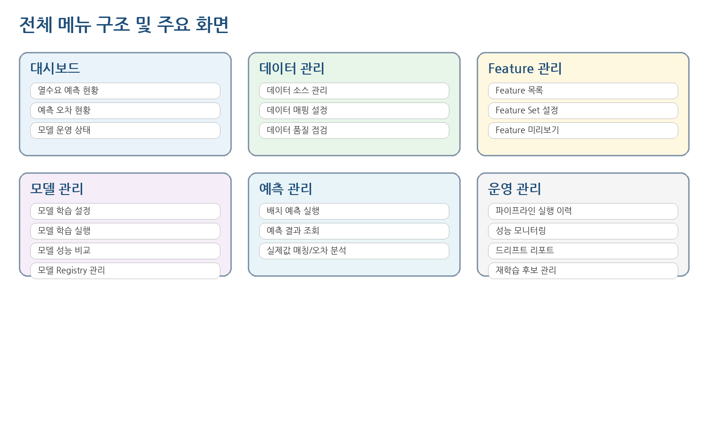
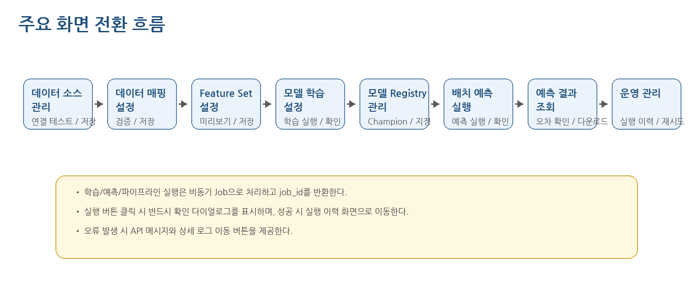
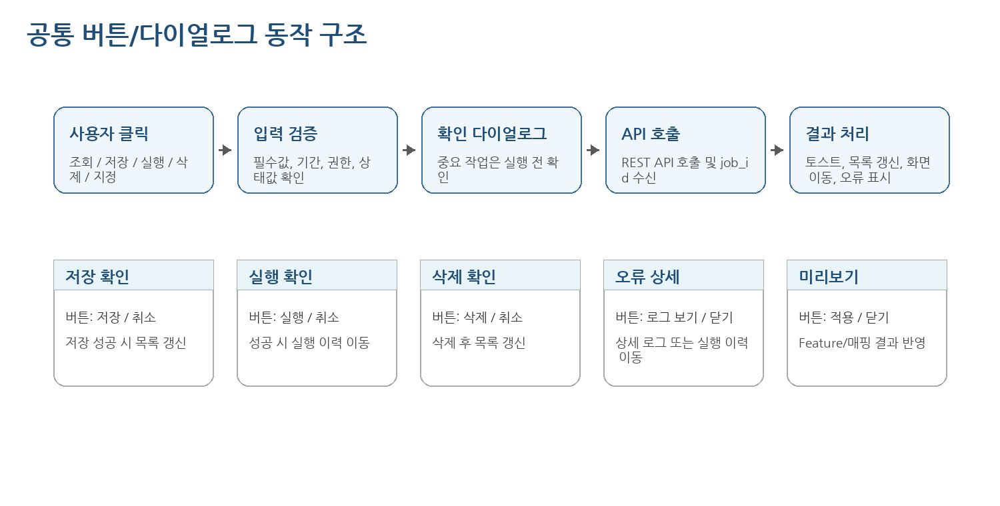

**THERMOps: 열수요 예측 모델 운영 자동화 플랫폼  
화면 설계서**

정식 UI 설계 및 Figma 인터랙티브 프로토타입 제작 기준

| **항목**  | **내용**                                                                                            |
|-----------|-----------------------------------------------------------------------------------------------------|
| 문서명    | THERMOps: 열수요 예측 모델 운영 자동화 플랫폼 화면 설계서                                                          |
| 작성 기준 | 기능정의서, 아키텍처 설계서, DB 설계서, 데이터 매핑 정의서, 배치/파이프라인 설계서, API 설계서 기반 |
| 작성 목적 | 전체 메뉴, 화면 구성, 버튼 이벤트, 팝업/다이얼로그, 화면 이동, API 연계 기준 정의                   |
| 적용 범위 | 사전 구축형 솔루션의 관리 UI 및 Figma 인터랙티브 프로토타입 제작 범위                               |
| 작성일    | 2026.06.24                                                                                          |
| 버전      | v0.1                                                                                                |

# 문서 이력

| **버전** | **일자**   | **작성/수정 내용**                                   | **비고**               |
|----------|------------|------------------------------------------------------|------------------------|
| v0.1     | 2026.06.24 | THERMOps: 열수요 예측 모델 운영 자동화 플랫폼 화면 설계서 최초 작성 | 제안 전 사전 구축 기준 |

# 목차

1\. 개요

2\. 화면 설계 기준

3\. 사용자 역할 및 권한

4\. 전체 메뉴 구조

5\. 화면 목록

6\. 공통 UI 구성

7\. 화면 전환 및 인터랙션 원칙

8\. 화면별 상세 설계

9\. 공통 팝업/다이얼로그 설계

10\. 화면-API 연계 매트릭스

11\. 권한별 버튼 노출 기준

12\. 상태값 및 메시지 기준

13\. Figma 인터랙티브 프로토타입 제작 기준

14\. 수주 후 보정 필요사항

15\. 후속 작업

# 1. 개요

## 1.1 목적

본 문서는 오픈소스 기반 THERMOps: 열수요 예측 모델 운영 자동화 플랫폼의 관리 UI를 설계하기 위한 문서이다. 단순 샘플 화면이 아니라, Figma 인터랙티브 프로토타입 및 프론트엔드 구현 기준으로 사용할 수 있도록 전체 메뉴, 화면별 구성요소, 버튼 이벤트, 팝업/다이얼로그, 화면 이동, API 연계를 정의한다.

## 1.2 설계 범위

- 데이터 소스 등록, 데이터 매핑, 데이터 품질 점검 화면

- Feature 목록, Feature Set 설정, Feature 미리보기 화면

- 모델 학습 설정, 학습 실행 이력, 성능 비교, 모델 Registry 관리 화면

- 배치 예측 실행, 예측 결과 조회, 실제값 매칭 및 오차 분석 화면

- 파이프라인 실행 이력, 성능 모니터링, 드리프트 리포트, 재학습 후보 관리 화면

- 공통 코드/설정 관리 및 공통 팝업/다이얼로그

## 1.3 설계 전제

| **구분**     | **전제 내용**                                                                                        |
|--------------|------------------------------------------------------------------------------------------------------|
| UI 성격      | 실제 구현을 전제로 한 정식 화면 설계이며, 단순 데모용 샘플 UI가 아니다.                              |
| 프론트엔드   | React 기반 SPA를 가정하되, Figma 설계는 특정 프레임워크에 종속되지 않는다.                           |
| API 연계     | 화면은 직접 Airflow/MLflow를 호출하지 않고, 솔루션 API 서버를 통해 일관된 권한/오류 처리를 수행한다. |
| 비동기 처리  | 학습, 예측, 파이프라인 실행은 job_id 또는 run_id를 반환하고 실행 이력 화면에서 추적한다.             |
| 권한         | 관리자, 데이터 관리자, 분석가, 운영자, 모델 승인자, 조회자 역할을 기준으로 버튼 노출을 제어한다.     |
| 수주 후 보정 | 발주기관의 SSO, 메뉴 체계, 디자인 시스템, 실제 운영 프로세스가 확정되면 화면명/권한/버튼은 보정한다. |

# 2. 화면 설계 기준

| **설계 기준**    | **내용**                                                                                                                                 |
|------------------|------------------------------------------------------------------------------------------------------------------------------------------|
| 업무 흐름 중심   | 데이터 준비 → Feature 구성 → 모델 학습 → 모델 등록 → 예측 실행 → 성능 모니터링 → 재학습 후보 관리 흐름이 자연스럽게 이어지도록 구성한다. |
| 확인 후 실행     | 저장, 삭제, 학습 실행, 예측 실행, Champion 지정, 파이프라인 재시도 등 영향도가 큰 작업은 확인 다이얼로그를 표시한다.                     |
| 비동기 작업 추적 | 실행 버튼 클릭 후 긴 작업을 화면에서 대기시키지 않고, 실행 이력 화면으로 이동하여 상태를 추적한다.                                       |
| 설정 기반 적용   | 발주기관 데이터 구조에 맞춰 데이터 매핑, Feature Set, 학습 설정을 화면에서 조정할 수 있도록 한다.                                        |
| 오류 가시화      | 필수값 오류, 권한 오류, API 오류, 파이프라인 실패, 데이터 검증 실패는 사용자 조치가 가능한 메시지로 표시한다.                            |
| Figma 제작 연계  | 모든 화면은 Frame ID, 버튼명, 팝업명, 이동 대상 화면이 명확하도록 설계한다.                                                              |

# 3. 사용자 역할 및 권한

| **역할**      | **권한 범위**               | **주요 가능 작업**                                                                   |
|---------------|-----------------------------|--------------------------------------------------------------------------------------|
| 관리자        | 전체 관리 권한              | 데이터 소스 등록, 매핑 수정, Feature/학습/예측/운영 설정, Champion 지정, 시스템 설정 |
| 데이터 관리자 | 데이터 준비 권한            | 데이터 소스 등록, 데이터 매핑, 데이터 품질 점검 실행                                 |
| 분석가        | 모델/Feature/예측 운영 권한 | Feature Set 구성, 모델 학습 설정/실행, 성능 비교, 예측 실행                          |
| 운영자        | 배치 운영 및 모니터링 권한  | 파이프라인 상태 확인, 실패 재시도, 로그 조회, 품질/성능 모니터링                     |
| 모델 승인자   | 운영 모델 승인 권한         | Champion 지정, 재학습 후보 승인/반려                                                 |
| 조회자        | 조회 권한                   | 대시보드, 예측 결과, 성능지표 조회                                                   |

# 4. 전체 메뉴 구조

## 4.1 메뉴 구조도

## 4.2 메뉴 목록

| **1Depth**   | **2Depth 화면명**        | **화면ID** | **Route**                  | **권한**                    | **주요 기능**                                          |
|--------------|--------------------------|------------|----------------------------|-----------------------------|--------------------------------------------------------|
| 대시보드     | 열수요 예측 대시보드     | DASH-001   | /dashboard                 | 관리자/분석가/운영자/조회자 | 예측 현황, 최신 오차, 모델 상태, 실패 배치 요약        |
| 데이터 관리  | 데이터 소스 관리         | DATA-001   | /data/sources              | 관리자/데이터 관리자        | CSV/DB/API 데이터 소스 등록, 연결 테스트, 적재 실행    |
| 데이터 관리  | 데이터 매핑 설정         | MAP-001    | /data/mappings             | 관리자/데이터 관리자        | 원천 컬럼과 표준 스키마 매핑, 검증 결과 확인           |
| 데이터 관리  | 데이터 품질 점검         | DATA-002   | /data/quality              | 관리자/분석가/운영자        | 결측, 중복, 이상치, 시간 누락 점검 결과 조회           |
| Feature 관리 | Feature 목록             | FEAT-001   | /features                  | 관리자/분석가/조회자        | 원천/파생 Feature 정의와 사용 상태 관리                |
| Feature 관리 | Feature Set 설정         | FEAT-002   | /feature-sets              | 관리자/분석가               | 학습 입력값 묶음 구성, 미리보기, 복제                  |
| 모델 관리    | 모델 학습 설정           | ML-001     | /models/training-configs   | 관리자/분석가               | 학습 대상, 기간, 알고리즘, 평가 지표, Feature Set 설정 |
| 모델 관리    | 모델 학습 실행           | ML-002     | /models/training-jobs      | 관리자/분석가               | 학습 실행 요청, 진행 상태, 로그, 결과 확인             |
| 모델 관리    | 모델 성능 비교           | ML-003     | /models/performance        | 관리자/분석가/조회자        | 모델 버전별 MAE/RMSE/MAPE 비교 및 차트 조회            |
| 모델 관리    | 모델 Registry 관리       | ML-004     | /models/registry           | 관리자/모델승인자/분석가    | 모델 버전 조회, Champion 지정, 모델 상태 변경          |
| 예측 관리    | 배치 예측 실행           | PRED-001   | /predictions/jobs          | 관리자/분석가               | D+1/D+7/CUSTOM 예측 작업 수동 실행                     |
| 예측 관리    | 예측 결과 조회           | PRED-002   | /predictions/results       | 관리자/분석가/조회자        | 예측값/실제값/오차 표와 차트 조회                      |
| 예측 관리    | 실제값 매칭 및 오차 분석 | PRED-003   | /predictions/errors        | 관리자/분석가/운영자        | 실제값 매칭 상태, 오차 재계산, 오차 원인 메모          |
| 운영 관리    | 파이프라인 실행 이력     | OPS-001    | /ops/pipeline-runs         | 관리자/운영자/분석가        | Airflow DAG 실행 상태, 재시도, 로그 조회               |
| 운영 관리    | 성능 모니터링            | OPS-002    | /ops/model-monitoring      | 관리자/운영자/분석가/조회자 | 기간별 성능 추이, 임계치 초과 알림                     |
| 운영 관리    | 드리프트 리포트          | OPS-003    | /ops/drift-reports         | 관리자/운영자/분석가        | 데이터 드리프트 리포트 조회 및 상세 확인               |
| 운영 관리    | 재학습 후보 관리         | OPS-004    | /ops/retraining-candidates | 관리자/분석가/모델승인자    | 성능 저하/드리프트 기준 재학습 후보 검토               |
| 시스템 관리  | 공통 코드/설정 관리      | SYS-001    | /system/configs            | 관리자                      | 지사, 권역, 상태값, 임계치 등 공통 설정 관리           |

# 5. 화면 목록

| **No** | **화면ID** | **화면명**               | **메뉴**     | **Route**                  | **설명**                                               |
|--------|------------|--------------------------|--------------|----------------------------|--------------------------------------------------------|
| 1      | DASH-001   | 열수요 예측 대시보드     | 대시보드     | /dashboard                 | 예측 현황, 최신 오차, 모델 상태, 실패 배치 요약        |
| 2      | DATA-001   | 데이터 소스 관리         | 데이터 관리  | /data/sources              | CSV/DB/API 데이터 소스 등록, 연결 테스트, 적재 실행    |
| 3      | MAP-001    | 데이터 매핑 설정         | 데이터 관리  | /data/mappings             | 원천 컬럼과 표준 스키마 매핑, 검증 결과 확인           |
| 4      | DATA-002   | 데이터 품질 점검         | 데이터 관리  | /data/quality              | 결측, 중복, 이상치, 시간 누락 점검 결과 조회           |
| 5      | FEAT-001   | Feature 목록             | Feature 관리 | /features                  | 원천/파생 Feature 정의와 사용 상태 관리                |
| 6      | FEAT-002   | Feature Set 설정         | Feature 관리 | /feature-sets              | 학습 입력값 묶음 구성, 미리보기, 복제                  |
| 7      | ML-001     | 모델 학습 설정           | 모델 관리    | /models/training-configs   | 학습 대상, 기간, 알고리즘, 평가 지표, Feature Set 설정 |
| 8      | ML-002     | 모델 학습 실행           | 모델 관리    | /models/training-jobs      | 학습 실행 요청, 진행 상태, 로그, 결과 확인             |
| 9      | ML-003     | 모델 성능 비교           | 모델 관리    | /models/performance        | 모델 버전별 MAE/RMSE/MAPE 비교 및 차트 조회            |
| 10     | ML-004     | 모델 Registry 관리       | 모델 관리    | /models/registry           | 모델 버전 조회, Champion 지정, 모델 상태 변경          |
| 11     | PRED-001   | 배치 예측 실행           | 예측 관리    | /predictions/jobs          | D+1/D+7/CUSTOM 예측 작업 수동 실행                     |
| 12     | PRED-002   | 예측 결과 조회           | 예측 관리    | /predictions/results       | 예측값/실제값/오차 표와 차트 조회                      |
| 13     | PRED-003   | 실제값 매칭 및 오차 분석 | 예측 관리    | /predictions/errors        | 실제값 매칭 상태, 오차 재계산, 오차 원인 메모          |
| 14     | OPS-001    | 파이프라인 실행 이력     | 운영 관리    | /ops/pipeline-runs         | Airflow DAG 실행 상태, 재시도, 로그 조회               |
| 15     | OPS-002    | 성능 모니터링            | 운영 관리    | /ops/model-monitoring      | 기간별 성능 추이, 임계치 초과 알림                     |
| 16     | OPS-003    | 드리프트 리포트          | 운영 관리    | /ops/drift-reports         | 데이터 드리프트 리포트 조회 및 상세 확인               |
| 17     | OPS-004    | 재학습 후보 관리         | 운영 관리    | /ops/retraining-candidates | 성능 저하/드리프트 기준 재학습 후보 검토               |
| 18     | SYS-001    | 공통 코드/설정 관리      | 시스템 관리  | /system/configs            | 지사, 권역, 상태값, 임계치 등 공통 설정 관리           |

# 6. 공통 UI 구성

## 6.1 공통 레이아웃

| **영역**        | **구성요소**                                | **설계 기준**                                                      |
|-----------------|---------------------------------------------|--------------------------------------------------------------------|
| Header          | 시스템명, 현재 사용자, 권한, 알림, 로그아웃 | SSO 연계 시 로그아웃 정책은 발주기관 기준을 따른다.                |
| Left Navigation | 1Depth/2Depth 메뉴, 현재 메뉴 강조          | 권한이 없는 메뉴는 숨김 또는 비활성 처리한다.                      |
| Page Header     | 화면명, 설명, Breadcrumb, 주요 버튼         | 실행/신규/다운로드 등 중요 버튼은 우측 정렬한다.                   |
| Search Panel    | 기간, 지사/권역, 상태, 모델, 키워드         | 조회 조건 변경 후 조회 버튼 클릭 시 API 호출한다.                  |
| Grid/List       | 목록 데이터, 정렬, 페이징, 행 선택          | 행 클릭 시 상세 Drawer 또는 상세 팝업을 표시한다.                  |
| Detail Drawer   | 상세 정보, 입력/수정 항목, 로그, 결과       | 목록 화면을 유지한 채 오른쪽에서 표시한다.                         |
| Dialog/Modal    | 확인, 실행, 오류, 미리보기, 상세 로그       | 중요 작업은 확인/취소 버튼을 제공한다.                             |
| Toast/Alert     | 성공, 실패, 경고, 안내 메시지               | 실행 결과는 3~5초 토스트로 표시하고 상세 오류는 팝업으로 연결한다. |

## 6.2 공통 버튼 기준

| **버튼 유형** | **대표 버튼**                                      | **공통 동작**                                                 |
|---------------|----------------------------------------------------|---------------------------------------------------------------|
| 조회          | 조회, 새로고침                                     | 검색조건 검증 후 목록/차트 API 호출, 성공 시 화면 갱신        |
| 등록/수정     | 신규, 저장, 복제                                   | 필수값 검증 후 저장 API 호출, 성공 시 목록 갱신               |
| 검증          | 연결 테스트, 매핑 검증, 계산식 검증                | 검증 API 호출 후 결과 패널 또는 팝업 표시                     |
| 실행          | 학습 실행, 예측 실행, 점검 실행, 리포트 생성       | 확인 다이얼로그 표시 후 비동기 Job API 호출                   |
| 상태 변경     | Champion 지정, 사용/미사용, 승인, 반려             | 권한/상태 검증 후 확인 다이얼로그를 통해 처리                 |
| 이동          | 상세보기, 성능 보기, Registry 이동, 실행 이력 이동 | 현재 조건 또는 대상 ID를 전달하여 관련 화면으로 이동          |
| 다운로드      | CSV 다운로드, 리포트 다운로드, 로그 다운로드       | 현재 조회 조건 기준 파일 생성. 대량 데이터는 비동기 처리 가능 |

# 7. 화면 전환 및 인터랙션 원칙

## 7.1 화면 이동 원칙

- 조회성 화면 간 이동 시 사용자가 입력한 검색조건을 query parameter 또는 화면 상태로 전달한다.

- 학습/예측/파이프라인 실행 성공 시 즉시 결과를 기다리지 않고 실행 이력 화면으로 이동한다.

- 오류가 발생하면 화면 이동을 하지 않고 오류 다이얼로그 또는 토스트를 표시한다.

- 권한이 없는 버튼은 원칙적으로 숨김 처리하며, 공통 정책상 필요할 경우 비활성 및 툴팁으로 사유를 표시한다.

- 삭제, 상태 변경, 운영 모델 지정, 재학습 실행 등 영향도가 큰 작업은 확인 다이얼로그를 필수로 표시한다.

# 8. 화면별 상세 설계

## 8.1 DASH-001 열수요 예측 대시보드

| **항목**  | **내용**                                                                                                   |
|-----------|------------------------------------------------------------------------------------------------------------|
| 화면ID    | DASH-001                                                                                                   |
| 화면명    | 열수요 예측 대시보드                                                                                       |
| Route     | /dashboard                                                                                                 |
| 접근 권한 | 관리자/분석가/운영자/조회자                                                                                |
| 주요 API  | GET /api/v1/dashboard/overview, GET /api/v1/dashboard/prediction-trend, GET /api/v1/dashboard/model-health |
| 화면 목적 | 전체 열수요 예측 운영 현황을 카드, 차트, 알림 형태로 요약하여 제공한다.                                    |

### 화면 구성

| **영역**  | **표시/입력 항목**                                                           | **설계 기준**                            |
|-----------|------------------------------------------------------------------------------|------------------------------------------|
| 상단 카드 | 금일 예측 대상, 최신 MAPE, 운영 모델 버전, 실패 파이프라인, 재학습 후보 건수 | 대시보드 진입 시 자동 조회               |
| 검색 조건 | 지사/권역, 기간, 예측구간, 모델 버전                                         | 기본값은 전체 지사/최근 7일              |
| 추이 차트 | 예측값, 실제값, 오차율 시계열                                                | 실제값 미매칭 구간은 점선 또는 공백 처리 |
| 알림 영역 | 실패 작업, 임계치 초과, Champion 미지정, 재학습 후보                         | 알림 클릭 시 관련 화면 이동              |

### 버튼 및 이벤트

| **버튼** | **클릭 동작**                                                     | **성공 시**                        | **실패/예외 시**      |
|----------|-------------------------------------------------------------------|------------------------------------|-----------------------|
| 조회     | 검색조건 검증 후 대시보드 API 재호출                              | 카드/차트/알림 갱신                | 오류 토스트 표시      |
| 상세보기 | 선택 카드 유형에 따라 예측 결과/성능 모니터링/실행 이력 화면 이동 | 해당 조건을 query parameter로 전달 | 권한 없으면 이동 차단 |
| 새로고침 | 현재 조건으로 전체 데이터 재조회                                  | 최종 갱신 시각 갱신                | API 오류 메시지 표시  |

### 팝업/화면 이동

| **팝업/이동** | **표시 조건**                 | **버튼**            | **처리 기준**               |
|---------------|-------------------------------|---------------------|-----------------------------|
| 알림 상세     | 알림 클릭 시 우측 Drawer 표시 | 닫기/관련 화면 이동 | 관련 화면 이동 시 조건 유지 |

## 8.2 DATA-001 데이터 소스 관리

| **항목**  | **내용**                                                                                            |
|-----------|-----------------------------------------------------------------------------------------------------|
| 화면ID    | DATA-001                                                                                            |
| 화면명    | 데이터 소스 관리                                                                                    |
| Route     | /data/sources                                                                                       |
| 접근 권한 | 관리자/데이터 관리자                                                                                |
| 주요 API  | GET /api/v1/data-sources, POST /api/v1/data-sources, POST /api/v1/data-sources/{id}/test-connection |
| 화면 목적 | 열수요, 기상, 운영, 달력 데이터의 원천 소스를 등록하고 연결 상태를 확인한다.                        |

### 화면 구성

| **영역**         | **표시/입력 항목**                                            | **설계 기준**                                        |
|------------------|---------------------------------------------------------------|------------------------------------------------------|
| 검색 조건        | 데이터 영역, 소스 유형, 사용 여부, 등록일                     | 데이터 영역은 HEAT_DEMAND/WEATHER/OPERATION/CALENDAR |
| 목록             | 소스명, 유형, 대상 도메인, 연결상태, 최종 적재시각, 사용여부  | 행 클릭 시 상세 Drawer 표시                          |
| 상세/등록 Drawer | 소스명, 접속 방식, 파일 경로/API URL/DB 정보, 인증 방식, 설명 | 비밀번호/토큰은 마스킹 처리                          |

### 버튼 및 이벤트

| **버튼**    | **클릭 동작**                                          | **성공 시**                      | **실패/예외 시**       |
|-------------|--------------------------------------------------------|----------------------------------|------------------------|
| 신규        | 등록 Drawer를 초기화하여 표시                          | 저장 버튼 활성화                 | \-                     |
| 저장        | 필수값 검증 후 데이터 소스 등록/수정 API 호출          | 목록 갱신 및 성공 토스트         | 필드별 오류 표시       |
| 연결 테스트 | 현재 입력값 또는 저장된 소스 기준 연결 테스트 API 호출 | 연결 성공/실패 결과 표시         | 상세 오류 코드 표시    |
| 삭제        | 삭제 확인 다이얼로그 표시                              | 확인 시 삭제 후 목록 갱신        | 매핑 연결 시 삭제 차단 |
| 적재 실행   | 파이프라인 수동 실행 다이얼로그로 이동                 | 실행 요청 후 실행 이력 화면 이동 | 중복 실행 시 경고      |

### 팝업/화면 이동

| **팝업/이동**                | **표시 조건** | **버튼**              | **처리 기준**          |
|------------------------------|---------------|-----------------------|------------------------|
| 데이터 소스 등록/수정 Drawer | 신규/행 클릭  | 저장/연결 테스트/닫기 | 닫기 시 변경사항 확인  |
| 삭제 확인                    | 삭제 클릭     | 삭제/취소             | 삭제 성공 시 목록 갱신 |

## 8.3 MAP-001 데이터 매핑 설정

| **항목**  | **내용**                                                                                                    |
|-----------|-------------------------------------------------------------------------------------------------------------|
| 화면ID    | MAP-001                                                                                                     |
| 화면명    | 데이터 매핑 설정                                                                                            |
| Route     | /data/mappings                                                                                              |
| 접근 권한 | 관리자/데이터 관리자                                                                                        |
| 주요 API  | GET /api/v1/mappings, POST /api/v1/mappings, PUT /api/v1/mappings/{id}, POST /api/v1/mappings/{id}/validate |
| 화면 목적 | 원천 데이터 컬럼과 표준 스키마 컬럼 간 매핑 규칙, 타입 변환, 단위 변환, 필수 여부를 설정한다.               |

### 화면 구성

| **영역**       | **표시/입력 항목**                                             | **설계 기준**                    |
|----------------|----------------------------------------------------------------|----------------------------------|
| 검색 조건      | 데이터 소스, 표준 테이블, 사용 여부, 검증 상태                 | 소스 선택 시 원천 컬럼 자동 로딩 |
| 매핑 그리드    | 원천 컬럼, 표준 컬럼, 타입, 단위, 변환식, 필수 여부, 오류 여부 | 오류 셀은 강조 표시              |
| 검증 결과 패널 | 누락 컬럼, 타입 불일치, 날짜 포맷 오류, 단위 변환 오류         | 검증 버튼 클릭 후 표시           |

### 버튼 및 이벤트

| **버튼**           | **클릭 동작**                       | **성공 시**           | **실패/예외 시**             |
|--------------------|-------------------------------------|-----------------------|------------------------------|
| 신규               | 매핑 설정 화면을 신규 모드로 전환   | 빈 매핑 그리드 표시   | \-                           |
| 원천 컬럼 불러오기 | 선택 데이터 소스의 샘플 컬럼 조회   | 그리드 원천 컬럼 채움 | 소스 미선택 시 안내          |
| 검증               | 매핑 검증 API 호출                  | 검증 결과 패널 갱신   | 오류 컬럼 하이라이트         |
| 저장               | 검증 통과 또는 사용자 확인 후 저장  | 목록 갱신             | 검증 실패 시 확인 다이얼로그 |
| 복제               | 선택 매핑을 복제하여 신규 매핑 생성 | 복제본 편집 모드      | \-                           |

### 팝업/화면 이동

| **팝업/이동**       | **표시 조건**                | **버튼**            | **처리 기준**                   |
|---------------------|------------------------------|---------------------|---------------------------------|
| 매핑 검증 결과 팝업 | 검증 버튼 클릭               | 오류 상세 보기/닫기 | 오류 행 클릭 시 그리드 포커스   |
| 검증 실패 저장 확인 | 검증 실패 상태에서 저장 클릭 | 저장/취소           | 저장 시 상태를 WARNING으로 저장 |

## 8.4 DATA-002 데이터 품질 점검

| **항목**  | **내용**                                                                                           |
|-----------|----------------------------------------------------------------------------------------------------|
| 화면ID    | DATA-002                                                                                           |
| 화면명    | 데이터 품질 점검                                                                                   |
| Route     | /data/quality                                                                                      |
| 접근 권한 | 관리자/분석가/운영자                                                                               |
| 주요 API  | GET /api/v1/data-quality/reports, POST /api/v1/pipelines/{pipeline_id}/trigger                     |
| 화면 목적 | 적재 데이터의 결측, 중복, 이상치, 시간 누락, 범위 오류를 조회하고 품질 점검 파이프라인을 실행한다. |

### 화면 구성

| **영역**  | **표시/입력 항목**                                  | **설계 기준**              |
|-----------|-----------------------------------------------------|----------------------------|
| 검색 조건 | 데이터 영역, 지사/권역, 기간, 점검 상태             | 최근 점검 결과가 기본 조회 |
| 요약 카드 | 결측률, 이상치 건수, 누락 시간 수, 실패 규칙 수     | 임계치 초과는 경고 색상    |
| 결과 목록 | 점검일시, 대상 테이블, 규칙명, 상태, 오류건수, 상세 | 행 클릭 시 오류 샘플 팝업  |

### 버튼 및 이벤트

| **버튼**  | **클릭 동작**                       | **성공 시**                 | **실패/예외 시**           |
|-----------|-------------------------------------|-----------------------------|----------------------------|
| 조회      | 품질 리포트 조회 API 호출           | 목록/요약 갱신              | 조건 오류 표시             |
| 점검 실행 | 품질 점검 실행 확인 다이얼로그 표시 | 실행 요청 후 이력 화면 이동 | 동일 작업 실행 중이면 차단 |
| 오류 샘플 | 선택 규칙의 오류 샘플 팝업 표시     | 샘플 다운로드 가능          | 샘플 없음 안내             |

### 팝업/화면 이동

| **팝업/이동**       | **표시 조건**  | **버튼**      | **처리 기준**                     |
|---------------------|----------------|---------------|-----------------------------------|
| 품질 점검 실행 확인 | 점검 실행 클릭 | 실행/취소     | 실행 시 파이프라인 실행 이력 이동 |
| 오류 샘플 팝업      | 오류 샘플 클릭 | 다운로드/닫기 | 다운로드는 CSV 기준               |

## 8.5 FEAT-001 Feature 목록

| **항목**  | **내용**                                                               |
|-----------|------------------------------------------------------------------------|
| 화면ID    | FEAT-001                                                               |
| 화면명    | Feature 목록                                                           |
| Route     | /features                                                              |
| 접근 권한 | 관리자/분석가/조회자                                                   |
| 주요 API  | GET /api/v1/features, POST /api/v1/features, PUT /api/v1/features/{id} |
| 화면 목적 | 열수요 예측 입력값으로 사용할 원천/파생 Feature 정의를 관리한다.       |

### 화면 구성

| **영역**    | **표시/입력 항목**                                              | **설계 기준**                               |
|-------------|-----------------------------------------------------------------|---------------------------------------------|
| 검색 조건   | Feature 그룹, 유형, 사용 여부, 키워드                           | 그룹은 열수요 이력/기상/달력/운영/지역/파생 |
| 목록        | Feature ID, 명칭, 그룹, 유형, 계산식, 사용 여부, 최종 수정일    | 파생 Feature는 계산식 표시                  |
| 상세 Drawer | Feature 설명, 데이터 타입, 결측 처리, 계산 방식, 기본 사용 여부 | 조회자는 저장 버튼 미노출                   |

### 버튼 및 이벤트

| **버튼**    | **클릭 동작**                | **성공 시**       | **실패/예외 시**             |
|-------------|------------------------------|-------------------|------------------------------|
| 신규        | Feature 등록 Drawer 표시     | 입력 후 저장 가능 | \-                           |
| 저장        | Feature 정의 저장 API 호출   | 목록 갱신         | 계산식 오류 표시             |
| 사용/미사용 | 상태 변경 확인 후 API 호출   | 상태 Badge 갱신   | Feature Set 사용 중이면 경고 |
| 계산식 검증 | 샘플 데이터 기준 계산식 검증 | 검증 결과 표시    | 실패 시 오류 위치 표시       |

### 팝업/화면 이동

| **팝업/이동**            | **표시 조건** | **버튼**              | **처리 기준**         |
|--------------------------|---------------|-----------------------|-----------------------|
| Feature 등록/수정 Drawer | 신규/행 클릭  | 저장/계산식 검증/닫기 | 닫기 시 변경사항 확인 |

## 8.6 FEAT-002 Feature Set 설정

| **항목**  | **내용**                                                                                    |
|-----------|---------------------------------------------------------------------------------------------|
| 화면ID    | FEAT-002                                                                                    |
| 화면명    | Feature Set 설정                                                                            |
| Route     | /feature-sets                                                                               |
| 접근 권한 | 관리자/분석가                                                                               |
| 주요 API  | GET /api/v1/feature-sets, POST /api/v1/feature-sets, POST /api/v1/feature-sets/{id}/preview |
| 화면 목적 | 모델 학습에 사용할 Feature 묶음을 구성하고 적용 대상 및 미리보기 결과를 확인한다.           |

### 화면 구성

| **영역**          | **표시/입력 항목**                                 | **설계 기준**              |
|-------------------|----------------------------------------------------|----------------------------|
| 좌측 목록         | Feature Set 명, 적용 대상, 사용 Feature 수, 생성일 | 행 선택 시 우측 상세 표시  |
| Feature 선택 영역 | Feature 그룹별 체크박스, 필수 Feature 잠금, 검색   | 필수 Feature는 해제 불가   |
| 미리보기 영역     | 선택 Feature의 샘플 데이터, 결측률, 생성 가능 여부 | 미리보기 버튼 클릭 후 표시 |

### 버튼 및 이벤트

| **버튼**           | **클릭 동작**                                      | **성공 시**         | **실패/예외 시**        |
|--------------------|----------------------------------------------------|---------------------|-------------------------|
| 신규               | 빈 Feature Set 편집 상태 시작                      | Feature 선택 가능   | \-                      |
| 복제               | 선택 Feature Set 복제                              | 명칭에 \_copy 부여  | \-                      |
| 미리보기           | Feature Set 미리보기 API 호출                      | 샘플 팝업 표시      | 계산 실패 Feature 표시  |
| 저장               | Feature Set 저장 API 호출                          | 목록 갱신           | 중복명/필수값 오류 표시 |
| 학습 설정으로 이동 | 선택 Feature Set을 가지고 모델 학습 설정 화면 이동 | Feature Set ID 전달 | \-                      |

### 팝업/화면 이동

| **팝업/이동**         | **표시 조건**         | **버튼**  | **처리 기준**             |
|-----------------------|-----------------------|-----------|---------------------------|
| Feature 미리보기 팝업 | 미리보기 클릭         | 적용/닫기 | 적용 시 선택 Feature 유지 |
| 변경사항 취소 확인    | 편집 중 다른 Set 선택 | 이동/취소 | 이동 시 변경 내용 폐기    |

## 8.7 ML-001 모델 학습 설정

| **항목**  | **내용**                                                                                   |
|-----------|--------------------------------------------------------------------------------------------|
| 화면ID    | ML-001                                                                                     |
| 화면명    | 모델 학습 설정                                                                             |
| Route     | /models/training-configs                                                                   |
| 접근 권한 | 관리자/분석가                                                                              |
| 주요 API  | GET /api/v1/training-configs, POST /api/v1/training-configs, POST /api/v1/training-jobs    |
| 화면 목적 | 학습 대상, 기간, 알고리즘, 평가 지표, Feature Set, 등록 정책 등 모델 학습 조건을 정의한다. |

### 화면 구성

| **영역**  | **표시/입력 항목**                                                 | **설계 기준**         |
|-----------|--------------------------------------------------------------------|-----------------------|
| 검색 조건 | 설정명, 지사/권역, 알고리즘, 사용 여부                             | 기본은 사용 중 설정   |
| 설정 목록 | 설정명, 예측단위, 예측구간, 알고리즘, Feature Set, 최종 학습일     | 행 클릭 시 상세       |
| 상세 영역 | 학습 대상, 학습/검증 기간, 알고리즘 파라미터, 평가 지표, 등록 여부 | 기간 역전/필수값 검증 |

### 버튼 및 이벤트

| **버튼**         | **클릭 동작**                      | **성공 시**                      | **실패/예외 시**          |
|------------------|------------------------------------|----------------------------------|---------------------------|
| 신규             | 학습 설정 등록 화면/Drawer 표시    | 기본값 세팅                      | \-                        |
| 저장             | 학습 설정 저장 API 호출            | 목록 갱신                        | 유효성 오류 표시          |
| Feature Set 선택 | Feature Set 선택 팝업 표시         | 선택값 반영                      | 선택 취소 시 기존값 유지  |
| 학습 실행        | 학습 실행 확인 다이얼로그 표시     | 확인 시 POST /training-jobs 호출 | 실행 실패 다이얼로그 표시 |
| 성능 보기        | 해당 설정 기반 성능 비교 화면 이동 | config_id 전달                   | 학습 이력 없으면 안내     |

### 팝업/화면 이동

| **팝업/이동**         | **표시 조건**         | **버튼**  | **처리 기준**                    |
|-----------------------|-----------------------|-----------|----------------------------------|
| Feature Set 선택 팝업 | Feature Set 선택 클릭 | 선택/닫기 | 선택 시 입력 Feature 요약 갱신   |
| 모델 학습 실행 확인   | 학습 실행 클릭        | 실행/취소 | 성공 시 학습 실행 이력 화면 이동 |

## 8.8 ML-002 모델 학습 실행

| **항목**  | **내용**                                                                   |
|-----------|----------------------------------------------------------------------------|
| 화면ID    | ML-002                                                                     |
| 화면명    | 모델 학습 실행                                                             |
| Route     | /models/training-jobs                                                      |
| 접근 권한 | 관리자/분석가                                                              |
| 주요 API  | GET /api/v1/training-jobs, GET /api/v1/training-jobs/{job_id}              |
| 화면 목적 | 모델 학습 작업의 실행 상태, 진행률, 로그, 산출 모델, 성능 지표를 확인한다. |

### 화면 구성

| **영역**    | **표시/입력 항목**                                           | **설계 기준**                       |
|-------------|--------------------------------------------------------------|-------------------------------------|
| 검색 조건   | 실행 기간, 상태, 설정명, 알고리즘, 실행자                    | 상태는 READY/RUNNING/SUCCESS/FAILED |
| 실행 목록   | Job ID, 설정명, 상태, 시작/종료시각, 소요시간, MLflow Run ID | 상태별 Badge 표시                   |
| 상세 Drawer | 실행 파라미터, 단계별 로그, 성능 결과, 등록 모델 버전        | 실패 시 오류 로그 우선 표시         |

### 버튼 및 이벤트

| **버튼**       | **클릭 동작**                           | **성공 시**             | **실패/예외 시**      |
|----------------|-----------------------------------------|-------------------------|-----------------------|
| 조회           | 학습 작업 목록 조회                     | 목록 갱신               | 오류 메시지 표시      |
| 상세 보기      | Job 상세 API 호출 후 Drawer 표시        | 로그/결과 표시          | Job 미존재 시 안내    |
| 재실행         | 실패/완료 Job 조건으로 재실행 확인 표시 | 실행 요청 후 목록 갱신  | RUNNING 상태는 차단   |
| MLflow 열기    | MLflow Run URL 새 창 이동               | 외부 링크 열기          | URL 없으면 비활성     |
| 모델 등록 보기 | 등록된 모델이 있으면 Registry 화면 이동 | model_name/version 전달 | 등록 모델 없으면 안내 |

### 팝업/화면 이동

| **팝업/이동**  | **표시 조건**  | **버튼**    | **처리 기준**         |
|----------------|----------------|-------------|-----------------------|
| 재실행 확인    | 재실행 클릭    | 재실행/취소 | 재실행 시 새 Job 생성 |
| 로그 상세 팝업 | 로그 보기 클릭 | 복사/닫기   | 로그 복사 가능        |

## 8.9 ML-003 모델 성능 비교

| **항목**  | **내용**                                                        |
|-----------|-----------------------------------------------------------------|
| 화면ID    | ML-003                                                          |
| 화면명    | 모델 성능 비교                                                  |
| Route     | /models/performance                                             |
| 접근 권한 | 관리자/분석가/조회자                                            |
| 주요 API  | GET /api/v1/performance-metrics                                 |
| 화면 목적 | 모델 버전, 알고리즘, 지사/권역, 평가기간별 성능지표를 비교한다. |

### 화면 구성

| **영역**  | **표시/입력 항목**                                               | **설계 기준**          |
|-----------|------------------------------------------------------------------|------------------------|
| 검색 조건 | 지사/권역, 평가기간, 모델명, 버전, 알고리즘, 지표                | 기본 지표는 MAPE       |
| 비교 차트 | MAE/RMSE/MAPE 막대/선 차트                                       | 지표 변경 시 차트 갱신 |
| 성능 목록 | 모델명, 버전, 알고리즘, MAE, RMSE, MAPE, 평가기간, Champion 여부 | 행 선택 시 상세        |

### 버튼 및 이벤트

| **버튼**      | **클릭 동작**                                     | **성공 시**                     | **실패/예외 시**    |
|---------------|---------------------------------------------------|---------------------------------|---------------------|
| 조회          | 성능 지표 조회 API 호출                           | 차트/목록 갱신                  | 조건 오류 표시      |
| 상세 비교     | 선택한 2개 이상 모델의 상세 비교 팝업 표시        | Feature 중요도/기간별 지표 비교 | 선택 수 부족 안내   |
| Champion 지정 | 권한 있는 사용자에게만 노출, 확인 다이얼로그 표시 | 성공 시 Registry 상태 갱신      | 성능 기준 미달 경고 |
| 다운로드      | 성능 목록 CSV 다운로드                            | 파일 생성                       | 데이터 없음 안내    |

### 팝업/화면 이동

| **팝업/이동**      | **표시 조건**      | **버튼**           | **처리 기준**                     |
|--------------------|--------------------|--------------------|-----------------------------------|
| 상세 비교 팝업     | 상세 비교 클릭     | 닫기/Registry 이동 | 모델별 지표와 Feature 중요도 표시 |
| Champion 지정 확인 | Champion 지정 클릭 | 지정/취소          | 기존 Champion 해제 안내 포함      |

## 8.10 ML-004 모델 Registry 관리

| **항목**  | **내용**                                                                         |
|-----------|----------------------------------------------------------------------------------|
| 화면ID    | ML-004                                                                           |
| 화면명    | 모델 Registry 관리                                                               |
| Route     | /models/registry                                                                 |
| 접근 권한 | 관리자/모델승인자/분석가                                                         |
| 주요 API  | GET /api/v1/models, POST /api/v1/models/{model_name}/versions/{version}/champion |
| 화면 목적 | MLflow Registry에 등록된 모델 버전, 상태, 운영 후보 모델을 관리한다.             |

### 화면 구성

| **영역**       | **표시/입력 항목**                                     | **설계 기준**                      |
|----------------|--------------------------------------------------------|------------------------------------|
| 검색 조건      | 모델명, 버전, 상태, 알고리즘, 등록일                   | 상태는 CANDIDATE/CHAMPION/ARCHIVED |
| 모델 버전 목록 | 모델명, 버전, 상태, 성능, 등록자, 등록일, Artifact URI | Champion은 강조 표시               |
| 상세 Drawer    | 모델 설명, 학습 설정, Feature Set, 성능, 변경 이력     | 상태 변경 이력 포함                |

### 버튼 및 이벤트

| **버튼**      | **클릭 동작**                      | **성공 시**             | **실패/예외 시**     |
|---------------|------------------------------------|-------------------------|----------------------|
| 조회          | 모델 목록 조회                     | 목록 갱신               | 오류 표시            |
| Champion 지정 | 지정 확인 다이얼로그 표시          | 성공 시 상태 갱신       | 권한/상태 오류 표시  |
| 보관 처리     | Archived 전환 확인 다이얼로그 표시 | 상태 변경               | Champion은 보관 차단 |
| 성능 보기     | 모델 성능 비교 화면 이동           | model_name/version 전달 | \-                   |

### 팝업/화면 이동

| **팝업/이동**      | **표시 조건**      | **버튼**  | **처리 기준**              |
|--------------------|--------------------|-----------|----------------------------|
| Champion 지정 확인 | Champion 지정 클릭 | 지정/취소 | 기존 Champion 변경 안내    |
| 보관 처리 확인     | 보관 처리 클릭     | 보관/취소 | 배치 예측 사용 중이면 차단 |

## 8.11 PRED-001 배치 예측 실행

| **항목**  | **내용**                                                                            |
|-----------|-------------------------------------------------------------------------------------|
| 화면ID    | PRED-001                                                                            |
| 화면명    | 배치 예측 실행                                                                      |
| Route     | /predictions/jobs                                                                   |
| 접근 권한 | 관리자/분석가                                                                       |
| 주요 API  | POST /api/v1/prediction-jobs, GET /api/v1/prediction-jobs                           |
| 화면 목적 | 선택한 지사/기간/모델 기준으로 D+1, D+7 또는 사용자 지정 예측 작업을 수동 실행한다. |

### 화면 구성

| **영역**       | **표시/입력 항목**                                         | **설계 기준**                |
|----------------|------------------------------------------------------------|------------------------------|
| 실행 조건      | 지사/권역, 예측 대상 기간, 예측 구간, 모델 선택, 실행 사유 | Champion 모델 기본 선택      |
| 모델 정보 카드 | 선택 모델 버전, 학습일, 주요 성능, Feature Set             | Champion 미지정 시 실행 차단 |
| 최근 실행 목록 | Job ID, 대상 기간, 상태, 실행자, 생성시각, 종료시각        | 실행 후 자동 갱신            |

### 버튼 및 이벤트

| **버튼**       | **클릭 동작**                                | **성공 시**                        | **실패/예외 시**           |
|----------------|----------------------------------------------|------------------------------------|----------------------------|
| 예측 실행      | 예측 실행 확인 다이얼로그 표시               | 확인 시 POST /prediction-jobs 호출 | 동일 조건 실행 중이면 차단 |
| 조건 초기화    | 실행 조건 기본값으로 초기화                  | Champion 모델 재선택               | \-                         |
| 실행 이력 보기 | 파이프라인 실행 이력 또는 예측 Job 목록 이동 | 조건 전달                          | \-                         |

### 팝업/화면 이동

| **팝업/이동**        | **표시 조건**  | **버튼**           | **처리 기준**                          |
|----------------------|----------------|--------------------|----------------------------------------|
| 예측 실행 확인       | 예측 실행 클릭 | 실행/취소          | 성공 시 실행 이력 화면 이동            |
| Champion 미지정 안내 | 운영 모델 없음 | Registry 이동/닫기 | Registry 이동 시 모델 관리 메뉴로 이동 |

## 8.12 PRED-002 예측 결과 조회

| **항목**  | **내용**                                                        |
|-----------|-----------------------------------------------------------------|
| 화면ID    | PRED-002                                                        |
| 화면명    | 예측 결과 조회                                                  |
| Route     | /predictions/results                                            |
| 접근 권한 | 관리자/분석가/조회자                                            |
| 주요 API  | GET /api/v1/predictions                                         |
| 화면 목적 | 열수요 예측값, 실제값, 오차를 지사/기간/모델 기준으로 조회한다. |

### 화면 구성

| **영역**  | **표시/입력 항목**                                             | **설계 기준**           |
|-----------|----------------------------------------------------------------|-------------------------|
| 검색 조건 | 지사/권역, 기간, 모델명, 모델 버전, 예측구간, 실제값 매칭 여부 | 기간은 필수             |
| 차트 영역 | 예측값/실제값/오차율 시계열 차트                               | 결측 실제값은 별도 표시 |
| 결과 목록 | 대상시각, 예측값, 실제값, 오차, 오차율, 모델버전, 생성시각     | 행 클릭 시 상세 팝업    |

### 버튼 및 이벤트

| **버튼**           | **클릭 동작**                     | **성공 시**                   | **실패/예외 시**          |
|--------------------|-----------------------------------|-------------------------------|---------------------------|
| 조회               | 예측 결과 조회 API 호출           | 차트/목록 갱신                | 기간 누락 시 오류         |
| 상세               | 선택 시각의 예측 상세 팝업 표시   | Feature 기여도/모델 정보 표시 | 상세 데이터 없음 안내     |
| CSV 다운로드       | 현재 조회 조건 결과 다운로드      | 파일 생성                     | 대량 데이터는 비동기 안내 |
| 오차 분석으로 이동 | 현재 조건을 오차 분석 화면에 전달 | PRED-003 이동                 | \-                        |

### 팝업/화면 이동

| **팝업/이동**  | **표시 조건** | **버튼**            | **처리 기준**                          |
|----------------|---------------|---------------------|----------------------------------------|
| 예측 상세 팝업 | 행 상세 클릭  | 닫기/오차 분석 이동 | 예측 생성 Job, 모델, Feature 요약 표시 |

## 8.13 PRED-003 실제값 매칭 및 오차 분석

| **항목**  | **내용**                                                                       |
|-----------|--------------------------------------------------------------------------------|
| 화면ID    | PRED-003                                                                       |
| 화면명    | 실제값 매칭 및 오차 분석                                                       |
| Route     | /predictions/errors                                                            |
| 접근 권한 | 관리자/분석가/운영자                                                           |
| 주요 API  | GET /api/v1/prediction-errors, POST /api/v1/prediction-errors/recalculate      |
| 화면 목적 | 예측 결과에 실제 열수요 값을 매칭하고 오차를 재계산하며, 오차 원인을 메모한다. |

### 화면 구성

| **영역**  | **표시/입력 항목**                                   | **설계 기준**                |
|-----------|------------------------------------------------------|------------------------------|
| 검색 조건 | 지사/권역, 기간, 모델 버전, 오차율 범위, 매칭 상태   | 오차율 초과값 우선 정렬 가능 |
| 오차 요약 | 평균 오차율, 최대 오차율, 매칭률, 임계치 초과 건수   | 임계치 초과 강조             |
| 오차 목록 | 대상시각, 예측값, 실제값, 오차율, 매칭상태, 원인메모 | 원인메모 인라인 편집 가능    |

### 버튼 및 이벤트

| **버튼**      | **클릭 동작**                  | **성공 시**        | **실패/예외 시**  |
|---------------|--------------------------------|--------------------|-------------------|
| 조회          | 오차 데이터 조회               | 목록/요약 갱신     | 오류 표시         |
| 실제값 재매칭 | 재매칭 확인 다이얼로그 표시    | 실행 후 결과 갱신  | 실행 중 상태 표시 |
| 오차 재계산   | 선택 기간 오차 재계산 API 호출 | 재계산 완료 토스트 | 실제값 없음 오류  |
| 메모 저장     | 선택 행 원인메모 저장          | 행 상태 갱신       | 저장 실패 표시    |

### 팝업/화면 이동

| **팝업/이동**      | **표시 조건** | **버튼**       | **처리 기준**                   |
|--------------------|---------------|----------------|---------------------------------|
| 실제값 재매칭 확인 | 재매칭 클릭   | 실행/취소      | 성공 시 목록 갱신               |
| 오차 상세 팝업     | 행 클릭       | 메모 저장/닫기 | Feature/기상/전일수요 비교 표시 |

## 8.14 OPS-001 파이프라인 실행 이력

| **항목**  | **내용**                                                                                    |
|-----------|---------------------------------------------------------------------------------------------|
| 화면ID    | OPS-001                                                                                     |
| 화면명    | 파이프라인 실행 이력                                                                        |
| Route     | /ops/pipeline-runs                                                                          |
| 접근 권한 | 관리자/운영자/분석가                                                                        |
| 주요 API  | GET /api/v1/pipeline-runs, POST /api/v1/pipelines/{pipeline_id}/trigger                     |
| 화면 목적 | 데이터 적재, 매핑 검증, Feature 생성, 학습, 예측, 모니터링 파이프라인 실행 상태를 관리한다. |

### 화면 구성

| **영역**    | **표시/입력 항목**                                              | **설계 기준**       |
|-------------|-----------------------------------------------------------------|---------------------|
| 검색 조건   | 파이프라인 유형, 상태, 실행 기간, 실행자, DAG ID                | 기본은 최근 24시간  |
| 실행 목록   | Run ID, DAG ID, 유형, 상태, 시작/종료시각, 소요시간, 재시도횟수 | 상태별 Badge        |
| 상세 Drawer | Task별 상태, 로그, 입력 파라미터, 오류 메시지                   | 실패 Task 우선 표시 |

### 버튼 및 이벤트

| **버튼**       | **클릭 동작**                            | **성공 시**        | **실패/예외 시**       |
|----------------|------------------------------------------|--------------------|------------------------|
| 조회           | 파이프라인 실행 이력 조회                | 목록 갱신          | 오류 표시              |
| 수동 실행      | 수동 실행 다이얼로그 표시                | 실행 후 목록 갱신  | 권한 없으면 숨김       |
| 재시도         | 실패 Run 재시도 확인 표시                | 재시도 Job 생성    | RUNNING/SUCCESS는 제한 |
| 로그 보기      | Task 로그 팝업 표시                      | 복사/다운로드 가능 | 로그 없음 안내         |
| 관련 화면 이동 | Run 유형에 따라 학습/예측/품질 화면 이동 | 조건 전달          | \-                     |

### 팝업/화면 이동

| **팝업/이동**        | **표시 조건**  | **버튼**    | **처리 기준**                    |
|----------------------|----------------|-------------|----------------------------------|
| 파이프라인 수동 실행 | 수동 실행 클릭 | 실행/취소   | 실행 시 Run ID 반환 후 목록 갱신 |
| 재시도 확인          | 재시도 클릭    | 재시도/취소 | 새 Run 생성                      |

## 8.15 OPS-002 성능 모니터링

| **항목**  | **내용**                                                             |
|-----------|----------------------------------------------------------------------|
| 화면ID    | OPS-002                                                              |
| 화면명    | 성능 모니터링                                                        |
| Route     | /ops/model-monitoring                                                |
| 접근 권한 | 관리자/운영자/분석가/조회자                                          |
| 주요 API  | GET /api/v1/performance-metrics, GET /api/v1/monitoring/alerts       |
| 화면 목적 | 운영 모델의 성능 추이, 임계치 초과, 재학습 필요 신호를 모니터링한다. |

### 화면 구성

| **영역**       | **표시/입력 항목**                              | **설계 기준**        |
|----------------|-------------------------------------------------|----------------------|
| 검색 조건      | 지사/권역, 기간, 모델명, 지표, 임계치 초과 여부 | 기본은 Champion 모델 |
| 성능 추이 차트 | 일/주/월 단위 MAE/RMSE/MAPE 추이                | 임계치 선 표시       |
| 알림 목록      | 발생일시, 지표, 실제값, 임계치, 상태, 조치여부  | 미조치 알림 강조     |

### 버튼 및 이벤트

| **버튼**         | **클릭 동작**                  | **성공 시**              | **실패/예외 시** |
|------------------|--------------------------------|--------------------------|------------------|
| 조회             | 성능 모니터링 API 호출         | 차트/목록 갱신           | 오류 표시        |
| 재학습 후보 등록 | 선택 알림을 재학습 후보로 등록 | OPS-004 이동 또는 토스트 | 중복 후보 안내   |
| 알림 확인 처리   | 선택 알림 상태를 확인 처리     | 상태 변경                | 권한 오류 표시   |

### 팝업/화면 이동

| **팝업/이동**         | **표시 조건**         | **버튼**  | **처리 기준**                         |
|-----------------------|-----------------------|-----------|---------------------------------------|
| 재학습 후보 등록 확인 | 재학습 후보 등록 클릭 | 등록/취소 | 등록 후 후보 관리 화면 이동 여부 선택 |

## 8.16 OPS-003 드리프트 리포트

| **항목**  | **내용**                                                             |
|-----------|----------------------------------------------------------------------|
| 화면ID    | OPS-003                                                              |
| 화면명    | 드리프트 리포트                                                      |
| Route     | /ops/drift-reports                                                   |
| 접근 권한 | 관리자/운영자/분석가                                                 |
| 주요 API  | GET /api/v1/drift-reports                                            |
| 화면 목적 | 학습 기준 데이터와 최근 입력 데이터의 분포 차이를 리포트로 확인한다. |

### 화면 구성

| **영역**    | **표시/입력 항목**                                        | **설계 기준**               |
|-------------|-----------------------------------------------------------|-----------------------------|
| 검색 조건   | 지사/권역, 기간, Feature Set, 드리프트 상태               | 최근 리포트 기본 조회       |
| 요약 카드   | 드리프트 Feature 수, 주요 변화 Feature, 점검 상태         | 위험 수준 표시              |
| 리포트 목록 | 리포트 ID, 생성일, 기준기간, 비교기간, 상태, 주요 Feature | 행 클릭 시 HTML 리포트 팝업 |

### 버튼 및 이벤트

| **버튼**         | **클릭 동작**                      | **성공 시**       | **실패/예외 시**           |
|------------------|------------------------------------|-------------------|----------------------------|
| 조회             | 드리프트 리포트 조회               | 목록 갱신         | 오류 표시                  |
| 리포트 생성      | 드리프트 점검 실행 확인 표시       | 실행 후 이력 이동 | 동일 기간 실행 중이면 차단 |
| 상세 보기        | Evidently 리포트 팝업/새 창 표시   | 리포트 표시       | 파일 없음 오류             |
| 재학습 후보 등록 | 드리프트 심각 리포트를 후보로 등록 | OPS-004 이동      | 중복 안내                  |

### 팝업/화면 이동

| **팝업/이동**        | **표시 조건**    | **버튼**      | **처리 기준**                |
|----------------------|------------------|---------------|------------------------------|
| 리포트 생성 확인     | 리포트 생성 클릭 | 실행/취소     | 성공 시 파이프라인 이력 이동 |
| 드리프트 리포트 팝업 | 상세 보기 클릭   | 다운로드/닫기 | HTML/PDF 다운로드 제공       |

## 8.17 OPS-004 재학습 후보 관리

| **항목**  | **내용**                                                                                 |
|-----------|------------------------------------------------------------------------------------------|
| 화면ID    | OPS-004                                                                                  |
| 화면명    | 재학습 후보 관리                                                                         |
| Route     | /ops/retraining-candidates                                                               |
| 접근 권한 | 관리자/분석가/모델승인자                                                                 |
| 주요 API  | GET /api/v1/retraining-candidates, POST /api/v1/training-jobs                            |
| 화면 목적 | 성능 저하, 드리프트, 수동 요청으로 생성된 재학습 후보를 검토하고 학습 실행으로 연결한다. |

### 화면 구성

| **영역**    | **표시/입력 항목**                                         | **설계 기준**                         |
|-------------|------------------------------------------------------------|---------------------------------------|
| 검색 조건   | 발생 유형, 지사/권역, 상태, 발생 기간, 심각도              | 상태는 NEW/REVIEWED/APPROVED/REJECTED |
| 후보 목록   | 후보ID, 발생유형, 대상, 사유, 심각도, 상태, 생성일         | 심각도순 정렬                         |
| 상세 Drawer | 발생 근거, 관련 성능/드리프트 리포트, 검토 의견, 처리 이력 | 승인 권한자만 승인 버튼 노출          |

### 버튼 및 이벤트

| **버튼**       | **클릭 동작**                        | **성공 시**                           | **실패/예외 시**  |
|----------------|--------------------------------------|---------------------------------------|-------------------|
| 조회           | 재학습 후보 조회                     | 목록 갱신                             | 오류 표시         |
| 검토 의견 저장 | 검토 의견 저장 API 호출              | 상태 REVIEWED 처리 가능               | 필수값 오류 표시  |
| 승인           | 승인 확인 다이얼로그 표시            | APPROVED 처리                         | 권한 오류 표시    |
| 반려           | 반려 사유 입력 다이얼로그 표시       | REJECTED 처리                         | 사유 필수         |
| 학습 실행      | 승인된 후보 기준 학습 실행 확인 표시 | POST /training-jobs 호출 후 이력 이동 | 승인 전 실행 차단 |

### 팝업/화면 이동

| **팝업/이동**            | **표시 조건**  | **버튼**  | **처리 기준**                 |
|--------------------------|----------------|-----------|-------------------------------|
| 승인 확인                | 승인 클릭      | 승인/취소 | 승인 후 학습 실행 버튼 활성화 |
| 반려 사유 입력           | 반려 클릭      | 반려/취소 | 사유 입력 필수                |
| 후보 기반 학습 실행 확인 | 학습 실행 클릭 | 실행/취소 | 성공 시 학습 실행 이력 이동   |

## 8.18 SYS-001 공통 코드/설정 관리

| **항목**  | **내용**                                                                          |
|-----------|-----------------------------------------------------------------------------------|
| 화면ID    | SYS-001                                                                           |
| 화면명    | 공통 코드/설정 관리                                                               |
| Route     | /system/configs                                                                   |
| 접근 권한 | 관리자                                                                            |
| 주요 API  | GET /api/v1/codes, PUT /api/v1/system-configs                                     |
| 화면 목적 | 지사/권역, 상태 코드, 성능 임계치, 기본 예측 구간 등 솔루션 공통 설정을 관리한다. |

### 화면 구성

| **영역**     | **표시/입력 항목**                           | **설계 기준**                |
|--------------|----------------------------------------------|------------------------------|
| 설정 그룹 탭 | 공통코드, 지사/권역, 임계치, API/배치 기본값 | 탭별 목록 표시               |
| 설정 목록    | 코드, 명칭, 값, 사용 여부, 수정일            | 일부 시스템 코드는 수정 제한 |
| 상세 영역    | 설명, 값, 정렬순서, 사용여부, 적용 범위      | 저장 전 영향 범위 표시       |

### 버튼 및 이벤트

| **버튼**    | **클릭 동작**                  | **성공 시**       | **실패/예외 시**  |
|-------------|--------------------------------|-------------------|-------------------|
| 조회        | 설정 목록 조회                 | 목록 갱신         | 오류 표시         |
| 저장        | 설정 저장 확인 다이얼로그 표시 | 저장 후 캐시 갱신 | 유효성 오류 표시  |
| 코드 추가   | 신규 코드 행 추가              | 저장 전 임시 상태 | 중복 코드 오류    |
| 기본값 복원 | 기본값 복원 확인 표시          | 초기값 반영       | 운영 중 영향 경고 |

### 팝업/화면 이동

| **팝업/이동**    | **표시 조건**    | **버튼**  | **처리 기준**         |
|------------------|------------------|-----------|-----------------------|
| 설정 저장 확인   | 저장 클릭        | 저장/취소 | 저장 성공 시 새로고침 |
| 기본값 복원 확인 | 기본값 복원 클릭 | 복원/취소 | 복원 후 저장 필요     |

# 9. 공통 팝업/다이얼로그 설계

| **Dialog ID** | **명칭**              | **표시 조건**                                       | **버튼**            | **버튼 동작**                                   | **후속 처리**                             |
|---------------|-----------------------|-----------------------------------------------------|---------------------|-------------------------------------------------|-------------------------------------------|
| DLG-COM-001   | 저장 확인             | 저장 버튼 클릭 시 선택적으로 표시                   | 저장/취소           | 저장 클릭 시 저장 API 호출, 취소 클릭 시 닫기   | 저장 성공 시 성공 토스트 및 목록 갱신     |
| DLG-COM-002   | 삭제 확인             | 삭제 버튼 클릭                                      | 삭제/취소           | 삭제 클릭 시 삭제 API 호출, 취소 클릭 시 닫기   | 연계 데이터 존재 시 삭제 차단 메시지 표시 |
| DLG-COM-003   | 실행 확인             | 학습/예측/점검/리포트 생성 실행 클릭                | 실행/취소           | 실행 클릭 시 비동기 Job API 호출                | 성공 시 실행 이력 화면 이동               |
| DLG-COM-004   | 오류 상세             | API 오류 또는 파이프라인 실패 발생                  | 로그 보기/닫기      | 로그 보기 클릭 시 로그 팝업 또는 실행 이력 이동 | 사용자 조치 가능한 메시지 우선 표시       |
| DLG-COM-005   | 변경사항 취소 확인    | 편집 중 닫기/이동 시                                | 이동/취소           | 이동 시 변경사항 폐기                           | 취소 시 현재 편집 유지                    |
| DLG-DATA-001  | 매핑 검증 결과        | 데이터 매핑 검증 실행 후                            | 오류 위치 이동/닫기 | 오류 행 클릭 시 그리드 포커스                   | 검증 성공 시 저장 가능 상태 표시          |
| DLG-FEAT-001  | Feature 미리보기      | Feature Set 미리보기 클릭                           | 적용/닫기           | 적용 클릭 시 현재 Feature Set 구성 유지         | 계산 실패 Feature는 오류 탭에 표시        |
| DLG-ML-001    | Champion 지정 확인    | 모델 Registry 또는 성능 비교에서 Champion 지정 클릭 | 지정/취소           | 기존 Champion 해제 및 신규 Champion 지정        | 성공 시 모델 목록 상태 갱신               |
| DLG-OPS-001   | 재학습 후보 승인/반려 | 재학습 후보 관리에서 승인/반려 클릭                 | 승인/반려/취소      | 반려는 사유 입력 필수                           | 승인 후 학습 실행 버튼 활성화             |

# 10. 화면-API 연계 매트릭스

| **화면ID** | **사용자 동작**  | **호출 API**                                              | **성공 시 화면 처리**           |
|------------|------------------|-----------------------------------------------------------|---------------------------------|
| DASH-001   | 진입/조회        | GET /dashboard/overview, GET /dashboard/prediction-trend  | 대시보드 카드/차트 갱신         |
| DATA-001   | 저장             | POST /data-sources, PUT /data-sources/{id}                | 데이터 소스 목록 갱신           |
| DATA-001   | 연결 테스트      | POST /data-sources/{id}/test-connection                   | 연결 테스트 결과 표시           |
| MAP-001    | 저장             | POST /mappings, PUT /mappings/{id}                        | 매핑 목록 갱신                  |
| MAP-001    | 검증             | POST /mappings/{id}/validate                              | 검증 결과 패널/팝업 표시        |
| DATA-002   | 점검 실행        | POST /pipelines/{pipeline_id}/trigger                     | 실행 이력 화면 이동             |
| FEAT-001   | 저장             | POST /features, PUT /features/{id}                        | Feature 목록 갱신               |
| FEAT-002   | 저장             | POST /feature-sets                                        | Feature Set 목록 갱신           |
| FEAT-002   | 미리보기         | POST /feature-sets/{id}/preview                           | 미리보기 팝업 표시              |
| ML-001     | 학습 실행        | POST /training-jobs                                       | 학습 실행 이력 화면 이동        |
| ML-002     | 상세 보기        | GET /training-jobs/{job_id}                               | 실행 상세 Drawer 표시           |
| ML-003     | 조회             | GET /performance-metrics                                  | 성능 차트/목록 갱신             |
| ML-004     | Champion 지정    | POST /models/{model_name}/versions/{version}/champion     | 모델 상태 갱신                  |
| PRED-001   | 예측 실행        | POST /prediction-jobs                                     | 실행 이력 화면 이동             |
| PRED-002   | 조회             | GET /predictions                                          | 예측 결과 차트/목록 갱신        |
| PRED-003   | 오차 재계산      | POST /prediction-errors/recalculate                       | 오차 목록 갱신                  |
| OPS-001    | 재시도/수동 실행 | POST /pipelines/{pipeline_id}/trigger                     | Run ID 반환 후 목록 갱신        |
| OPS-002    | 조회             | GET /performance-metrics, GET /monitoring/alerts          | 성능 차트/알림 목록 갱신        |
| OPS-003    | 조회/생성        | GET /drift-reports, POST /pipelines/{pipeline_id}/trigger | 리포트 목록 또는 이력 화면 이동 |
| OPS-004    | 학습 실행        | POST /training-jobs                                       | 후보 기반 학습 이력 생성        |
| SYS-001    | 저장             | PUT /system-configs                                       | 설정 저장 및 캐시 갱신          |

# 11. 권한별 버튼 노출 기준

| **화면**             | **주요 버튼**                        | **노출 권한**         | **비고**                     |
|----------------------|--------------------------------------|-----------------------|------------------------------|
| 데이터 소스 관리     | 신규/저장/삭제/연결 테스트/적재 실행 | 관리자, 데이터 관리자 | 조회자는 메뉴 미노출         |
| 데이터 매핑 설정     | 신규/저장/검증/복제                  | 관리자, 데이터 관리자 | 검증은 저장 전 필수 권장     |
| Feature 목록         | 신규/저장/사용변경/계산식 검증       | 관리자, 분석가        | 조회자는 목록/상세만 가능    |
| Feature Set 설정     | 신규/복제/미리보기/저장              | 관리자, 분석가        | 조회자 미노출                |
| 모델 학습 설정       | 신규/저장/학습 실행                  | 관리자, 분석가        | 학습 실행은 비동기 처리      |
| 모델 Registry 관리   | Champion 지정/보관 처리              | 관리자, 모델 승인자   | 분석가는 조회 및 성능 보기   |
| 배치 예측 실행       | 예측 실행                            | 관리자, 분석가        | Champion 모델 없으면 비활성  |
| 파이프라인 실행 이력 | 수동 실행/재시도/로그 보기           | 관리자, 운영자        | 분석가는 조회/로그 보기      |
| 재학습 후보 관리     | 승인/반려/학습 실행                  | 관리자, 모델 승인자   | 분석가는 후보 등록/의견 저장 |
| 시스템 설정          | 저장/코드 추가/기본값 복원           | 관리자                | 타 역할 미노출               |

# 12. 상태값 및 메시지 기준

## 12.1 상태값 표시 기준

| **구분**       | **상태값** | **화면 표시** | **동작 기준**                    |
|----------------|------------|---------------|----------------------------------|
| 파이프라인/Job | READY      | 대기          | 실행 가능 또는 실행 대기 상태    |
| 파이프라인/Job | RUNNING    | 실행 중       | 재실행/삭제 차단, 로그 조회 가능 |
| 파이프라인/Job | SUCCESS    | 성공          | 결과 화면 이동 가능              |
| 파이프라인/Job | FAILED     | 실패          | 오류 상세/재시도 버튼 제공       |
| 모델           | CANDIDATE  | 후보          | 성능 확인 후 Champion 지정 가능  |
| 모델           | CHAMPION   | 운영 모델     | 배치 예측 기본 모델로 사용       |
| 모델           | ARCHIVED   | 보관          | 예측 실행 대상에서 제외          |
| 재학습 후보    | NEW        | 신규          | 검토 의견 입력 가능              |
| 재학습 후보    | APPROVED   | 승인          | 후보 기반 학습 실행 가능         |
| 재학습 후보    | REJECTED   | 반려          | 학습 실행 불가                   |

## 12.2 주요 메시지

| **상황**          | **메시지**                                                                        | **처리 기준**                              |
|-------------------|-----------------------------------------------------------------------------------|--------------------------------------------|
| 필수 입력값 누락  | 필수 항목을 입력해 주세요.                                                        | 필드 하단에 오류 메시지 표시               |
| 기간 조건 오류    | 시작일은 종료일보다 이전이어야 합니다.                                            | 조회/저장/실행 차단                        |
| 권한 없음         | 해당 작업을 수행할 권한이 없습니다.                                               | 버튼 숨김 또는 오류 토스트                 |
| 저장 성공         | 저장되었습니다.                                                                   | 토스트 표시 후 목록 갱신                   |
| 실행 요청 성공    | 작업이 실행되었습니다. 실행 이력에서 진행 상태를 확인해 주세요.                   | 실행 이력 화면 이동                        |
| 동일 조건 실행 중 | 동일 조건의 작업이 실행 중입니다.                                                 | 중복 실행 차단 및 실행 이력 이동 버튼 제공 |
| Champion 미지정   | 운영 모델이 지정되지 않았습니다. 모델 Registry에서 Champion 모델을 지정해 주세요. | 예측 실행 차단                             |
| API 오류          | 요청 처리 중 오류가 발생했습니다. 잠시 후 다시 시도해 주세요.                     | 상세 오류는 오류 상세 팝업 제공            |

# 13. Figma 인터랙티브 프로토타입 제작 기준

## 13.1 Figma 페이지 구성

| **Figma Page**       | **포함 Frame**                                                     | **비고**                                                |
|----------------------|--------------------------------------------------------------------|---------------------------------------------------------|
| 00_Cover             | 문서명, 버전, 작성 기준                                            | 프로토타입 시작 페이지                                  |
| 01_IA_Menu           | 전체 메뉴 구조, 권한별 메뉴 노출                                   | 메뉴 클릭 이동 흐름 포함                                |
| 02_Common_Components | Header, Left Nav, Search Panel, Grid, Drawer, Dialog, Toast, Badge | 컴포넌트화 권장                                         |
| 03_Dashboard         | DASH-001                                                           | 대시보드 카드/차트/알림                                 |
| 04_Data              | DATA-001, MAP-001, DATA-002                                        | 데이터 등록/매핑/품질 흐름                              |
| 05_Feature           | FEAT-001, FEAT-002, DLG-FEAT-001                                   | Feature 선택/미리보기                                   |
| 06_Model             | ML-001~ML-004                                                      | 학습 실행, 성능 비교, Registry 관리                     |
| 07_Prediction        | PRED-001~PRED-003                                                  | 예측 실행, 결과 조회, 오차 분석                         |
| 08_Operation         | OPS-001~OPS-004                                                    | 운영 모니터링, 드리프트, 재학습 후보                    |
| 09_System            | SYS-001                                                            | 공통 코드/설정                                          |
| 10_Prototype_Flow    | 주요 클릭 흐름 연결                                                | 학습 실행/예측 실행/Champion 지정/재학습 흐름 필수 연결 |

## 13.2 필수 Prototype Flow

| **Flow ID** | **시나리오**                    | **필수 연결**                                                                     |
|-------------|---------------------------------|-----------------------------------------------------------------------------------|
| FLOW-001    | 데이터 소스 등록 및 연결 테스트 | DATA-001 신규 → 등록 Drawer → 연결 테스트 → 저장 → 목록 갱신                      |
| FLOW-002    | 데이터 매핑 검증 및 저장        | MAP-001 원천 컬럼 불러오기 → 매핑 입력 → 검증 → 검증 결과 팝업 → 저장             |
| FLOW-003    | Feature Set 구성                | FEAT-002 신규 → Feature 선택 → 미리보기 팝업 → 적용 → 저장                        |
| FLOW-004    | 모델 학습 실행                  | ML-001 학습 설정 선택 → 학습 실행 확인 → 실행 → ML-002 실행 이력 이동             |
| FLOW-005    | Champion 모델 지정              | ML-003 성능 비교 → Champion 지정 확인 → ML-004 Registry 상태 갱신                 |
| FLOW-006    | 배치 예측 실행                  | PRED-001 조건 입력 → 예측 실행 확인 → OPS-001 실행 이력 이동 → PRED-002 결과 조회 |
| FLOW-007    | 성능 저하 후 재학습             | OPS-002 알림 선택 → OPS-004 후보 등록 → 승인 → 학습 실행                          |

## 13.3 Frame/Component 명명 규칙

| **구분**        | **명명 예시**                        | **설명**                                           |
|-----------------|--------------------------------------|----------------------------------------------------|
| 화면 Frame      | SCR_ML_001_모델학습설정              | 화면ID를 포함하여 개발/문서 간 추적 가능하게 한다. |
| 팝업 Frame      | DLG_ML_001_모델학습실행확인          | Dialog ID와 명칭을 포함한다.                       |
| 버튼 Component  | BTN_Primary_실행, BTN_Secondary_취소 | 공통 상태 default/hover/disabled를 정의한다.       |
| 상태 Badge      | BADGE_Status_RUNNING                 | 상태값별 색상/문구를 컴포넌트화한다.               |
| Navigation Link | Go_to_OPS_001                        | Prototype 연결명에 이동 대상 화면ID를 포함한다.    |

# 14. 수주 후 보정 필요사항

| **보정 항목**          | **보정 내용**                                           | **영향 화면**                       |
|------------------------|---------------------------------------------------------|-------------------------------------|
| 발주기관 디자인 시스템 | 색상, 폰트, 버튼 스타일, 표준 컴포넌트 적용             | 전체 화면                           |
| 인증/권한 체계         | SSO, IAM, 사용자 역할, 메뉴 권한 확정                   | 전체 메뉴 및 버튼                   |
| 원천 데이터 구조       | 실제 데이터 소스, 컬럼, 테이블, API 구조 반영           | 데이터 소스/매핑/품질 화면          |
| 모델 운영 정책         | Champion 지정 승인 절차, 재학습 승인 기준 반영          | 모델 Registry, 재학습 후보 관리     |
| 배치 운영 정책         | 실행 주기, 실패 재처리, 운영자 알림 정책 반영           | 파이프라인 실행 이력, 성능 모니터링 |
| 통합운영 플랫폼 연계   | 상위 메뉴, 공통 레이아웃, API Gateway, 알림 시스템 연계 | 전체 화면                           |

# 15. 후속 작업

| **우선순위** | **작업**             | **내용**                                                                                     | **산출물**                  |
|--------------|----------------------|----------------------------------------------------------------------------------------------|-----------------------------|
| 1            | Figma 정식 UI 설계   | 본 화면 설계서를 기준으로 전체 메뉴, 화면, Drawer, Dialog, 버튼 상태를 디자인한다.           | Figma UI Design             |
| 2            | Figma Prototype 연결 | 학습 실행, 예측 실행, Champion 지정, 재학습 후보 처리 등 주요 흐름을 클릭 가능하게 연결한다. | Figma Interactive Prototype |
| 3            | 프론트엔드 개발 명세 | 화면별 컴포넌트, 상태관리, API 호출, Form Validation, 권한처리 기준을 작성한다.              | Frontend 개발 명세서        |
| 4            | 백엔드 API 보정      | 화면 설계에서 확정된 요청/응답 필드를 API 설계서에 반영한다.                                 | API 설계서 v0.2             |
| 5            | 테스트 시나리오 작성 | 화면별 정상/예외/권한/비동기 처리 테스트 케이스를 작성한다.                                  | 화면 테스트 시나리오        |
